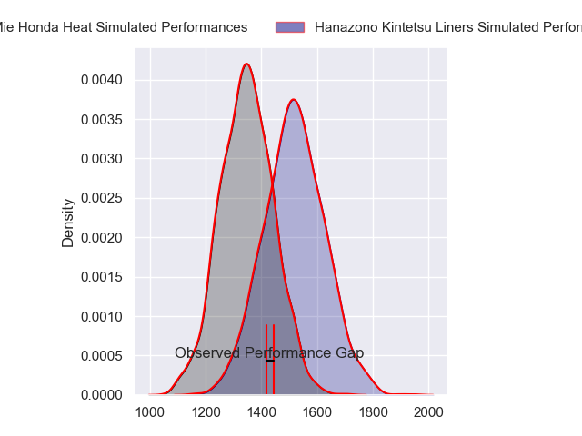
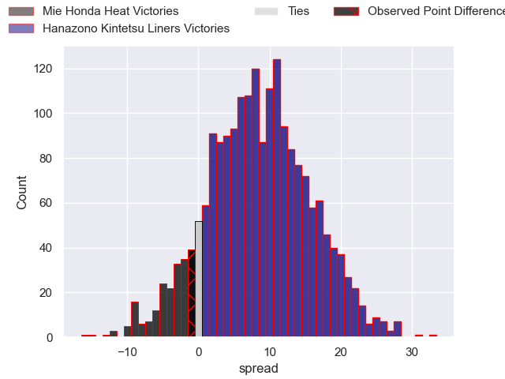
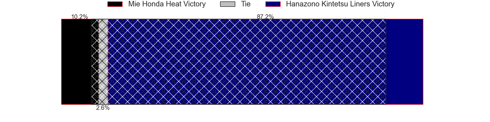
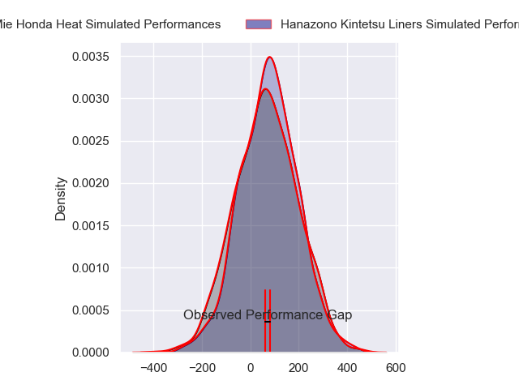
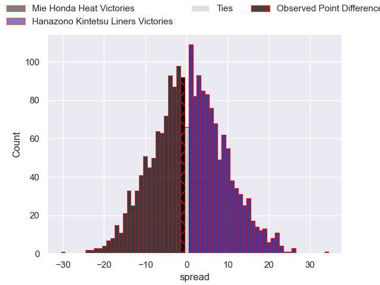

---  
layout: page  
title: Mie Honda Heat at Hanazono Kintetsu Liners; 20-19  
date: 2024-03-17 18:00:00 -0500  
categories: "Japan Rugby League One 2023" match review  
---
# Mie Honda Heat at Hanazono Kintetsu Liners; 20-19

# Club Level Predictions

The first set of predictions treats a club as the smallest object, as the club develops its members, organizes a gameplan, and deploys its players as needed for each match. This club model has a prediction of 0.718, which translates to predicting Hanazono Kintetsu Liners to win by 8.5.

Our Over/Under is 54.5 - and combined with the spread above, we have a predicted scoreline of 23 to 31

Each club has a rating and a rating deviation (similar to a Glicko rating), and expected performances can be generated. This allows for simulated matches and spreads like the ones below.
## Projected Performances - Club Model

## Projected Spreads - Club Model

## Projected Results - Club Model

# Player Level Predictions - Version 2

Treating teams instead as an entity made up of the currently active players, I have ratings for each player in an altogether different system. These can be combined to form team ratings once teamsheets are announced, weighting starters a bit higher than the reserves. After the match is played, players can be weighted by their minutes on the field, allowing for an accurate measure of the team's composition. With these compiled team ratings, we can make predictions, measure inaccuracy, and update the individual player ratings.
## Prediction without Player Minutes: Mie Honda Heat by 0.1

Mie Honda Heat by 3.6 on a neutral pitch

## Projected Performances - Player Model

## Projected Spreads - Player Model

## Projected Results - Player Model

|   Away Minutes | Away Player         |   Away Percentile |   Number |   Home Percentile | Home Player       |   Home Minutes |
|---------------:|:--------------------|------------------:|---------:|------------------:|:------------------|---------------:|
|             67 | Tatsuhiko Tsurukawa |              3.31 |        1 |              7.09 | Kenta Tanaka      |             48 |
|             67 | Lee Seung Hyok      |              6.8  |        2 |              8.35 | Keiichi Kaneko    |             48 |
|             67 | Katsuyuki Hoshino   |             17.77 |        3 |             15.69 | Kota Mitake       |             48 |
|             80 | Yoji Akiyama        |             26.33 |        4 |              6.67 | Patrick Tafa      |             80 |
|             80 | Franco Mostert      |             90.29 |        5 |             21.6  | James Blackwell   |             48 |
|             80 | Ryota Kobayashi     |              4.12 |        6 |              0.57 | Takahito Sugahara |             80 |
|             80 | Kosuke Hattori      |             51.55 |        7 |             17.41 | Shohei Nonaka     |             80 |
|             67 | Waimana Kapa        |             21.73 |        8 |             33.58 | Jose Seru         |             80 |
|             51 | Takuro Hojo         |             38.25 |        9 |             24.95 | Tomoya Nakamura   |             48 |
|             80 | Gwangtee Oh         |             20.3  |       10 |             98.48 | Quade Cooper      |             62 |
|             18 | Kanta Watanabe      |             24.92 |       11 |             62.35 | Ryosuke Kataoka   |             80 |
|             80 | Clinton Knox        |              4.74 |       12 |             14.58 | Haruki Kanazawa   |             62 |
|             75 | Tevita Li           |             95.02 |       13 |             58.32 | Tom Hendrickson   |             80 |
|             80 | Haruhiko Uemura     |             16.72 |       14 |             12.29 | Tomoya Kimura     |             66 |
|             80 | Tom Banks           |             80.84 |       15 |             19.66 | Semisi Masirewa   |             80 |
|             62 | Fraser Quirk        |              5.1  |       16 |              4.63 | Shun Sasaki       |             32 |
|             29 | Taichi Takenaka     |            nan    |       17 |             25.63 | Kazuma Matsuda    |             32 |
|             13 | Takumi Fuji         |            nan    |       18 |              8.03 | Lata Tangimana    |             32 |
|             13 | Koki Hida           |            nan    |       19 |              8.98 | Isamu Matsuoka    |             32 |
|             13 | Matthys Basson      |            nan    |       20 |             90.02 | Will Genia        |             32 |
|             13 | Tetuhi Roberts      |             14.93 |       21 |             39.8  | Yoshizumi Takeda  |             18 |
|              5 | Mitch Hunt          |             63.45 |       22 |             10.21 | Takumi Yoshimoto  |             18 |
|            nan | nan                 |            nan    |       23 |             15.69 | Jed Brown         |             14 |

