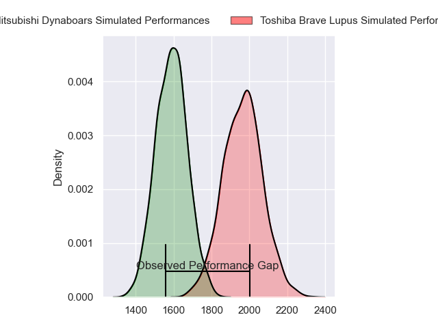
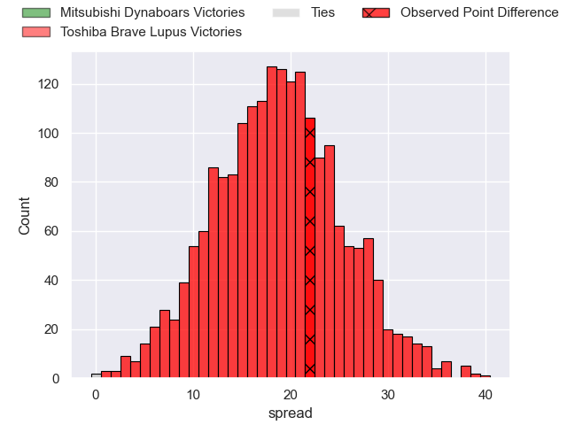
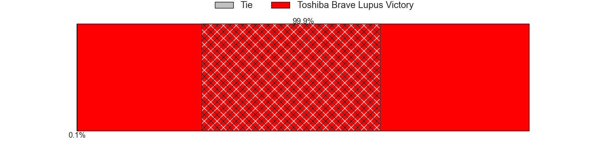
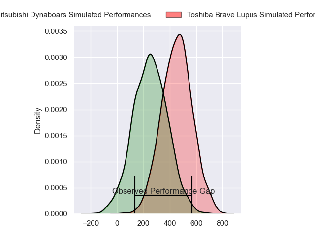
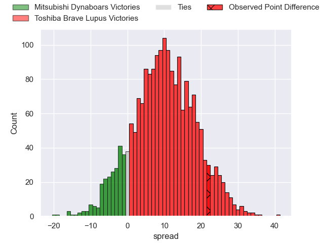
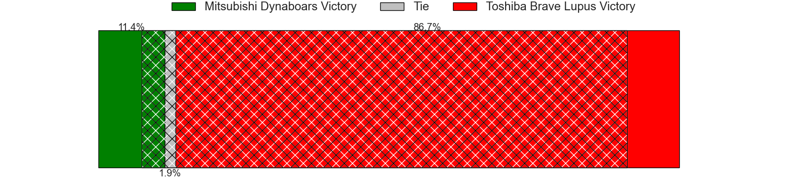

---  
layout: page  
title: Mitsubishi Dynaboars at Toshiba Brave Lupus; 19-41  
date: 2024-03-17 18:00:00 -0500  
categories: "Japan Rugby League One 2023" match review  
---
# Mitsubishi Dynaboars at Toshiba Brave Lupus; 19-41

# Club Level Predictions

The first set of predictions treats a club as the smallest object, as the club develops its members, organizes a gameplan, and deploys its players as needed for each match. This club model has a prediction of 0.893, which translates to predicting Toshiba Brave Lupus to win by 19.0.

Our Over/Under is 63.5 - and combined with the spread above, we have a predicted scoreline of 22 to 41

Each club has a rating and a rating deviation (similar to a Glicko rating), and expected performances can be generated. This allows for simulated matches and spreads like the ones below.
## Projected Performances - Club Model

## Projected Spreads - Club Model

## Projected Results - Club Model

# Player Level Predictions - Version 2

Treating teams instead as an entity made up of the currently active players, I have ratings for each player in an altogether different system. These can be combined to form team ratings once teamsheets are announced, weighting starters a bit higher than the reserves. After the match is played, players can be weighted by their minutes on the field, allowing for an accurate measure of the team's composition. With these compiled team ratings, we can make predictions, measure inaccuracy, and update the individual player ratings.
## Prediction without Player Minutes: Toshiba Brave Lupus by 11.7

Toshiba Brave Lupus by 8.4 on a neutral pitch

## Projected Performances - Player Model

## Projected Spreads - Player Model

## Projected Results - Player Model

|   Away Minutes | Away Player            |   Away Percentile |   Number |   Home Percentile | Home Player        |   Home Minutes |
|---------------:|:-----------------------|------------------:|---------:|------------------:|:-------------------|---------------:|
|             69 | Hayato Hosoda          |              6.99 |        1 |             86.2  | Teruo Makabe       |             52 |
|             48 | Yoshimitsu Yasue       |             82.91 |        2 |             83.69 | Mamoru Harada      |             52 |
|             48 | Mototsugu Hachiya      |             18.9  |        3 |             89.22 | Yuta Kokaji        |             52 |
|             61 | Walt Steenkamp         |             77.79 |        4 |             91.63 | Warner Dearns      |             52 |
|             80 | Daniel Linde           |             32.52 |        5 |             41.87 | Samuela Anise      |             80 |
|             80 | Masataka Tsuruya       |             91.52 |        6 |             80.64 | Shin Ito           |             80 |
|              7 | Yusuke Sakamoto        |             46.85 |        7 |             35.17 | Yoshitaka Tokunaga |             66 |
|             80 | Marino Mikaele-Tu'u    |             23.7  |        8 |             85.93 | Shannon Frizell    |             80 |
|             69 | Kota Iwamura           |             83.78 |        9 |             77.13 | Yuhei Sugiyama     |             52 |
|             59 | James Grayson          |             75.13 |       10 |             99.75 | Richie Mo'unga     |             80 |
|             80 | Satoshi Koizumi        |             74.31 |       11 |             67.11 | Yuto Mori          |             80 |
|             59 | Tonishio Vaiahu        |             41.07 |       12 |             44.71 | Rob Thompson       |             36 |
|             80 | Matt Vaega             |             63.55 |       13 |             96.48 | Seta Tamanivalu    |             80 |
|             80 | Honeti Taumoha'apai    |             75.53 |       14 |             81.73 | Atsuki Kuwayama    |             69 |
|             80 | Kazuki Ishida          |             17.44 |       15 |             90.42 | Takuro Matsunaga   |             80 |
|             73 | Ryoma Tokuda           |            nan    |       16 |             76.06 | Taichi Mano        |             44 |
|             32 | Chinen Yu              |             44.8  |       17 |            nan    | Masataka Mikami    |             28 |
|             32 | Yuki Miyazato          |             39.42 |       18 |             49.51 | Daigo Hashimoto    |             28 |
|             21 | Brackin Karauria-Henry |             54.43 |       19 |             50.19 | Taufa Latu         |             28 |
|             21 | Curtis Rona            |             85.05 |       20 |             16.5  | PJ Steenkamp       |             28 |
|             19 | Kyo Yoshida            |             85.57 |       21 |            nan    | Kohei Takahashi    |             28 |
|             11 | Jun Morimoto           |             53.4  |       22 |            nan    | Asaeli Lausii      |             14 |
|             11 | Ryoto Fukuyama         |            nan    |       23 |            nan    | Taiki Matsunobu    |             11 |

