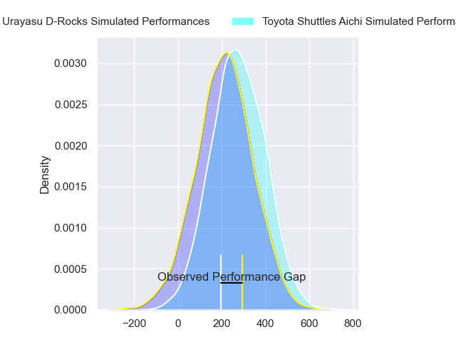
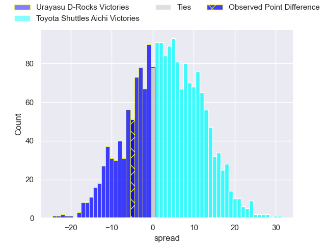
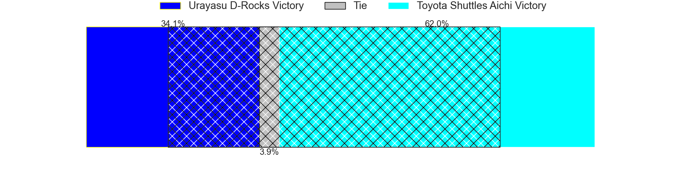

---  
layout: page  
title: Urayasu D-Rocks at Toyota Shuttles Aichi; 19-14  
date: 2024-03-17 18:00:00 -0500  
categories: "Japan Rugby League One D2 2023" match review  
---
# Urayasu D-Rocks at Toyota Shuttles Aichi; 19-14

# Club Level Predictions

The first set of predictions treats a club as the smallest object, as the club develops its members, organizes a gameplan, and deploys its players as needed for each match. This club model has a prediction of 0.548, which translates to predicting Toyota Shuttles Aichi to win by 1.7.

Our Over/Under is 64.5 - and combined with the spread above, we have a predicted scoreline of 32 to 33

Each club has a rating and a rating deviation (similar to a Glicko rating), and expected performances can be generated. This allows for simulated matches and spreads like the ones below.
## Projected Performances - Club Model

## Projected Spreads - Club Model

## Projected Results - Club Model

# Player Level Predictions - Version 2

Treating teams instead as an entity made up of the currently active players, I have ratings for each player in an altogether different system. These can be combined to form team ratings once teamsheets are announced, weighting starters a bit higher than the reserves. After the match is played, players can be weighted by their minutes on the field, allowing for an accurate measure of the team's composition. With these compiled team ratings, we can make predictions, measure inaccuracy, and update the individual player ratings.
## Prediction without Player Minutes: Toyota Shuttles Aichi by 4.3

Toyota Shuttles Aichi by 1.3 on a neutral pitch

## Projected Performances - Player Model

## Projected Spreads - Player Model

## Projected Results - Player Model

|   Away Minutes | Away Player          |   Away Percentile |   Number |   Home Percentile | Home Player          |   Home Minutes |
|---------------:|:---------------------|------------------:|---------:|------------------:|:---------------------|---------------:|
|             61 | Gakuto Ishida        |             56.33 |        1 |             50.66 | Tomoki Yamaguchi     |             52 |
|             61 | Franco Marais        |             17.67 |        2 |             34.17 | Akito Fujinami       |             61 |
|             80 | Syuhei Takeuchi      |             63.23 |        3 |             45.56 | Ryota Fukamura       |             54 |
|             64 | Levi Douglas         |             30.34 |        4 |             46.36 | Seta Naivaluwaga     |             79 |
|             80 | James Moore          |              1.21 |        5 |             56.55 | James Gaskell        |             80 |
|             61 | Shin Takeuchi        |             69.87 |        6 |             80.3  | Kavaia Tagivetaua    |             80 |
|             77 | Brody MacAskill      |             91.98 |        7 |             52.81 | Talifolofola Tangipa |             79 |
|             80 | Tyler Paul           |             95.56 |        8 |             86.67 | Taleni Seu           |             80 |
|             77 | Ren Iinuma           |             73.39 |        9 |             63.83 | Takumi Sue           |             79 |
|             72 | Yu Tamura            |             71.32 |       10 |             89.09 | Freddie Burns        |             80 |
|             80 | Kai Ishii            |             44.85 |       11 |             34.44 | Go Nakano            |             80 |
|             80 | Samu Kerevi          |             97.33 |       12 |             19.08 | Keita Ichikawa       |             80 |
|             40 | Samisoni Ahokovi Tua |             53.58 |       13 |             14.22 | James Mollentze      |             59 |
|             80 | Shane Gates          |             68.77 |       14 |             47.95 | Hiroto Ogasahara     |             59 |
|             80 | Takuhei Yasuda       |             92.38 |       15 |             78.13 | Josua Kerevi         |             80 |
|             40 | Tone Tukufuka        |             93.56 |       16 |             63.04 | Tomoki Minami        |             28 |
|             19 | Kazuki Ban           |             61.44 |       17 |            nan    | Apisalome Bogidrau   |             26 |
|             19 | Takuya Ishibashi     |             65.67 |       18 |            nan    | Viliame Suwawa       |             21 |
|             19 | Ryeongji Kim         |             47.33 |       19 |             45.95 | Chance Peni          |             21 |
|             16 | Yuta Kojima          |             87.5  |       20 |              9.51 | Hiroshi Murakawa     |             19 |
|              8 | Hayden Cripps        |             65.48 |       21 |             51.94 | Shoma Makinouchi     |              1 |
|              3 | Daiki Sato           |            nan    |       22 |             66.78 | Yamato Matsuoka      |              1 |
|              3 | Taisei Konishi       |            nan    |       23 |            nan    | Taisei Okamoto       |              1 |

