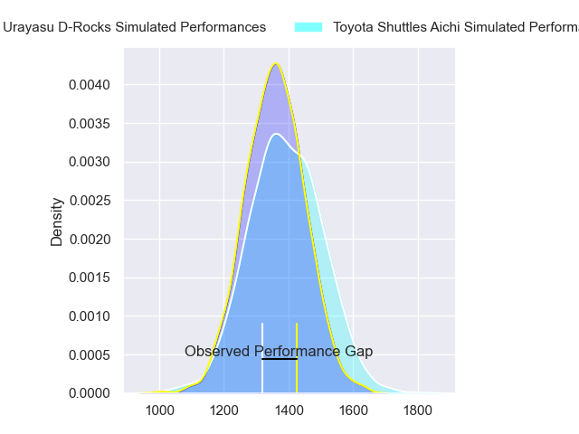
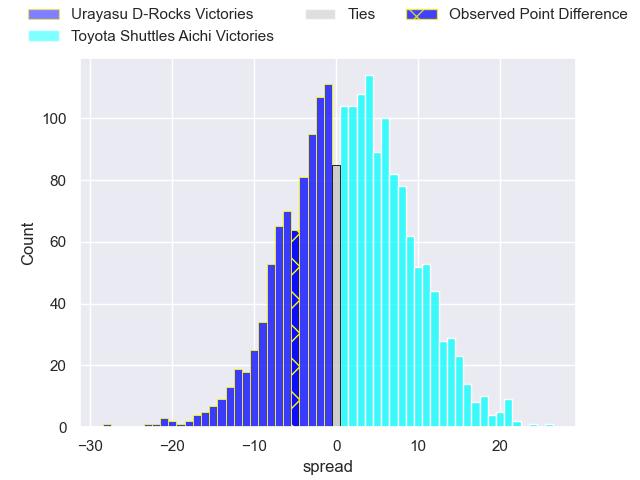
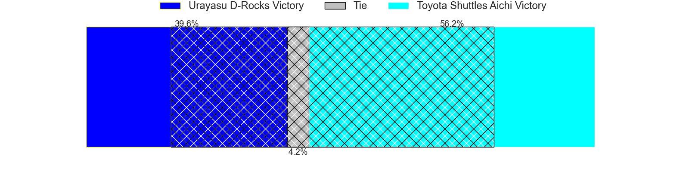

---  
layout: page  
title: Urayasu D-Rocks at Toyota Shuttles Aichi; 19-14  
date: 2024-03-17 18:00:00 -0500  
categories: "Japan Rugby League One D2 2023" match review  
---
# Urayasu D-Rocks at Toyota Shuttles Aichi; 19-14

# Club Level Predictions

The first set of predictions treats a club as the smallest object, as the club develops its members, organizes a gameplan, and deploys its players as needed for each match. This club model has a prediction of 0.548, which translates to predicting Toyota Shuttles Aichi to win by 1.7.

Our Over/Under is 62.5 - and combined with the spread above, we have a predicted scoreline of 31 to 32

Each club has a rating and a rating deviation (similar to a Glicko rating), and expected performances can be generated. This allows for simulated matches and spreads like the ones below.
## Projected Performances - Club Model

## Projected Spreads - Club Model

## Projected Results - Club Model

