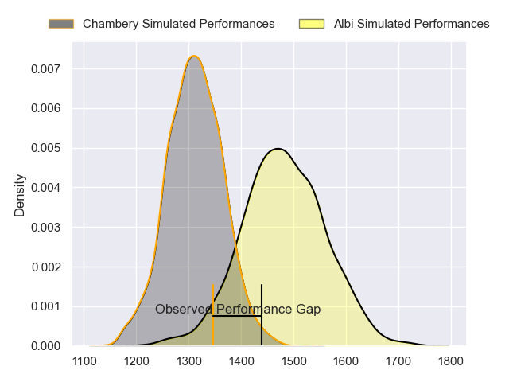
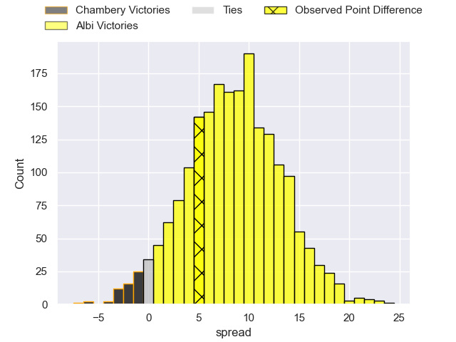
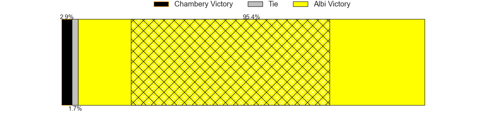
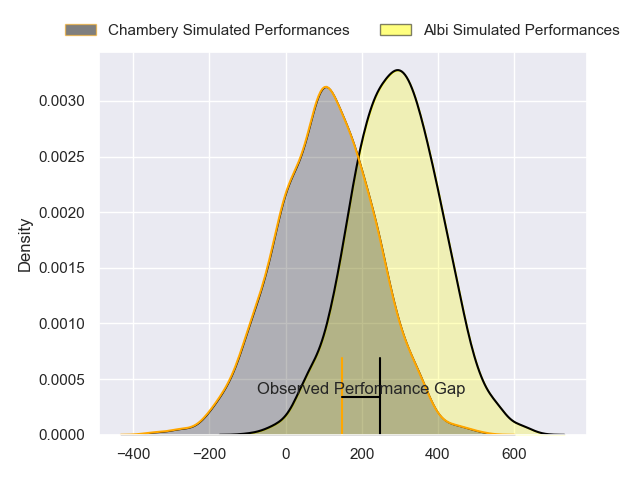
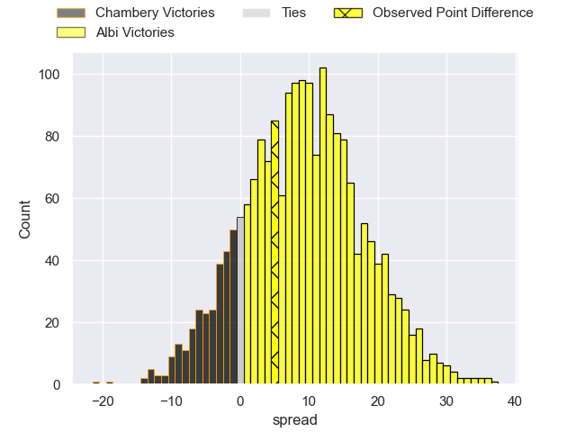
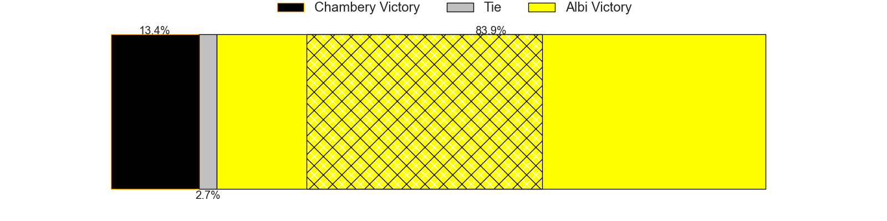

---  
layout: page  
title: Chambery at Albi; 18-23  
date: 2024-03-22 18:00:00 -0500  
categories: "Nationale 2023" match review  
---
# Chambery at Albi; 18-23

# Club Level Predictions

The first set of predictions treats a club as the smallest object, as the club develops its members, organizes a gameplan, and deploys its players as needed for each match. This club model has a prediction of 0.726, which translates to predicting Albi to win by 8.6.

Our Over/Under is 35.5 - and combined with the spread above, we have a predicted scoreline of 13 to 22

Each club has a rating and a rating deviation (similar to a Glicko rating), and expected performances can be generated. This allows for simulated matches and spreads like the ones below.
## Projected Performances - Club Model

## Projected Spreads - Club Model

## Projected Results - Club Model

# Player Level Predictions - Version 2

Treating teams instead as an entity made up of the currently active players, I have ratings for each player in an altogether different system. These can be combined to form team ratings once teamsheets are announced, weighting starters a bit higher than the reserves. After the match is played, players can be weighted by their minutes on the field, allowing for an accurate measure of the team's composition. With these compiled team ratings, we can make predictions, measure inaccuracy, and update the individual player ratings.
## Prediction without Player Minutes: Albi by 11.0

Albi by 4.1 on a neutral pitch

## Projected Performances - Player Model

## Projected Spreads - Player Model

## Projected Results - Player Model

|   Away Minutes | Away Player                  |   Away Percentile |   Number |   Home Percentile | Home Player             |   Home Minutes |
|---------------:|:-----------------------------|------------------:|---------:|------------------:|:------------------------|---------------:|
|             66 | Nugzar Somkhishvili          |             42.16 |        1 |             87.62 | Antoine Soave           |             57 |
|             66 | Gauthier Brute de Remur      |             81.94 |        2 |             88.93 | Romain Maurice          |             74 |
|             72 | Giorgi Pertaia               |             77.88 |        3 |             75.8  | Jean Baptiste De Clercq |             72 |
|             80 | Taniela Matakaiongo          |             62.74 |        4 |             38.47 | Guillem Calmon          |             80 |
|             53 | Corentin Astier              |             71.12 |        5 |             21.48 | Dion Evrard Oulai       |             80 |
|             80 | Colin Lebian                 |             76.52 |        6 |             43.87 | Pierre Roussel          |             80 |
|             66 | Thomas Coignat               |             71.94 |        7 |             51.89 | Luke Stringer           |             47 |
|             80 | Tui Uru                      |             73.83 |        8 |             83.46 | Sandrick Maciotta       |             53 |
|             80 | Thibault Dufau               |             23.49 |        9 |             80.46 | Gilen Queheille         |             66 |
|             80 | Victor Pisano                |             46.19 |       10 |             79.95 | Benjamin Pehau          |             57 |
|             80 | Paul Baptiste Florent Altier |             68.88 |       11 |             65.12 | Sean Robinson           |             80 |
|             80 | Bastien Reymond              |             51.28 |       12 |             65.25 | Gabriel Aviragnet       |             47 |
|             48 | Emmanuel Vaitulukina         |             44.96 |       13 |              7.05 | James Haydn Tedder      |             80 |
|             80 | Va'aufauese Apelu Maliko     |             54.04 |       14 |             74.97 | Enzo Marzocca           |             80 |
|             80 | Jules Dorrival               |             43.73 |       15 |             33.17 | Téo Dospital            |             80 |
|             14 | Julien Primault              |             43.69 |       16 |             50.57 | Lucas Pindor            |             23 |
|             14 | Enzo Segui                   |             36.77 |       17 |             12.62 | Reinach Venter          |              6 |
|              8 | Nail Audoire                 |             67.3  |       18 |             29.02 | Simon Renaud            |              8 |
|             27 | Fabien Witz                  |             68.45 |       19 |             62.22 | Camille Jarreau         |             27 |
|             14 | Pierre-Nicolas Dance         |            nan    |       20 |             61.4  | Vincent Calas           |             33 |
|             32 | Clément Pérusin              |            nan    |       21 |             94.18 | Théo Vidal              |             14 |
|            nan | nan                          |            nan    |       22 |             80.84 | Simon Hartmann          |             23 |
|            nan | nan                          |            nan    |       23 |             27.58 | Jarrod Poi              |             33 |

