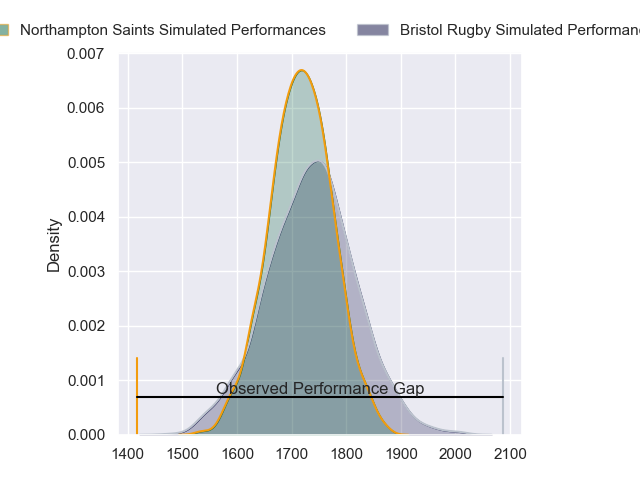
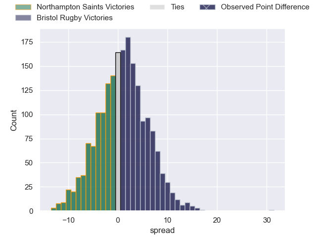
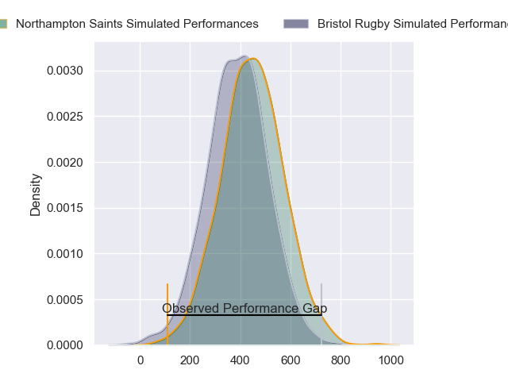
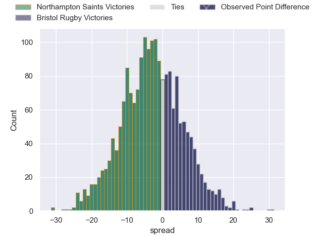

---  
layout: page  
title: Northampton Saints at Bristol Rugby; 21-52  
date: 2024-03-22 18:00:00 -0500  
categories: "Gallagher Premiership 2023" match review  
---
# Northampton Saints at Bristol Rugby; 21-52

# Club Level Predictions

The first set of predictions treats a club as the smallest object, as the club develops its members, organizes a gameplan, and deploys its players as needed for each match. This club model has a prediction of 0.525, which translates to predicting Bristol Rugby to win by 0.9.

Our Over/Under is 49.5 - and combined with the spread above, we have a predicted scoreline of 24 to 25

Each club has a rating and a rating deviation (similar to a Glicko rating), and expected performances can be generated. This allows for simulated matches and spreads like the ones below.
## Projected Performances - Club Model

## Projected Spreads - Club Model

## Projected Results - Club Model

# Player Level Predictions - Version 2

Treating teams instead as an entity made up of the currently active players, I have ratings for each player in an altogether different system. These can be combined to form team ratings once teamsheets are announced, weighting starters a bit higher than the reserves. After the match is played, players can be weighted by their minutes on the field, allowing for an accurate measure of the team's composition. With these compiled team ratings, we can make predictions, measure inaccuracy, and update the individual player ratings.
## Prediction without Player Minutes: Northampton Saints by 1.8

Northampton Saints by 6.7 on a neutral pitch

## Projected Performances - Player Model

## Projected Spreads - Player Model

## Projected Results - Player Model

|   Away Minutes | Away Player        |   Away Percentile |   Number |   Home Percentile | Home Player                |   Home Minutes |
|---------------:|:-------------------|------------------:|---------:|------------------:|:---------------------------|---------------:|
|             63 | Emmanuel Iyogun    |             38.19 |        1 |             78.45 | Yann Thomas                |             46 |
|             53 | Sam Matavesi       |             83.5  |        2 |             46.6  | Gabriel Oghre              |             65 |
|             68 | Trevor Davison     |              2.55 |        3 |             89.13 | Kyle Sinckler              |             59 |
|             63 | Temo Mayanavanua   |             89.56 |        4 |             84.22 | James Dun                  |             65 |
|             81 | Alex Coles         |             19.17 |        5 |             82.4  | Joe Batley                 |             81 |
|             81 | Courtney Lawes     |             98.51 |        6 |             98.97 | Steven Luatua              |             74 |
|             81 | Lewis Ludlam       |             62.66 |        7 |             83.39 | Fitz Harding               |             81 |
|             56 | Sam Graham         |             98.02 |        8 |             29.38 | Magnus Bradbury            |             81 |
|             81 | Archie McParland   |             24.32 |        9 |             89.19 | Harry Randall              |             81 |
|             81 | Fin Smith          |             79.19 |       10 |             95.69 | AJ MacGinty                |             74 |
|             81 | Ollie Sleightholme |             95.57 |       11 |             90.03 | Gabriel Ibitoye            |             81 |
|             53 | Rory Hutchinson    |             81.17 |       12 |             70.11 | James Williams             |             81 |
|             74 | Burger Odendaal    |             83.72 |       13 |             85.78 | Benhard Janse van Rensburg |             81 |
|             81 | James Ramm         |             65.45 |       14 |             62.68 | Ratu Naulago               |             59 |
|             62 | George Hendy       |             79.36 |       15 |             65.36 | Noah Heward                |             79 |
|             28 | Curtis Langdon     |             90.68 |       16 |            nan    | Fred Davies                |             16 |
|             18 | Alex Waller        |             98.49 |       17 |             48.39 | Ellis Genge                |             35 |
|             13 | Edward Prowse      |            nan    |       18 |             48.87 | Max Lahiff                 |             22 |
|             18 | Tom Lockett        |            nan    |       19 |            nan    | Joe Owen                   |             16 |
|             25 | Juarno Augustus    |             61.48 |       20 |             60.14 | Jake Heenan                |              7 |
|             19 | Jake Garside       |            nan    |       21 |             88.98 | Kieran Marmion             |              2 |
|             28 | Fraser Dingwall    |             89.79 |       22 |             64.56 | Kalaveti Ravouvou          |              7 |
|              7 | Tom Litchfield     |             61.97 |       23 |             37.35 | Max Malins                 |             22 |

