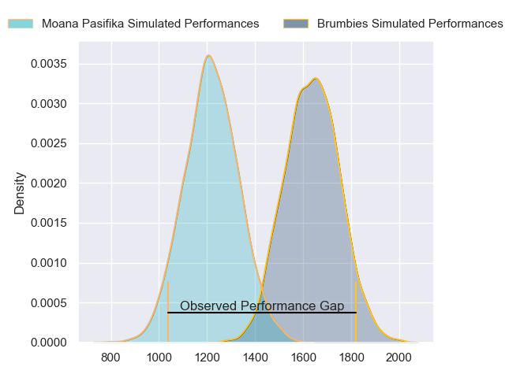
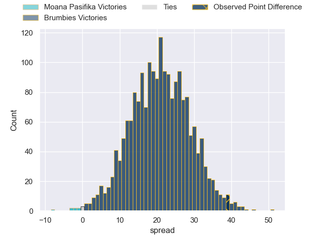
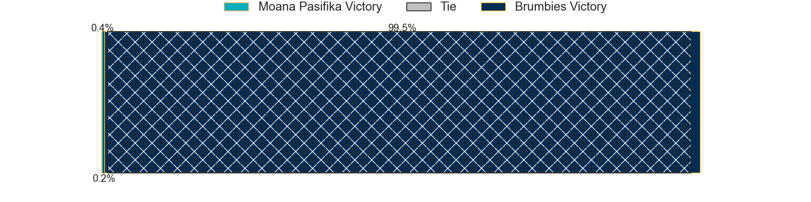
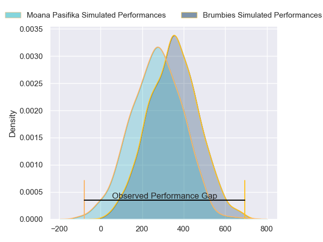
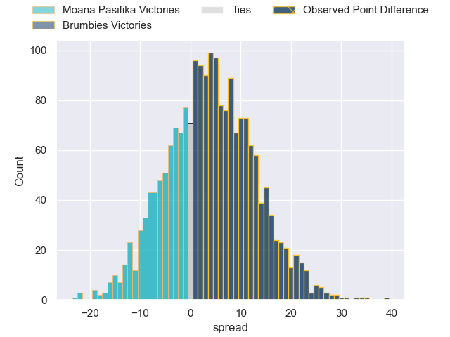

---  
layout: page  
title: Moana Pasifika at Brumbies; 21-60  
date: 2024-03-22 18:00:00 -0500  
categories: "Super Rugby Pacific 2024" match review  
---
# Moana Pasifika at Brumbies; 21-60

# Club Level Predictions

The first set of predictions treats a club as the smallest object, as the club develops its members, organizes a gameplan, and deploys its players as needed for each match. This club model has a prediction of 0.904, which translates to predicting Brumbies to win by 20.6.

Our Over/Under is 60.5 - and combined with the spread above, we have a predicted scoreline of 20 to 41

Each club has a rating and a rating deviation (similar to a Glicko rating), and expected performances can be generated. This allows for simulated matches and spreads like the ones below.
## Projected Performances - Club Model

## Projected Spreads - Club Model

## Projected Results - Club Model

# Player Level Predictions - Version 2

Treating teams instead as an entity made up of the currently active players, I have ratings for each player in an altogether different system. These can be combined to form team ratings once teamsheets are announced, weighting starters a bit higher than the reserves. After the match is played, players can be weighted by their minutes on the field, allowing for an accurate measure of the team's composition. With these compiled team ratings, we can make predictions, measure inaccuracy, and update the individual player ratings.
## Prediction without Player Minutes: Brumbies by 5.8

Brumbies by 1.1 on a neutral pitch

## Projected Performances - Player Model

## Projected Spreads - Player Model

## Projected Results - Player Model

|   Away Minutes | Away Player           |   Away Percentile |   Number |   Home Percentile | Home Player      |   Home Minutes |
|---------------:|:----------------------|------------------:|---------:|------------------:|:-----------------|---------------:|
|             56 | Abraham Pole          |             33.27 |        1 |             55.67 | Harry Vella      |             51 |
|             56 | Samiuela Moli         |              5.05 |        2 |             63.5  | Billy Pollard    |             51 |
|             56 | Sione Mafileo         |             63.33 |        3 |             30.15 | Sefo Kautai      |             51 |
|             80 | Michael Curry         |             76.46 |        4 |             50.49 | Darcy Swain      |             74 |
|             59 | Allan Craig           |             23.54 |        5 |             98.91 | Cadeyrn Neville  |             62 |
|             80 | Jacob Norris          |             89.46 |        6 |             97.25 | Rob Valetini     |             65 |
|             59 | Sione Havili Talitui  |             92.21 |        7 |             87.63 | Jahrome Brown    |             58 |
|             80 | Lotu Inisi            |             19.26 |        8 |             42.72 | Charlie Cale     |             80 |
|             56 | Ere Enari             |              2.7  |        9 |             17.26 | Harrison Goddard |             62 |
|             52 | Christian Leali'ifano |             83.25 |       10 |             80.71 | Noah Lolesio     |             80 |
|             80 | Kyren Taumoefolau     |             46.84 |       11 |             43.63 | Corey Toole      |             80 |
|             53 | D'Angelo Leuila       |             22.48 |       12 |             49.7  | Tamati Tua       |             80 |
|             80 | Pepesana Patafilo     |             75.7  |       13 |             46.05 | Hudson Creighton |             80 |
|             80 | Nigel Ah Wong         |             85.83 |       14 |             87.93 | Ollie Sapsford   |             80 |
|             80 | Danny Toala           |             11.55 |       15 |             63.64 | Tom Wright       |             80 |
|             24 | Thomas Maka           |            nan    |       16 |              7.77 | Lachlan Lonergan |             29 |
|             24 | Sateki Latu           |            nan    |       17 |             91.49 | James Slipper    |             29 |
|             24 | Sekope Kepu           |             88.75 |       18 |             62.29 | Rhys Van Nek     |             29 |
|             21 | Miracle Faiilagi      |             66.55 |       19 |             42.23 | Nick Frost       |             18 |
|             21 | Semisi Paea           |             81.56 |       20 |             63.92 | Tom Hooper       |             15 |
|             24 | Melani Matavao        |            nan    |       21 |             53.49 | Luke Reimer      |             22 |
|             28 | William Havili        |             34.01 |       22 |             74.43 | Ryan Lonergan    |             18 |
|             27 | Fine Inisi            |             16.39 |       23 |            nan    | Declan Meredith  |              6 |

