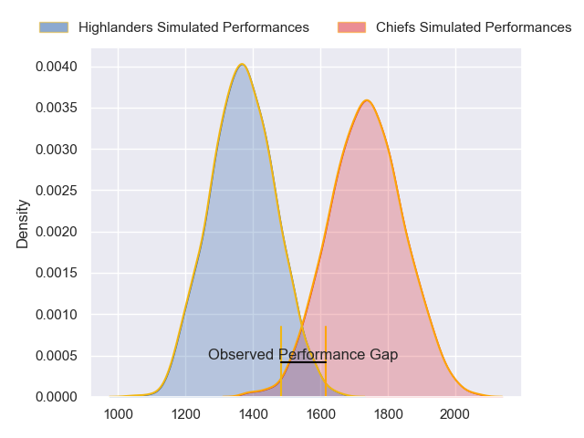
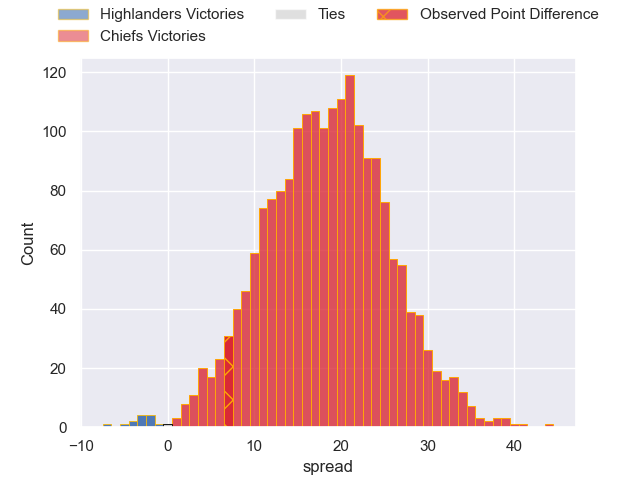
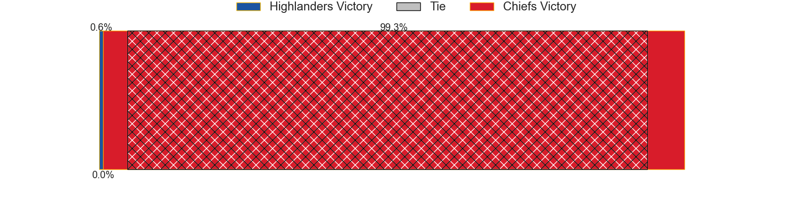
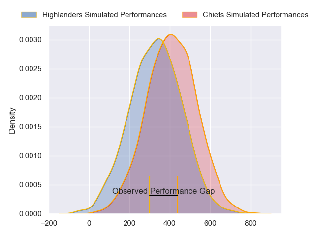
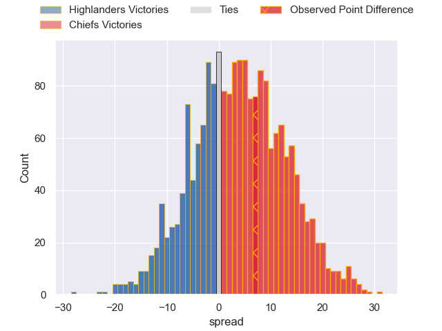

---  
layout: page  
title: Highlanders at Chiefs; 21-28  
date: 2024-03-22 18:00:00 -0500  
categories: "Super Rugby Pacific 2024" match review  
---
# Highlanders at Chiefs; 21-28

# Club Level Predictions

The first set of predictions treats a club as the smallest object, as the club develops its members, organizes a gameplan, and deploys its players as needed for each match. This club model has a prediction of 0.882, which translates to predicting Chiefs to win by 18.3.

Our Over/Under is 43.5 - and combined with the spread above, we have a predicted scoreline of 13 to 31

Each club has a rating and a rating deviation (similar to a Glicko rating), and expected performances can be generated. This allows for simulated matches and spreads like the ones below.
## Projected Performances - Club Model

## Projected Spreads - Club Model

## Projected Results - Club Model

# Player Level Predictions - Version 2

Treating teams instead as an entity made up of the currently active players, I have ratings for each player in an altogether different system. These can be combined to form team ratings once teamsheets are announced, weighting starters a bit higher than the reserves. After the match is played, players can be weighted by their minutes on the field, allowing for an accurate measure of the team's composition. With these compiled team ratings, we can make predictions, measure inaccuracy, and update the individual player ratings.
## Prediction without Player Minutes: Chiefs by 3.0

Highlanders by 1.6 on a neutral pitch

## Projected Performances - Player Model

## Projected Spreads - Player Model

## Projected Results - Player Model

|   Away Minutes | Away Player                   |   Away Percentile |   Number |   Home Percentile | Home Player        |   Home Minutes |
|---------------:|:------------------------------|------------------:|---------:|------------------:|:-------------------|---------------:|
|             47 | Ayden Johnstone               |             93.86 |        1 |             29.58 | Jared Proffit      |             56 |
|             62 | Henry Bell                    |             30.49 |        2 |             80.58 | Bradley Slater     |             67 |
|             56 | Saula Ma'u                    |             45.94 |        3 |             22.78 | Reuben O'Neill     |             46 |
|             80 | Fabian Holland                |             67.84 |        4 |             80.95 | Josh Lord          |             52 |
|             47 | Pari Pari Parkinson           |             97.69 |        5 |             82.52 | Tupou Vaa'i        |             74 |
|             80 | Sean Withy                    |             17.07 |        6 |             91.29 | Samipeni Finau     |             80 |
|             80 | Billy Harmon                  |             67.58 |        7 |             48.45 | Kaylum Boshier     |             60 |
|             58 | Tom Sanders                   |             79.26 |        8 |             89.38 | Luke Jacobson      |             80 |
|             72 | Folau Fakatava                |             60.5  |        9 |             68.19 | Cortez Ratima      |             72 |
|             52 | Rhys Patchell                 |             97.46 |       10 |             96.45 | Damian McKenzie    |             64 |
|             80 | Jona Nareki                   |             82.06 |       11 |             34.55 | Etene Nanai-Seturo |             80 |
|             80 | Sam Gilbert                   |             32.08 |       12 |             87    | Quinn Tupaea       |             56 |
|             60 | Tanielu Tele'a                |             38.76 |       13 |             59.3  | Rameka Poihipi     |             80 |
|             80 | Timoci Tavatavanawai          |             28.13 |       14 |             71.21 | Daniel Rona        |             80 |
|             80 | Jacob Ratumaitavuki-Kneepkens |             96.07 |       15 |             91.4  | Shaun Stevenson    |             80 |
|             18 | Jack Taylor                   |             42.52 |       16 |             71.84 | Tyrone Thompson    |             13 |
|             33 | Dan Lienert-Brown             |             20.04 |       17 |             97.73 | Aidan Ross         |             24 |
|             24 | Jermaine Ainsley              |             36.48 |       18 |             79.68 | George Dyer        |             34 |
|             33 | Oliver Haig                   |            nan    |       19 |             94.54 | Naitoa Ah Kuoi     |             34 |
|             22 | Nikora Broughton              |             36.3  |       20 |             19.47 | Wallace Sititi     |             20 |
|              8 | James Arscott                 |             12.47 |       21 |             45.11 | Xavier Roe         |              8 |
|             28 | Ajay Faleafaga                |            nan    |       22 |             46.19 | Josh Ioane         |             16 |
|             20 | Connor Garden-Bachop          |             49.39 |       23 |             90.37 | Emoni Narawa       |             24 |

