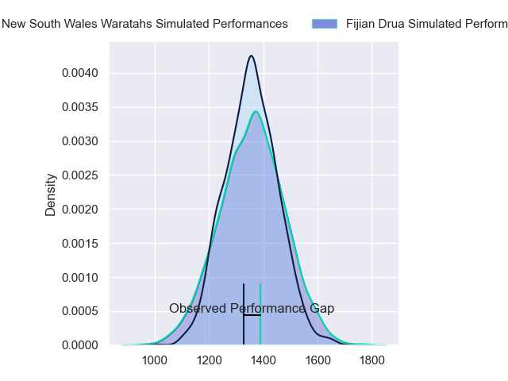
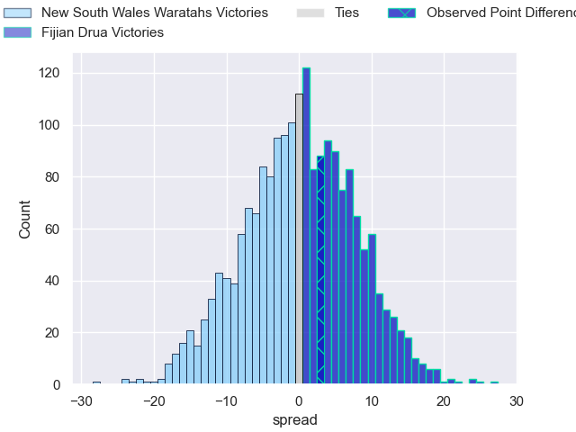
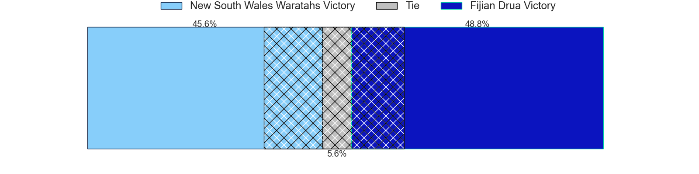
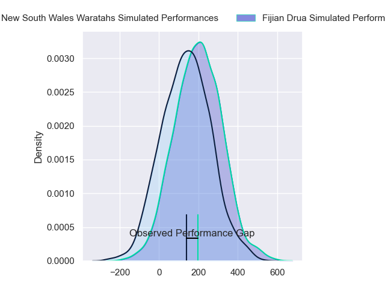
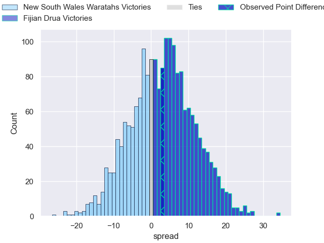
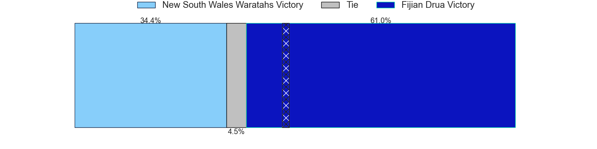

---  
layout: page  
title: New South Wales Waratahs at Fijian Drua; 36-39  
date: 2024-03-22 18:00:00 -0500  
categories: "Super Rugby Pacific 2024" match review  
---
# New South Wales Waratahs at Fijian Drua; 36-39

# Club Level Predictions

The first set of predictions treats a club as the smallest object, as the club develops its members, organizes a gameplan, and deploys its players as needed for each match. This club model has a prediction of 0.503, which translates to predicting Fijian Drua to win by 0.1.

Our Over/Under is 59.5 - and combined with the spread above, we have a predicted scoreline of 30 to 30

Each club has a rating and a rating deviation (similar to a Glicko rating), and expected performances can be generated. This allows for simulated matches and spreads like the ones below.
## Projected Performances - Club Model

## Projected Spreads - Club Model

## Projected Results - Club Model

# Player Level Predictions - Version 2

Treating teams instead as an entity made up of the currently active players, I have ratings for each player in an altogether different system. These can be combined to form team ratings once teamsheets are announced, weighting starters a bit higher than the reserves. After the match is played, players can be weighted by their minutes on the field, allowing for an accurate measure of the team's composition. With these compiled team ratings, we can make predictions, measure inaccuracy, and update the individual player ratings.
## Prediction without Player Minutes: Fijian Drua by 3.9

Fijian Drua by 1.5 on a neutral pitch

## Projected Performances - Player Model

## Projected Spreads - Player Model

## Projected Results - Player Model

|   Away Minutes | Away Player              |   Away Percentile |   Number |   Home Percentile | Home Player             |   Home Minutes |
|---------------:|:-------------------------|------------------:|---------:|------------------:|:------------------------|---------------:|
|             58 | Angus Bell               |             92.44 |        1 |             92.53 | Haereiti Hetet          |             67 |
|             65 | Mahe Vailanu             |             25.44 |        2 |             89.9  | Tevita Ikanivere        |             67 |
|             51 | Harry Johnson-Holmes     |             76.94 |        3 |             31.1  | Mesake Doge             |             58 |
|             51 | Jed Holloway             |             52.18 |        4 |             64.81 | Mesake Vocevoce         |             88 |
|             51 | Fergus Lee-Warner        |             39.68 |        5 |             44.66 | Ratu Rotuisolia         |             88 |
|             88 | Ned Hanigan              |             59.22 |        6 |             64.49 | Etonia Waqa             |             88 |
|             88 | Charlie Gamble           |             81.67 |        7 |             76.06 | Vilive Miramira         |             41 |
|             51 | Langi Gleeson            |             71.6  |        8 |             46.17 | Meli Derenalagi         |             51 |
|             88 | Jake Gordon              |             92.1  |        9 |             67.57 | Frank Lomani            |             60 |
|             88 | Tane Edmed               |             53.55 |       10 |             55.33 | Isaiah Armstrong-Ravula |             88 |
|             88 | Dylan Pietsch            |             82.5  |       11 |             40.75 | Taniela Rakuro          |             67 |
|             88 | Joey Walton              |             88.58 |       12 |             53.83 | Apisalome Vota          |             56 |
|             56 | Izaia Perese             |             64.64 |       13 |             77.04 | Iosefo Masi             |             88 |
|             88 | Mark Nawaqanitawase      |             63.79 |       14 |             86.05 | Selestino Ravutaumada   |             88 |
|             88 | Max Jorgensen            |             74.45 |       15 |             72.73 | Ilaisa Droasese         |             88 |
|             23 | Julian Heaven            |             62.91 |       16 |             32.62 | Zuriel Togiatama        |             21 |
|             30 | Hayden Thompson-Stringer |             94.23 |       17 |             59.36 | Emosi Tuqiri            |             21 |
|             37 | Tom Ross                 |             32.04 |       18 |              5.1  | Samu Tawake             |             30 |
|             37 | Miles Amatosero          |              5.7  |       19 |             57.65 | Te Ahiwaru Cirikidaveta |             37 |
|             37 | Hugh Sinclair            |             29.13 |       20 |             13.97 | Kitione Salawa          |             47 |
|             37 | Lachlan Swinton          |             25.54 |       21 |             56.55 | Peni Matawalu           |             28 |
|              0 | Jack Grant               |            nan    |       22 |            nan    | Kemu Valetini           |             32 |
|             32 | Triston Reilly           |             67.66 |       23 |             58.36 | Epeli Momo              |             21 |

