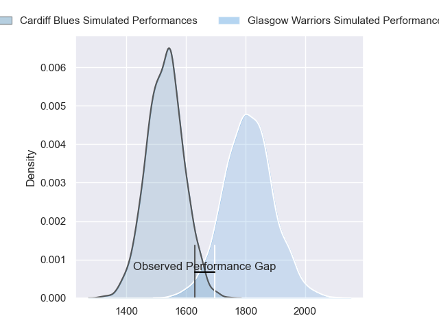
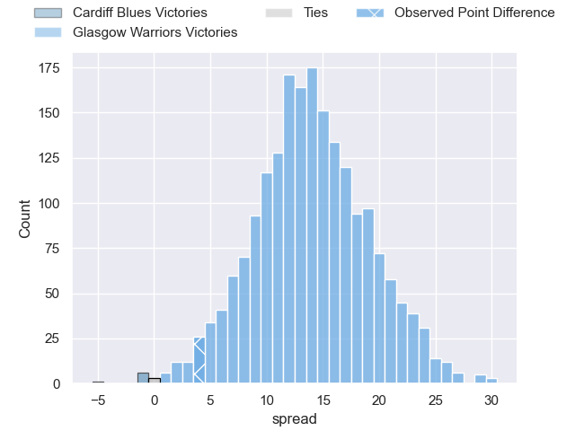
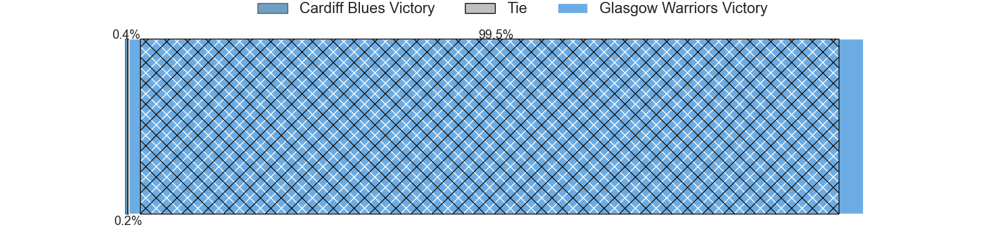
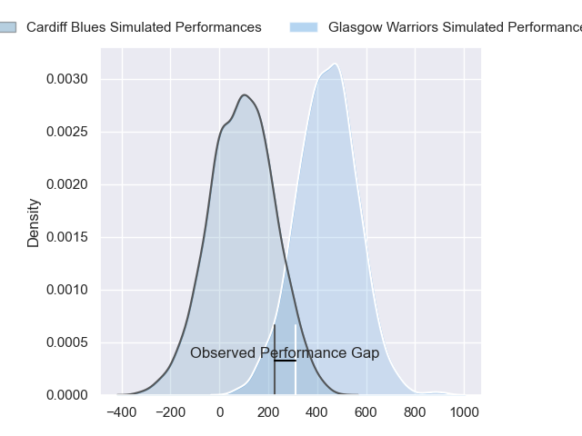
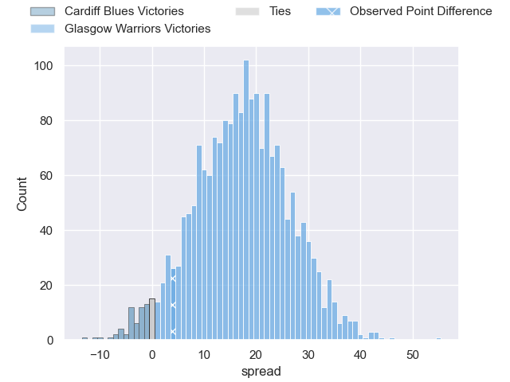
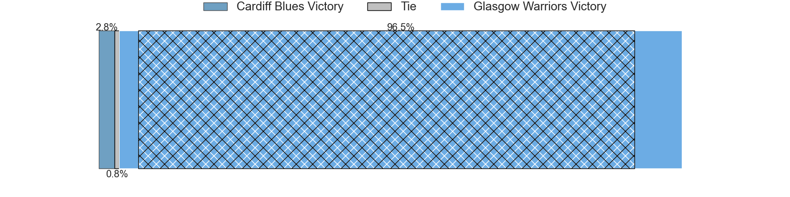

---  
layout: page  
title: Cardiff Blues at Glasgow Warriors; 13-17  
date: 2024-03-22 18:00:00 -0500  
categories: "United Rugby Championship 2023" match review  
---
# Cardiff Blues at Glasgow Warriors; 13-17

# Club Level Predictions

The first set of predictions treats a club as the smallest object, as the club develops its members, organizes a gameplan, and deploys its players as needed for each match. This club model has a prediction of 0.827, which translates to predicting Glasgow Warriors to win by 13.8.

Our Over/Under is 55.5 - and combined with the spread above, we have a predicted scoreline of 21 to 35

Each club has a rating and a rating deviation (similar to a Glicko rating), and expected performances can be generated. This allows for simulated matches and spreads like the ones below.
## Projected Performances - Club Model

## Projected Spreads - Club Model

## Projected Results - Club Model

# Player Level Predictions - Version 2

Treating teams instead as an entity made up of the currently active players, I have ratings for each player in an altogether different system. These can be combined to form team ratings once teamsheets are announced, weighting starters a bit higher than the reserves. After the match is played, players can be weighted by their minutes on the field, allowing for an accurate measure of the team's composition. With these compiled team ratings, we can make predictions, measure inaccuracy, and update the individual player ratings.
## Prediction without Player Minutes: Glasgow Warriors by 19.6

Glasgow Warriors by 13.2 on a neutral pitch

## Projected Performances - Player Model

## Projected Spreads - Player Model

## Projected Results - Player Model

|   Away Minutes | Away Player        |   Away Percentile |   Number |   Home Percentile | Home Player           |   Home Minutes |
|---------------:|:-------------------|------------------:|---------:|------------------:|:----------------------|---------------:|
|             80 | Rhys Carré         |             13.23 |        1 |             43.57 | Nathan McBeth         |             77 |
|             53 | Liam Belcher       |             57.67 |        2 |             25.83 | Johnny Matthews       |             77 |
|             66 | Will Davies-King   |             27.79 |        3 |             92.25 | Lucio Sordoni         |             56 |
|             56 | Shane Lewis-Hughes |             10.07 |        4 |             54.37 | Max Williamson        |             80 |
|             80 | Teddy Williams     |             23.18 |        5 |             54.25 | Alex Samuel           |             51 |
|             80 | Ben Donnell        |             78.47 |        6 |             46.96 | Euan Ferrie           |             77 |
|             80 | Thomas Young       |             88.77 |        7 |             95.65 | Matt Fagerson         |             51 |
|             53 | Mackenzie Martin   |             29.63 |        8 |             38.02 | Jack Dempsey          |             80 |
|             80 | Ellis Bevan        |             50.31 |        9 |             70.48 | Jamie Dobie           |             80 |
|             80 | Tinus de Beer      |             55.58 |       10 |             74.87 | Duncan Weir           |             80 |
|             80 | Aled Summerhill    |              7.42 |       11 |             96.46 | Kyle Steyn            |             80 |
|             80 | Ben Thomas         |             47.02 |       12 |             46.54 | Tom Jordan            |             80 |
|             41 | Max Clark          |             84.69 |       13 |             89.43 | Stafford McDowall     |             80 |
|             80 | Mason Grady        |             77.52 |       14 |             97.67 | Sebastian Cancelliere |             51 |
|             80 | Jacob Beetham      |             45.21 |       15 |             39.07 | Josh McKay            |             80 |
|             27 | Efan Daniel        |             19.61 |       16 |            nan    | Gregor Hiddleston     |              3 |
|              0 | Rhys Barratt       |            nan    |       17 |             80.15 | Allan Dell            |              3 |
|             14 | Ciaran Parker      |            nan    |       18 |             96.5  | Oli Kebble            |             24 |
|             24 | Seb Davies         |             17.72 |       19 |             63.47 | Sintu Manjezi         |              3 |
|             27 | Ellis Jenkins      |             30.36 |       20 |             19.13 | Ally Miller           |             29 |
|              0 | Matthew Aubrey     |            nan    |       21 |             96.79 | Henco Venter          |             29 |
|             39 | Uilisi Halaholo    |             91.74 |       22 |             99.38 | George Horne          |             29 |
|              0 | Owen Lane          |              2.1  |       23 |            nan    | Duncan Munn           |              0 |

