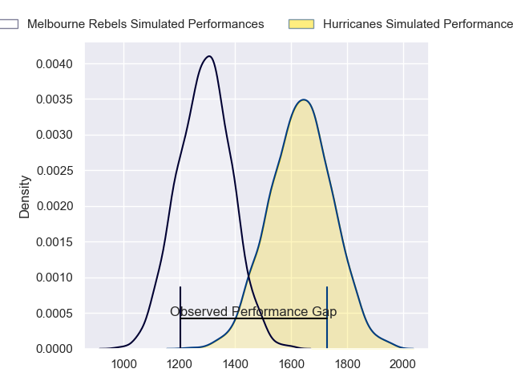
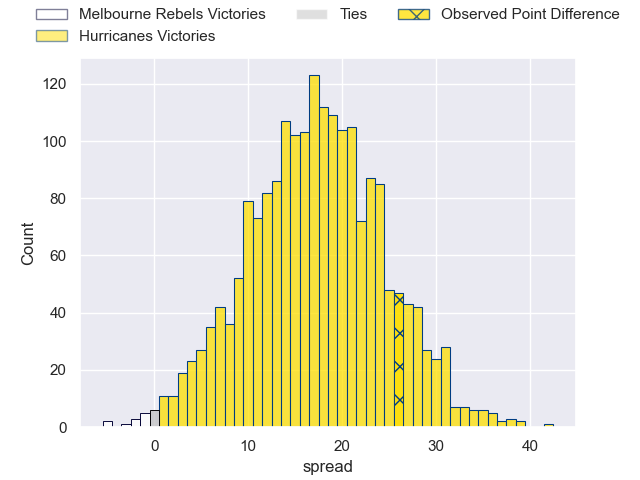
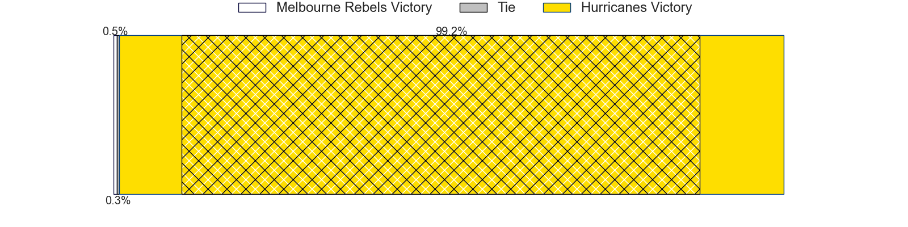
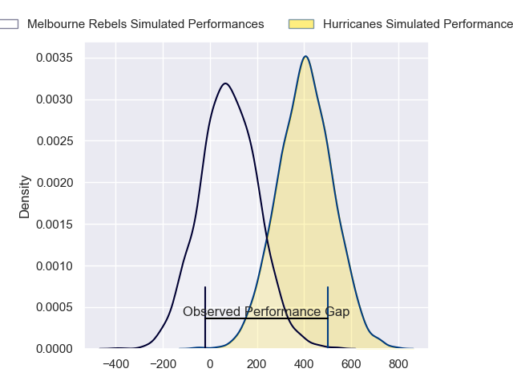
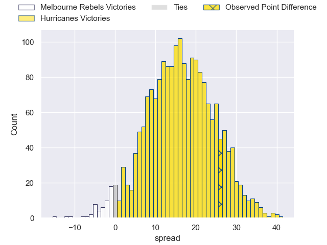
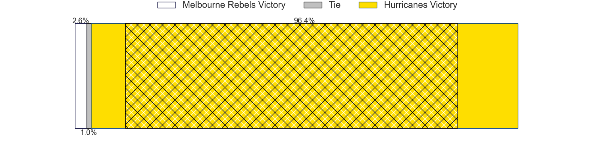

---  
layout: page  
title: Melbourne Rebels at Hurricanes; 28-54  
date: 2024-03-22 18:00:00 -0500  
categories: "Super Rugby Pacific 2024" match review  
---
# Melbourne Rebels at Hurricanes; 28-54

# Club Level Predictions

The first set of predictions treats a club as the smallest object, as the club develops its members, organizes a gameplan, and deploys its players as needed for each match. This club model has a prediction of 0.873, which translates to predicting Hurricanes to win by 17.5.

Our Over/Under is 54.5 - and combined with the spread above, we have a predicted scoreline of 18 to 36

Each club has a rating and a rating deviation (similar to a Glicko rating), and expected performances can be generated. This allows for simulated matches and spreads like the ones below.
## Projected Performances - Club Model

## Projected Spreads - Club Model

## Projected Results - Club Model

# Player Level Predictions - Version 2

Treating teams instead as an entity made up of the currently active players, I have ratings for each player in an altogether different system. These can be combined to form team ratings once teamsheets are announced, weighting starters a bit higher than the reserves. After the match is played, players can be weighted by their minutes on the field, allowing for an accurate measure of the team's composition. With these compiled team ratings, we can make predictions, measure inaccuracy, and update the individual player ratings.
## Prediction without Player Minutes: Hurricanes by 17.4

Hurricanes by 13.0 on a neutral pitch

## Projected Performances - Player Model

## Projected Spreads - Player Model

## Projected Results - Player Model

|   Away Minutes | Away Player          |   Away Percentile |   Number |   Home Percentile | Home Player         |   Home Minutes |
|---------------:|:---------------------|------------------:|---------:|------------------:|:--------------------|---------------:|
|             51 | Isaac Aedo Kailea    |             44.9  |        1 |             88    | Pouri Rakete-Stones |             51 |
|             47 | Jordan Uelese        |             33.59 |        2 |             32.23 | James O'Reilly      |             61 |
|             41 | Sam Talakai          |             20.79 |        3 |             93.48 | Tyrel Lomax         |             51 |
|             51 | Angelo Smith         |             29.73 |        4 |             73.06 | Justin Sangster     |             69 |
|             80 | Lukhan Salakaia-Loto |              7.65 |        5 |             80.46 | Caleb Delany        |             64 |
|             80 | Tuaina Taii Tualima  |             56.59 |        6 |             46.39 | Brad Shields        |             80 |
|             80 | Vaiolini Ekuasi      |             19.93 |        7 |             91.87 | Du'Plessis Kirifi   |             80 |
|             72 | Rob Leota            |             13.09 |        8 |             80    | Devan Flanders      |             64 |
|             53 | Ryan Louwrens        |             94.59 |        9 |             97.51 | TJ Perenara         |             57 |
|             80 | Carter Gordon        |             48.48 |       10 |             63.96 | Aidan Morgan        |             80 |
|             80 | Glen Vaihu           |             12.18 |       11 |             86.82 | Salesi Rayasi       |             80 |
|             80 | David Feliuai        |             36.45 |       12 |             96.23 | Jordie Barrett      |             80 |
|             55 | Lukas Ripley         |             51.52 |       13 |             42.89 | Ngatungane Punivai  |             57 |
|             80 | Lachie Anderson      |             34.66 |       14 |             47.62 | Dan Sinkinson       |             80 |
|             40 | Andrew Kellaway      |             77.15 |       15 |             15.48 | Harry Godfrey       |             71 |
|             33 | Alex Mafi            |             49.9  |       16 |             96.5  | Asafo Aumua         |             19 |
|             29 | Cabous Eloff         |             17.67 |       17 |             87.33 | Tevita Mafileo      |             29 |
|             39 | Taniela Tupou        |             97.83 |       18 |             62.1  | Pasilio Tosi        |             29 |
|             29 | Josh Canham          |             57.89 |       19 |             88.59 | James Tucker        |             27 |
|              8 | Daniel Maiava        |            nan    |       20 |              1.73 | Brayden Iose        |             16 |
|             27 | Jack Maunder         |             39.29 |       21 |            nan    | Richard Judd        |             23 |
|             40 | Mason Gordon         |            nan    |       22 |             85.18 | Riley Higgins       |             23 |
|             25 | Nick Jooste          |             39.98 |       23 |             80.95 | Joshua Moorby       |              9 |

