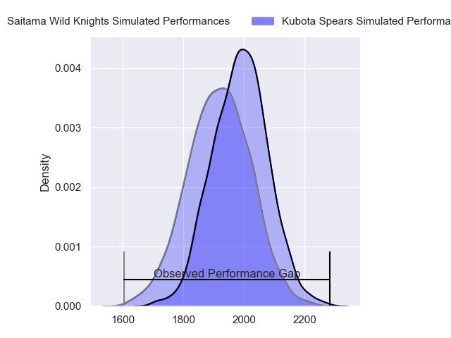
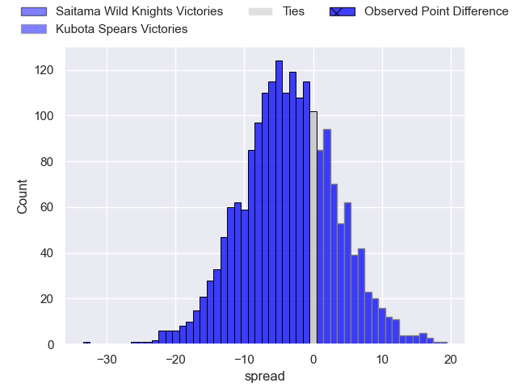
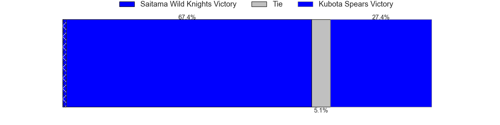
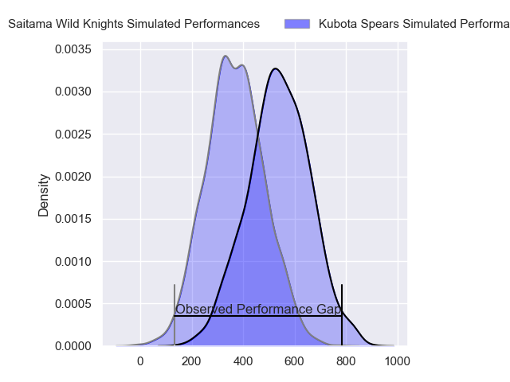
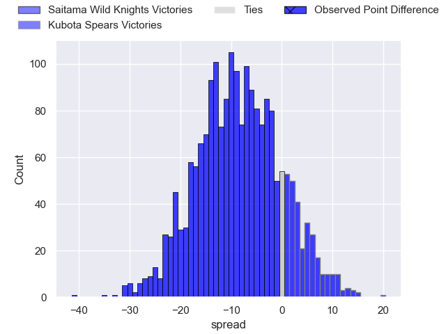
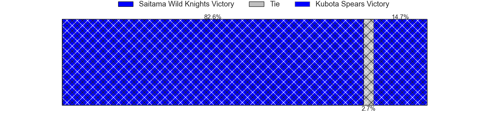

---  
layout: page  
title: Saitama Wild Knights at Kubota Spears; 55-22  
date: 2024-03-22 18:00:00 -0500  
categories: "Japan Rugby League One 2023" match review  
---
# Saitama Wild Knights at Kubota Spears; 55-22

# Club Level Predictions

The first set of predictions treats a club as the smallest object, as the club develops its members, organizes a gameplan, and deploys its players as needed for each match. This club model has a prediction of 0.401, which translates to predicting Saitama Wild Knights to win by 3.6.

Our Over/Under is 55.5 - and combined with the spread above, we have a predicted scoreline of 30 to 26

Each club has a rating and a rating deviation (similar to a Glicko rating), and expected performances can be generated. This allows for simulated matches and spreads like the ones below.
## Projected Performances - Club Model

## Projected Spreads - Club Model

## Projected Results - Club Model

# Player Level Predictions - Version 2

Treating teams instead as an entity made up of the currently active players, I have ratings for each player in an altogether different system. These can be combined to form team ratings once teamsheets are announced, weighting starters a bit higher than the reserves. After the match is played, players can be weighted by their minutes on the field, allowing for an accurate measure of the team's composition. With these compiled team ratings, we can make predictions, measure inaccuracy, and update the individual player ratings.
## Prediction without Player Minutes: Saitama Wild Knights by 6.7

Saitama Wild Knights by 9.7 on a neutral pitch

## Projected Performances - Player Model

## Projected Spreads - Player Model

## Projected Results - Player Model

|   Away Minutes | Away Player       |   Away Percentile |   Number |   Home Percentile | Home Player         |   Home Minutes |
|---------------:|:------------------|------------------:|---------:|------------------:|:--------------------|---------------:|
|             48 | Craig Millar      |             62.95 |        1 |             82.8  | Kota Kaishi         |             48 |
|             51 | Atsushi Sakate    |             86.02 |        2 |             99.81 | Dane Coles          |             55 |
|             40 | Asaeli Ai Valu    |             96.88 |        3 |             85.54 | Kengo Kitagawa      |             48 |
|             80 | Liam Mitchell     |             53.4  |        4 |             86.04 | Uwe Helu            |             48 |
|             55 | Lood de Jager     |             95.51 |        5 |             72.69 | David Bulbring      |             55 |
|             55 | Ben Gunter        |             95.3  |        6 |             71.02 | Finau Tupa          |             61 |
|             80 | Lachlan Boshier   |             98.4  |        7 |             87.86 | Lappies Labuschagne |             80 |
|             80 | Jack Cornelsen    |             93.83 |        8 |             73.33 | Takeo Suenaga       |             80 |
|             65 | Taiki Koyama      |             93.97 |        9 |             27.65 | Shinobu Fujiwara    |             80 |
|             62 | Rikiya Matsuda    |             98.22 |       10 |             44.42 | Tomoki Kishioka     |             80 |
|             55 | Koki Takeyama     |             98.01 |       11 |             40.09 | Hiroyuki Yamasaki   |             80 |
|             80 | Damian de Allende |             99.27 |       12 |             57.59 | Harumichi Tatekawa  |             80 |
|             80 | Dylan Riley       |             98.3  |       13 |             38.52 | Rikus Pretorius     |             55 |
|             80 | Tomoki Osada      |             61.35 |       14 |             83.06 | Koga Nezuka         |             48 |
|             80 | Kyohei Yamasawa   |             71.99 |       15 |             18.43 | Yuhei Shimada       |             80 |
|             40 | Taiki Fujii       |             78.83 |       16 |             50    | Yota Kaminori       |             32 |
|             32 | Daniel Perez      |             39.51 |       17 |              4    | JD Schickerling     |             32 |
|             29 | Shota Horie       |             93.2  |       18 |            nan    | Keijiro Tamefusa    |             32 |
|             25 | Mark Abbott       |             18.81 |       19 |             72.31 | Halatoa Vailea      |             32 |
|             25 | Marika Koroibete  |             94.13 |       20 |            nan    | Hayate Era          |             25 |
|             25 | Itsuki Onishi     |             91.64 |       21 |             98.3  | Ruan Botha          |             25 |
|             18 | Takuya Yamasawa   |             93.37 |       22 |             77.89 | Sione Teaupa        |             25 |
|             15 | Keisuke Uchida    |             97.92 |       23 |            nan    | Asipeli Moala       |             19 |

