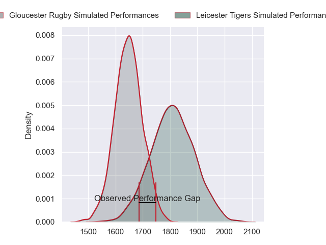
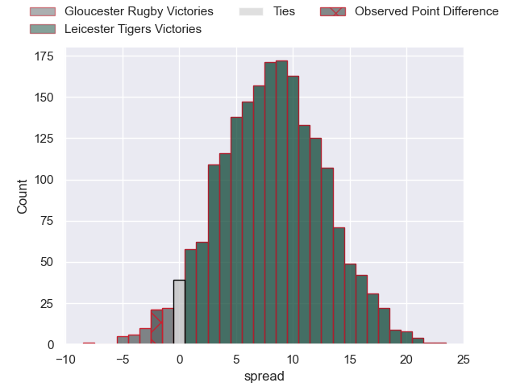
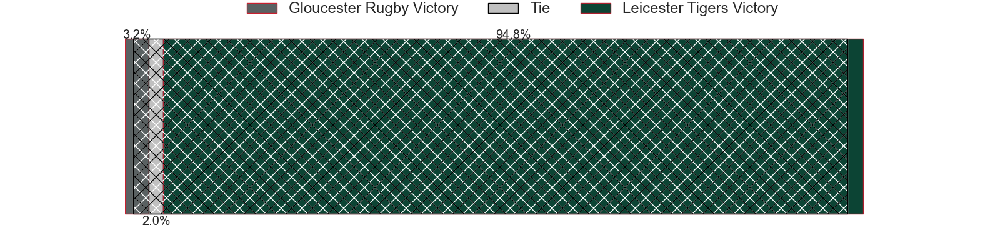
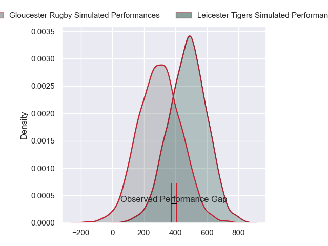
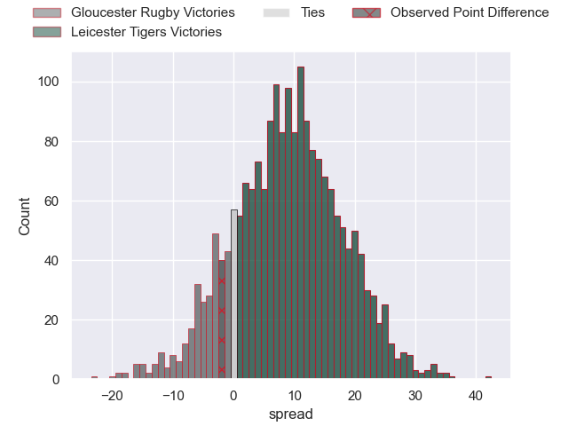
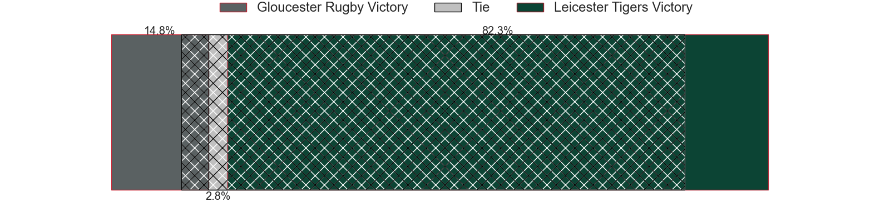

---  
layout: page  
title: Gloucester Rugby at Leicester Tigers; 27-25  
date: 2024-03-22 18:00:00 -0500  
categories: "Gallagher Premiership 2023" match review  
---
# Gloucester Rugby at Leicester Tigers; 27-25

# Club Level Predictions

The first set of predictions treats a club as the smallest object, as the club develops its members, organizes a gameplan, and deploys its players as needed for each match. This club model has a prediction of 0.713, which translates to predicting Leicester Tigers to win by 8.0.

Our Over/Under is 45.5 - and combined with the spread above, we have a predicted scoreline of 19 to 27

Each club has a rating and a rating deviation (similar to a Glicko rating), and expected performances can be generated. This allows for simulated matches and spreads like the ones below.
## Projected Performances - Club Model

## Projected Spreads - Club Model

## Projected Results - Club Model

# Player Level Predictions - Version 2

Treating teams instead as an entity made up of the currently active players, I have ratings for each player in an altogether different system. These can be combined to form team ratings once teamsheets are announced, weighting starters a bit higher than the reserves. After the match is played, players can be weighted by their minutes on the field, allowing for an accurate measure of the team's composition. With these compiled team ratings, we can make predictions, measure inaccuracy, and update the individual player ratings.
## Prediction without Player Minutes: Leicester Tigers by 10.7

Leicester Tigers by 2.6 on a neutral pitch

## Projected Performances - Player Model

## Projected Spreads - Player Model

## Projected Results - Player Model

|   Away Minutes | Away Player         |   Away Percentile |   Number |   Home Percentile | Home Player           |   Home Minutes |
|---------------:|:--------------------|------------------:|---------:|------------------:|:----------------------|---------------:|
|             48 | Mayco Vivas         |              9.83 |        1 |             90.64 | James Cronin          |             46 |
|             80 | Sebastian Blake     |             63.69 |        2 |             94.17 | Julian Montoya        |             80 |
|             80 | Kirill Gotovtsev    |             93.1  |        3 |             37.71 | Dan Cole              |             51 |
|             73 | Freddie Clarke      |             87.38 |        4 |             76.09 | Harry Wells           |             80 |
|             54 | Cameron Jordan      |             92.6  |        5 |             78.88 | Ollie Chessum         |             80 |
|             68 | Ruan Ackermann      |             94.27 |        6 |             86.71 | Hanro Liebenberg      |             80 |
|             80 | Jack Clement        |             56.01 |        7 |             87.29 | Tommy Reffell         |             61 |
|             80 | Zach Mercer         |             74.32 |        8 |             80.74 | Jasper Wiese          |             79 |
|             80 | Stephen Varney      |             42.41 |        9 |             79.63 | Ben Youngs            |             51 |
|             80 | Santiago Carreras   |             91.88 |       10 |             25.13 | Jamie Shillcock       |             80 |
|             69 | Josh Hathaway       |             55.04 |       11 |             67    | Ollie Hassell-Collins |             80 |
|             68 | Sebastien Atkinson  |             43.01 |       12 |             34.99 | Solomone Kata         |             61 |
|             80 | Max Llewellyn       |             90.52 |       13 |             80.32 | Dan Kelly             |             80 |
|             80 | Jonny May           |             71.1  |       14 |             73.31 | Josh Bassett          |             80 |
|             80 | Lloyd Evans         |             71.25 |       15 |             35.87 | Freddie Steward       |             80 |
|              0 | Adam McBurney       |            nan    |       16 |            nan    | Finn Theobald-Thomas  |              0 |
|              0 | Harry Elrington     |             12.95 |       17 |             38.94 | James Whitcombe       |             34 |
|             32 | Jamal Ford-Robinson |             28.64 |       18 |             91.3  | Joe Heyes             |             29 |
|              7 | Arthur Clark        |            nan    |       19 |              2.31 | Kyle Hatherell        |              1 |
|             12 | Freddie Thomas      |            nan    |       20 |             32.99 | Olly Cracknell        |             19 |
|             26 | Albert Tuisue       |             92.33 |       21 |             75.47 | Jack van Poortvliet   |             29 |
|              0 | Charlie Chapman     |             36.8  |       22 |            nan    | Kieran Wilkinson      |              0 |
|             23 | Chris Harris        |             88.7  |       23 |            nan    | Phil Cokanasiga       |             19 |

