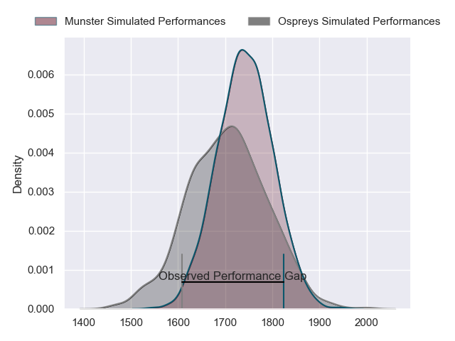
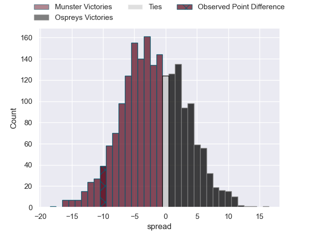
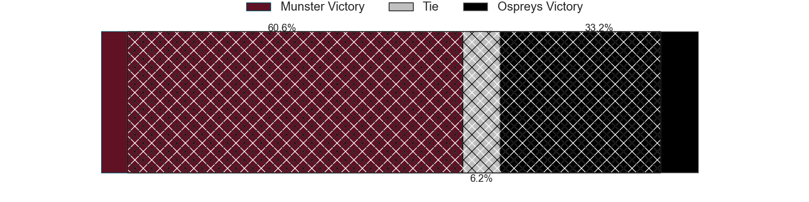
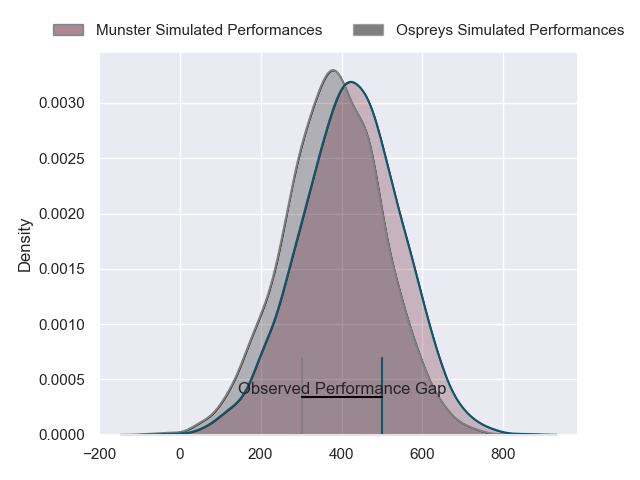
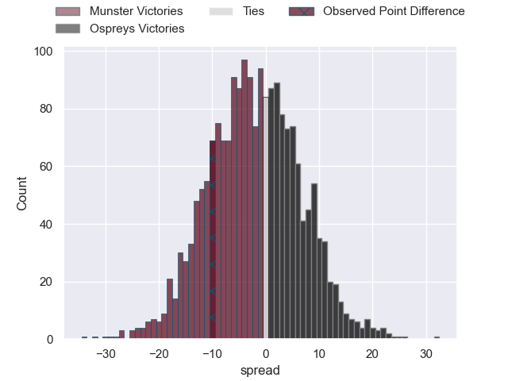

---  
layout: page  
title: Munster at Ospreys; 27-17  
date: 2024-03-22 18:00:00 -0500  
categories: "United Rugby Championship 2023" match review  
---
# Munster at Ospreys; 27-17

# Club Level Predictions

The first set of predictions treats a club as the smallest object, as the club develops its members, organizes a gameplan, and deploys its players as needed for each match. This club model has a prediction of 0.452, which translates to predicting Munster to win by 1.7.

Our Over/Under is 37.5 - and combined with the spread above, we have a predicted scoreline of 20 to 18

Each club has a rating and a rating deviation (similar to a Glicko rating), and expected performances can be generated. This allows for simulated matches and spreads like the ones below.
## Projected Performances - Club Model

## Projected Spreads - Club Model

## Projected Results - Club Model

# Player Level Predictions - Version 2

Treating teams instead as an entity made up of the currently active players, I have ratings for each player in an altogether different system. These can be combined to form team ratings once teamsheets are announced, weighting starters a bit higher than the reserves. After the match is played, players can be weighted by their minutes on the field, allowing for an accurate measure of the team's composition. With these compiled team ratings, we can make predictions, measure inaccuracy, and update the individual player ratings.
## Prediction without Player Minutes: Munster by 1.0

Munster by 6.8 on a neutral pitch

## Projected Performances - Player Model

## Projected Spreads - Player Model

## Projected Results - Player Model

|   Away Minutes | Away Player     |   Away Percentile |   Number |   Home Percentile | Home Player            |   Home Minutes |
|---------------:|:----------------|------------------:|---------:|------------------:|:-----------------------|---------------:|
|             45 | Josh Wycherley  |             41.02 |        1 |             49.72 | Nicky Smith            |             32 |
|             75 | Niall Scannell  |             92.04 |        2 |             51.07 | Sam Parry              |             76 |
|             60 | John Ryan       |             93.38 |        3 |             66.07 | Tom Botha              |             60 |
|             81 | Thomas Ahern    |             64.44 |        4 |             49.51 | James Ratti            |             81 |
|             60 | RG Snyman       |             99.15 |        5 |             87.26 | Rhys Davies            |             75 |
|             64 | John Hodnett    |             73.77 |        6 |             40.78 | Jeandre Rudolph        |             52 |
|             81 | Alex Kendellen  |             75.14 |        7 |             97.82 | Justin Tipuric         |             81 |
|             81 | Gavin Coombes   |             80.99 |        8 |              3.7  | Morgan Morris          |             81 |
|             72 | Craig Casey     |             85.24 |        9 |             62.37 | Reuben Morgan-Williams |             76 |
|             72 | Joey Carbery    |             73.86 |       10 |             90.61 | Owen Williams          |             81 |
|             81 | Shane Daly      |             96.01 |       11 |              4.87 | Keelan Giles           |             81 |
|             76 | Rory Scannell   |             94.9  |       12 |             76.79 | Keiran Williams        |             81 |
|             81 | Antoine Frisch  |             90.77 |       13 |             31.35 | Evardi Boshoff         |             68 |
|             81 | Sean O'Brien    |             26.58 |       14 |             98.23 | Alex Cuthbert          |             81 |
|             81 | Mike Haley      |             88.45 |       15 |             34.15 | Iestyn Hopkins         |             41 |
|              6 | Eoghan Clarke   |            nan    |       16 |            nan    | Lewis Lloyd            |              5 |
|             36 | Jeremy Loughman |             94.8  |       17 |            nan    | Garyn Phillips         |             21 |
|             21 | Stephen Archer  |             98.39 |       18 |             83.36 | Rhys Henry             |             49 |
|             21 | Jack O'Donoghue |            nan    |       19 |            nan    | Huw Owen-Sutton        |              6 |
|             17 | Ruadhan Quinn   |             51.78 |       20 |             82.7  | Harri Deaves           |             29 |
|              9 | Ethan Coughlan  |            nan    |       21 |            nan    | Cam Jones              |              5 |
|              9 | Tony Butler     |             38.83 |       22 |             20.39 | Jack Walsh             |             40 |
|              5 | Shay McCarthy   |            nan    |       23 |             97.21 | Owen Watkin            |             13 |

