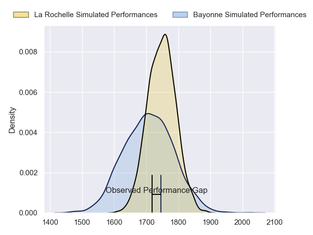
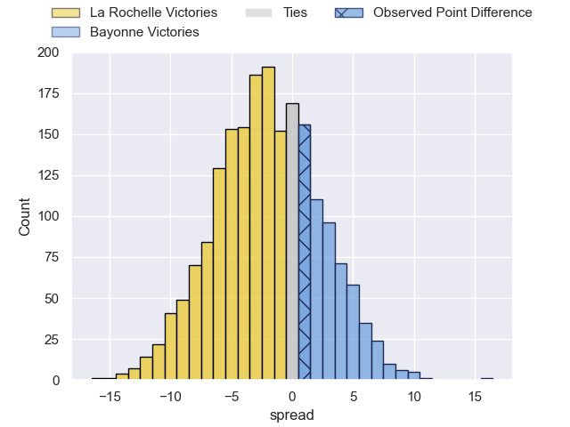
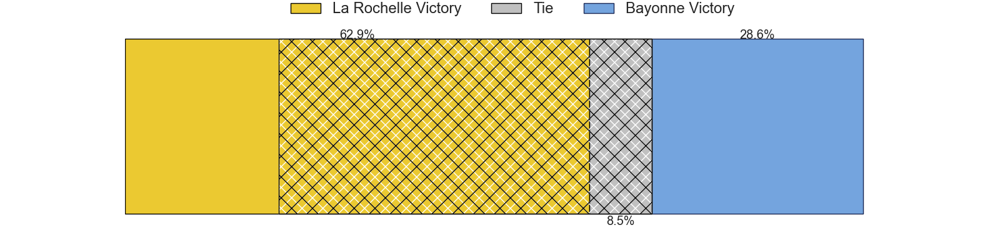
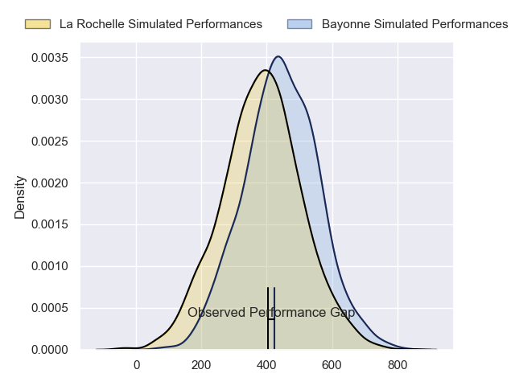
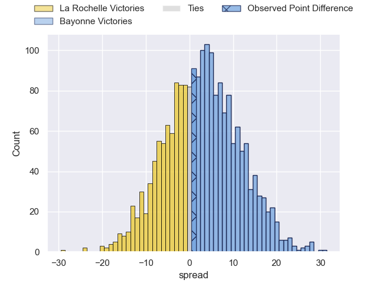
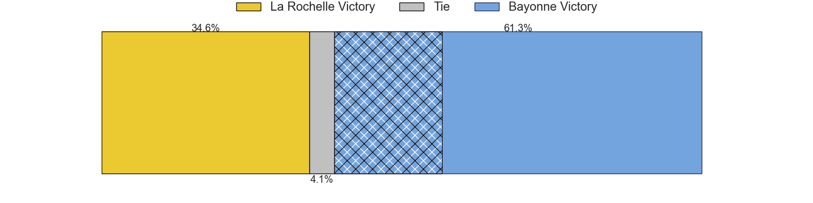

---  
layout: page  
title: La Rochelle at Bayonne; 12-13  
date: 2024-03-23 18:00:00 -0500  
categories: "Top 14 Orange 2023" match review  
---
# La Rochelle at Bayonne; 12-13

# Club Level Predictions

The first set of predictions treats a club as the smallest object, as the club develops its members, organizes a gameplan, and deploys its players as needed for each match. This club model has a prediction of 0.443, which translates to predicting La Rochelle to win by 2.0.

Our Over/Under is 44.5 - and combined with the spread above, we have a predicted scoreline of 23 to 21

Each club has a rating and a rating deviation (similar to a Glicko rating), and expected performances can be generated. This allows for simulated matches and spreads like the ones below.
## Projected Performances - Club Model

## Projected Spreads - Club Model

## Projected Results - Club Model

# Player Level Predictions - Version 2

Treating teams instead as an entity made up of the currently active players, I have ratings for each player in an altogether different system. These can be combined to form team ratings once teamsheets are announced, weighting starters a bit higher than the reserves. After the match is played, players can be weighted by their minutes on the field, allowing for an accurate measure of the team's composition. With these compiled team ratings, we can make predictions, measure inaccuracy, and update the individual player ratings.
## Prediction without Player Minutes: Bayonne by 5.0

La Rochelle by 3.1 on a neutral pitch

## Projected Performances - Player Model

## Projected Spreads - Player Model

## Projected Results - Player Model

|   Away Minutes | Away Player           |   Away Percentile |   Number |   Home Percentile | Home Player           |   Home Minutes |
|---------------:|:----------------------|------------------:|---------:|------------------:|:----------------------|---------------:|
|             48 | Louis Penverne        |             46.12 |        1 |             63.14 | Matis Perchaud        |             45 |
|             50 | Tolu Latu             |             90.1  |        2 |             90.87 | Facundo Bosch         |             63 |
|             50 | Georges-Henri Colombe |              5.48 |        3 |             39.6  | Tevita Tatafu         |             63 |
|             64 | Thomas Lavault        |             90.41 |        4 |             90.53 | Arthur Iturria        |             45 |
|             74 | Ultan Dillane         |             80.22 |        5 |              4.61 | Konstantin Mikautadze |             52 |
|             74 | Judicael Cancoriet    |             41.35 |        6 |             47.19 | Pierre Huguet         |             80 |
|             52 | Paul Boudehent        |             13.75 |        7 |             92.55 | Baptiste Heguy        |             80 |
|             80 | Gregory Alldritt      |             99.75 |        8 |             83.7  | Uzair Cassiem         |             53 |
|             50 | Thomas Berjon         |             82.74 |        9 |             93.76 | Maxime Machenaud      |             52 |
|             80 | Antoine Hastoy        |             61.68 |       10 |             95.18 | Camille Lopez         |             80 |
|             80 | Dillyn Leyds          |             99.22 |       11 |             90.81 | Remy Baget            |             80 |
|             64 | Jules Favre           |             82.38 |       12 |             57.47 | Federico Mori         |             80 |
|             63 | Ulupano Seuteni       |             71.57 |       13 |             52.37 | Arnaud Erbinartegaray |             80 |
|             80 | Jack Nowell           |             97.45 |       14 |             73.09 | Mateo Carreras        |             80 |
|             80 | Brice Dulin           |             99.26 |       15 |             27.03 | Cheikh Tiberghien     |             80 |
|             30 | Quentin Lespiaucq     |             74.37 |       16 |             85.24 | Thomas Acquier        |             17 |
|             36 | Joel Sclavi           |             88.09 |       17 |             58.22 | Swan Cormenier        |             35 |
|             22 | Remi Picquette        |             61.77 |       18 |             75.24 | Lucas Paulos          |             35 |
|             28 | Matthias Haddad       |             45.13 |       19 |             95.53 | Remi Bourdeau         |             28 |
|             17 | Yoan Tanga            |             69.14 |       20 |            100    | Rodrigo Bruni         |             27 |
|             30 | Lucas Zamora          |            nan    |       21 |            nan    | Guillaume Rouet       |             28 |
|             22 | Ihaia West            |             51.15 |       22 |            nan    | Tom Spring            |              0 |
|             26 | Alexandre Kuntelia    |             54.44 |       23 |              3.59 | Pieter Scholtz        |             17 |

