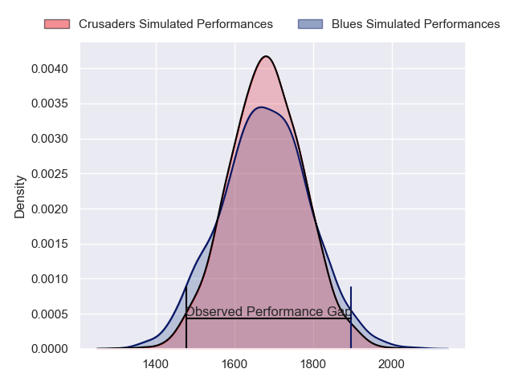
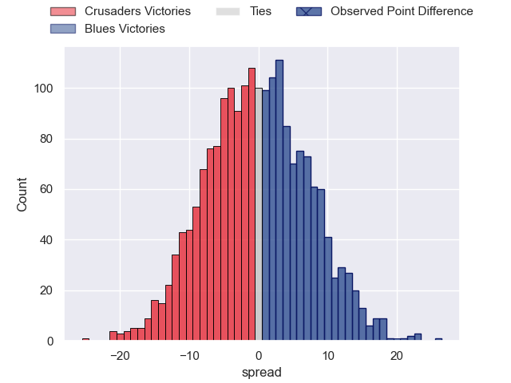
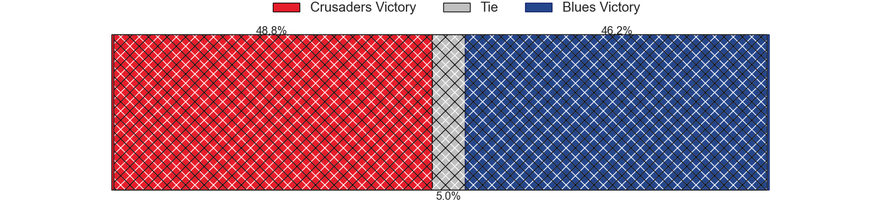
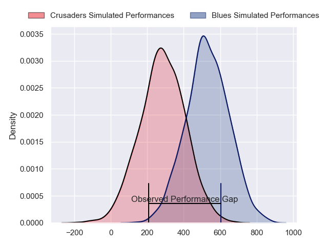
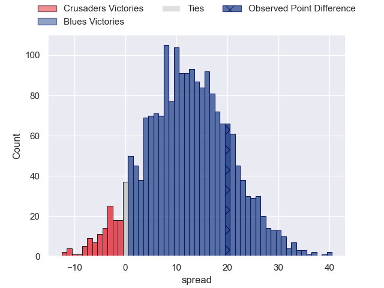
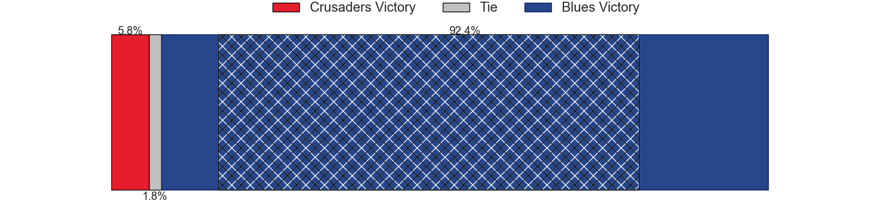

---  
layout: page  
title: Crusaders at Blues; 6-26  
date: 2024-03-23 18:00:00 -0500  
categories: "Super Rugby Pacific 2024" match review  
---
# Crusaders at Blues; 6-26

# Club Level Predictions

The first set of predictions treats a club as the smallest object, as the club develops its members, organizes a gameplan, and deploys its players as needed for each match. This club model has a prediction of 0.498, which translates to predicting Crusaders to win by 0.1.

Our Over/Under is 45.5 - and combined with the spread above, we have a predicted scoreline of 23 to 23

Each club has a rating and a rating deviation (similar to a Glicko rating), and expected performances can be generated. This allows for simulated matches and spreads like the ones below.
## Projected Performances - Club Model

## Projected Spreads - Club Model

## Projected Results - Club Model

# Player Level Predictions - Version 2

Treating teams instead as an entity made up of the currently active players, I have ratings for each player in an altogether different system. These can be combined to form team ratings once teamsheets are announced, weighting starters a bit higher than the reserves. After the match is played, players can be weighted by their minutes on the field, allowing for an accurate measure of the team's composition. With these compiled team ratings, we can make predictions, measure inaccuracy, and update the individual player ratings.
## Prediction without Player Minutes: Blues by 14.8

Blues by 10.3 on a neutral pitch

## Projected Performances - Player Model

## Projected Spreads - Player Model

## Projected Results - Player Model

|   Away Minutes | Away Player       |   Away Percentile |   Number |   Home Percentile | Home Player        |   Home Minutes |
|---------------:|:------------------|------------------:|---------:|------------------:|:-------------------|---------------:|
|             56 | George Bower      |              5.67 |        1 |             98.2  | Ofa Tu'ungafasi    |             52 |
|             60 | George Bell       |             11.07 |        2 |             69.71 | Ricky Riccitelli   |             73 |
|             56 | Fletcher Newell   |              1.23 |        3 |             95.65 | Angus Ta'avao      |             52 |
|             52 | Tahlor Cahill     |             38.23 |        4 |             91.5  | Patrick Tuipulotu  |             80 |
|             80 | Jamie Hannah      |             27.31 |        5 |             93.81 | Laghlan McWhannell |             66 |
|             80 | Dom Gardiner      |             28.41 |        6 |             93.93 | Akira Ioane        |             57 |
|             73 | Tom Christie      |             55.78 |        7 |             98.63 | Dalton Papalii     |             80 |
|             80 | Cullen Grace      |             64.94 |        8 |             88.64 | Hoskins Sotutu     |             80 |
|             55 | Willi Heinz       |             90.64 |        9 |             64.66 | Finlay Christie    |             73 |
|             80 | Riley Hohepa      |              8.38 |       10 |             94.16 | Stephen Perofeta   |             80 |
|             71 | Macca Springer    |             29.46 |       11 |             20.82 | Caleb Clarke       |             64 |
|             47 | David Havili      |             95.14 |       12 |             97.69 | Bryce Heem         |             80 |
|             80 | Levi Aumua        |             61.85 |       13 |             57.96 | AJ Lam             |             80 |
|             80 | Sevu Reece        |             75.97 |       14 |             47.51 | Mark Tele'a        |             80 |
|             58 | Chay Fihaki       |             11.79 |       15 |             78.62 | Zarn Sullivan      |             41 |
|             20 | Ioane Moananu     |            nan    |       16 |             73.79 | Soane Vikena       |              7 |
|             24 | Joe Moody         |             76.65 |       17 |             49.81 | Josh Fusitu'a      |             28 |
|             24 | Seb Calder        |            nan    |       18 |             50.47 | Marcel Renata      |             28 |
|              7 | Fletcher Anderson |            nan    |       19 |             72.33 | Josh Beehre        |             14 |
|             28 | Corey Kellow      |             60.6  |       20 |             47.77 | Adrian Choat       |             23 |
|             25 | Noah Hotham       |             52.6  |       21 |             13.31 | Taufa Funaki       |              7 |
|             31 | Johnny McNicholl  |             64.86 |       22 |             88.46 | Harry Plummer      |             16 |
|             33 | Dallas McLeod     |             55.65 |       23 |             48.4  | Cole Forbes        |             39 |

