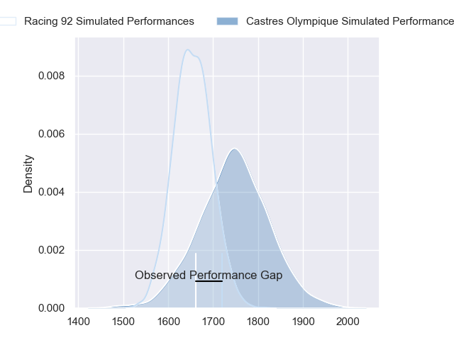
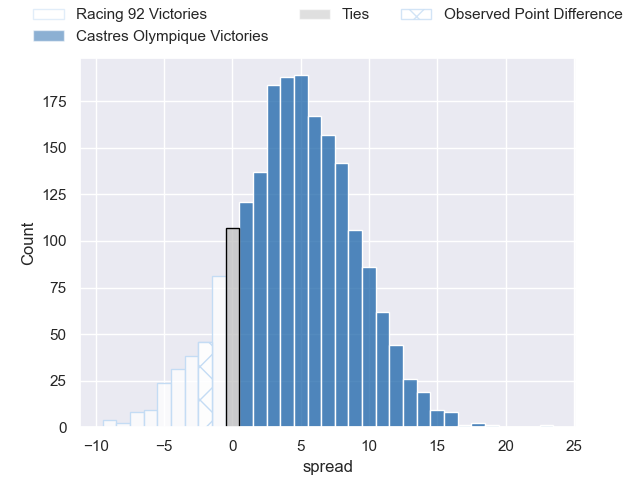
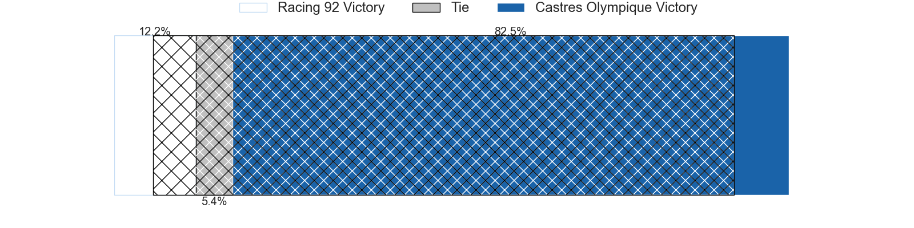
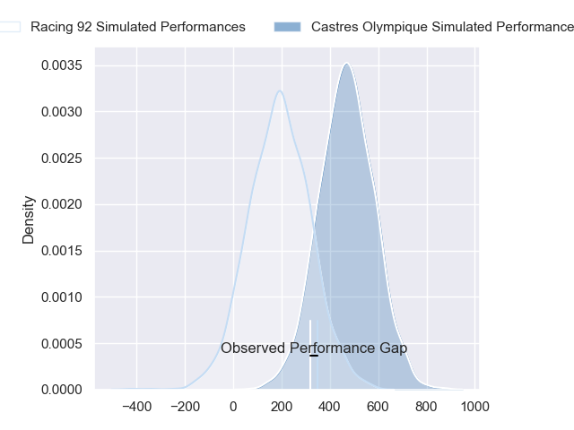
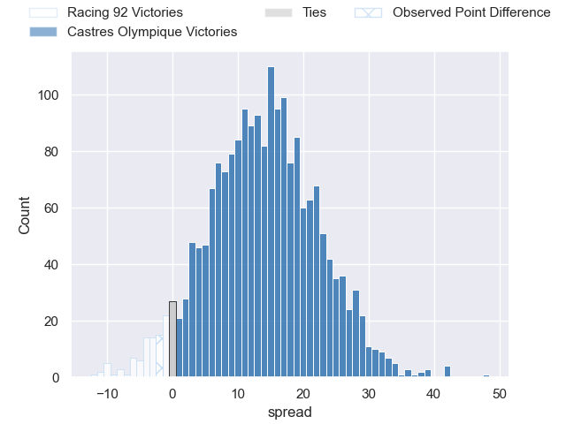
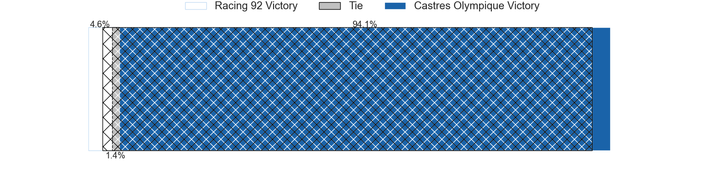

---  
layout: page  
title: Racing 92 at Castres Olympique; 23-21  
date: 2024-03-23 18:00:00 -0500  
categories: "Top 14 Orange 2023" match review  
---
# Racing 92 at Castres Olympique; 23-21

# Club Level Predictions

The first set of predictions treats a club as the smallest object, as the club develops its members, organizes a gameplan, and deploys its players as needed for each match. This club model has a prediction of 0.627, which translates to predicting Castres Olympique to win by 4.6.

Our Over/Under is 41.5 - and combined with the spread above, we have a predicted scoreline of 18 to 23

Each club has a rating and a rating deviation (similar to a Glicko rating), and expected performances can be generated. This allows for simulated matches and spreads like the ones below.
## Projected Performances - Club Model

## Projected Spreads - Club Model

## Projected Results - Club Model

# Player Level Predictions - Version 2

Treating teams instead as an entity made up of the currently active players, I have ratings for each player in an altogether different system. These can be combined to form team ratings once teamsheets are announced, weighting starters a bit higher than the reserves. After the match is played, players can be weighted by their minutes on the field, allowing for an accurate measure of the team's composition. With these compiled team ratings, we can make predictions, measure inaccuracy, and update the individual player ratings.
## Prediction without Player Minutes: Castres Olympique by 14.8

Castres Olympique by 6.9 on a neutral pitch

## Projected Performances - Player Model

## Projected Spreads - Player Model

## Projected Results - Player Model

|   Away Minutes | Away Player        |   Away Percentile |   Number |   Home Percentile | Home Player                |   Home Minutes |
|---------------:|:-------------------|------------------:|---------:|------------------:|:---------------------------|---------------:|
|             80 | Hassane Kolingar   |             16.73 |        1 |             53.5  | Lois Guerois-Galisson      |             49 |
|             67 | Camille Chat       |             92.23 |        2 |             35.92 | Loris Zarantonello         |             63 |
|             73 | Trevor Nyakane     |             59.74 |        3 |             53.12 | Henry Thomas               |             56 |
|             80 | Cameron Woki       |             85.8  |        4 |             94.42 | Leone Nakarawa             |             67 |
|             80 | Will Rowlands      |             25.24 |        5 |             73.91 | Tom Staniforth             |             80 |
|             73 | Ibrahim Diallo     |             13.4  |        6 |             35.51 | Mathieu Babillot           |             60 |
|             54 | Maxime Baudonne    |             55.1  |        7 |             38.37 | Nick Champion de Crespigny |             30 |
|             64 | Jordan Joseph      |             53.83 |        8 |             85.43 | Tyler Ardron               |             80 |
|             80 | Nolann Le Garrec   |             78.79 |        9 |             67.36 | Santiago Arata             |             71 |
|             74 | Antoine Gibert     |             84.52 |       10 |             67.51 | Louis Le Brun              |             41 |
|             80 | Wame Naituvi       |             22.48 |       11 |             83.83 | Nathanael Hulleu           |             80 |
|             70 | Henry Chavancy     |             98.78 |       12 |             84.08 | Adrea Cocagi               |             80 |
|             80 | Gael Fickou        |             96.72 |       13 |             20.05 | Adrien Seguret             |             80 |
|             69 | Christian Wade     |             95.68 |       14 |             82.17 | Filipo Nakosi              |             80 |
|             70 | Max Spring         |             37.84 |       15 |             54.55 | Pierre Popelin             |             80 |
|             20 | Peniami Narisia    |            nan    |       16 |             65.83 | Pierre Colonna             |             17 |
|              0 | Lino Julien        |            nan    |       17 |             85.07 | Antoine Tichit             |             31 |
|             26 | Fabien Sanconnie   |             27.55 |       18 |              5.95 | Gauthier Maravat           |             13 |
|             16 | Kitione Kamikamica |             77.53 |       19 |             84.99 | Baptiste Delaporte         |             50 |
|              6 | Martin Meliande    |             11.68 |       20 |             53.58 | Abraham Papali'i           |             13 |
|             10 | Olivier Klemenczak |              8.87 |       21 |             30.98 | Jeremy Fernandez           |              9 |
|             10 | Henry Arundell     |              8.08 |       22 |             60.27 | Vilimoni Botitu            |             39 |
|             18 | Thomas Laclayat    |             59.55 |       23 |             81.29 | Levan Chilachava           |             31 |

