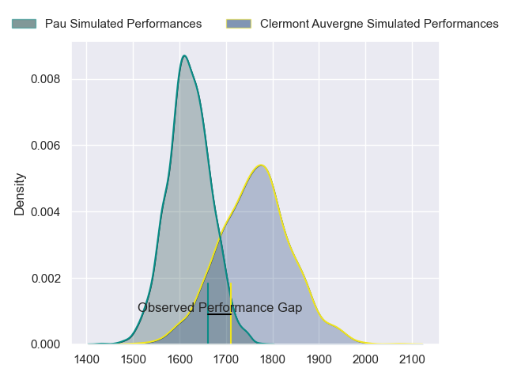
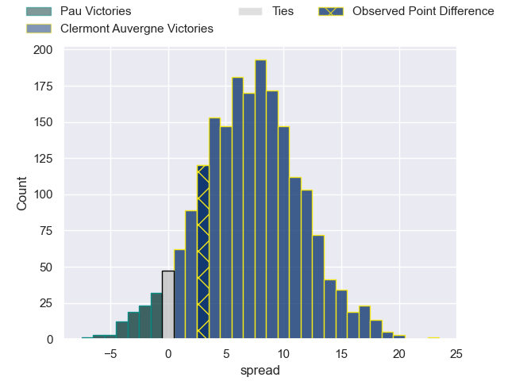
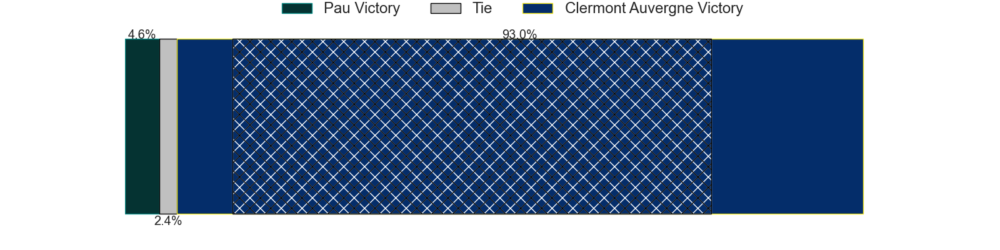
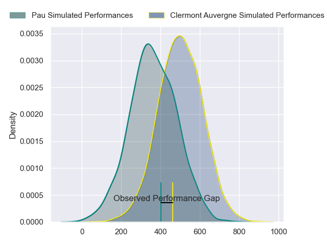
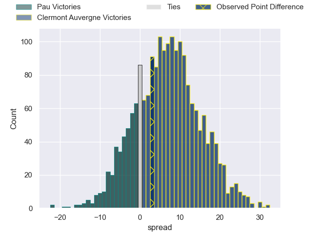

---  
layout: page  
title: Pau at Clermont Auvergne; 28-31  
date: 2024-03-23 18:00:00 -0500  
categories: "Top 14 Orange 2023" match review  
---
# Pau at Clermont Auvergne; 28-31

# Club Level Predictions

The first set of predictions treats a club as the smallest object, as the club develops its members, organizes a gameplan, and deploys its players as needed for each match. This club model has a prediction of 0.691, which translates to predicting Clermont Auvergne to win by 7.1.

Our Over/Under is 45.5 - and combined with the spread above, we have a predicted scoreline of 19 to 26

Each club has a rating and a rating deviation (similar to a Glicko rating), and expected performances can be generated. This allows for simulated matches and spreads like the ones below.
## Projected Performances - Club Model

## Projected Spreads - Club Model

## Projected Results - Club Model

# Player Level Predictions - Version 2

Treating teams instead as an entity made up of the currently active players, I have ratings for each player in an altogether different system. These can be combined to form team ratings once teamsheets are announced, weighting starters a bit higher than the reserves. After the match is played, players can be weighted by their minutes on the field, allowing for an accurate measure of the team's composition. With these compiled team ratings, we can make predictions, measure inaccuracy, and update the individual player ratings.
## Prediction without Player Minutes: Clermont Auvergne by 8.9

Clermont Auvergne by 1.4 on a neutral pitch

## Projected Performances - Player Model

## Projected Spreads - Player Model

## Projected Results - Player Model

|   Away Minutes | Away Player          |   Away Percentile |   Number |   Home Percentile | Home Player          |   Home Minutes |
|---------------:|:---------------------|------------------:|---------:|------------------:|:---------------------|---------------:|
|             48 | Simon-Pierre Chauvac |             37.33 |        1 |             24.1  | Giorgi Beria         |             47 |
|             48 | Romain Ruffenach     |             52.23 |        2 |             44.27 | Etienne Fourcade     |             54 |
|             48 | Nicolas Corato       |              9.74 |        3 |             77.6  | Rabah Slimani        |             47 |
|             83 | Samuel Whitelock     |             99.51 |        4 |             69.17 | Thibaud Lanen        |             54 |
|             48 | Fabrice Metz         |             83.62 |        5 |             93.69 | Rob Simmons          |             83 |
|             41 | Sacha Zegueur        |             53.15 |        6 |             61.05 | Killian Tixeront     |             83 |
|             76 | Reece Hewat          |             68.04 |        7 |             19.36 | Peceli Yato          |             54 |
|             83 | Luke Whitelock       |             97.78 |        8 |             90.12 | Fritz Lee            |             76 |
|             58 | Dan Robson           |             98.54 |        9 |             88.15 | Sebastien Bezy       |             54 |
|             83 | Joe Simmonds         |             85.03 |       10 |             84.77 | Benjamin Urdapilleta |             83 |
|             74 | Samuel Ezeala        |              6.53 |       11 |             74.53 | Joris Jurand         |             83 |
|             83 | Tumua Manu           |             94.65 |       12 |             93.92 | George Moala         |             76 |
|             76 | Emilien Gailleton    |             37.3  |       13 |             36.33 | Julien Heriteau      |             63 |
|             83 | Theo Attissogbe      |             48.17 |       14 |             78.85 | Bautista Delguy      |             83 |
|             83 | Jack Maddocks        |             79.85 |       15 |             63.39 | Alex Newsome         |             83 |
|             35 | Youri Delhommel      |             54.76 |       16 |             91.84 | Folau Fainga'a       |             36 |
|             35 | Guram Papidze        |             13.33 |       17 |             13.14 | Daniel Bibi Biziwu   |             36 |
|             35 | Hugo Auradou         |             60.56 |       18 |             89.93 | Tomas Lavanini       |             29 |
|             42 | Beka Gorgadze        |             50.37 |       19 |             81.33 | Lucas Dessaigne      |             29 |
|             25 | Thibault Daubagna    |             86.49 |       20 |             35.14 | Baptiste Jauneau     |             29 |
|              0 | Axel Desperes        |             56.85 |       21 |             91.12 | Anthony Belleau      |              7 |
|             16 | Elliot Roudil        |             19.68 |       22 |             31.11 | Leon Darricarrere    |             20 |
|             42 | Siate Tokolahi       |             83.27 |       23 |            nan    | Giorgi Dzmanashvili  |             36 |

