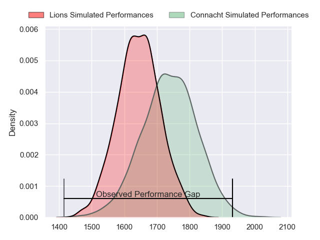
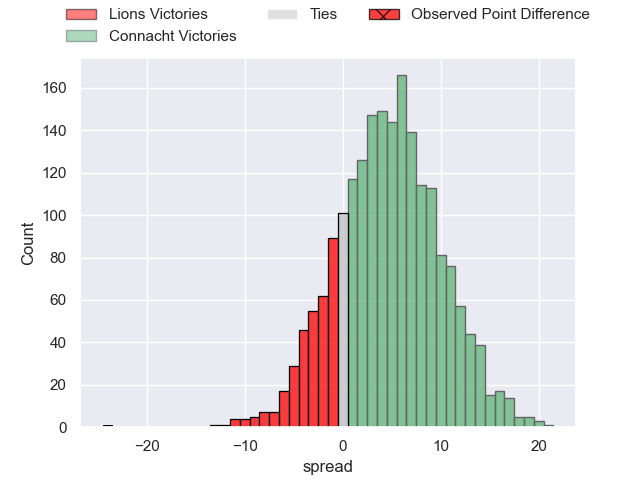
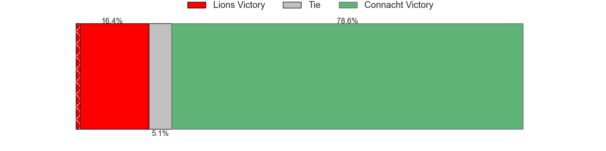
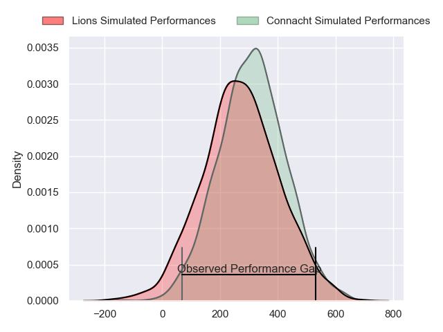
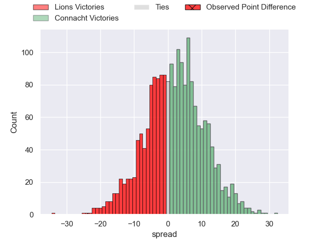
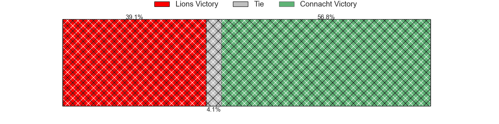

---  
layout: page  
title: Lions at Connacht; 38-14  
date: 2024-03-23 18:00:00 -0500  
categories: "United Rugby Championship 2023" match review  
---
# Lions at Connacht; 38-14

# Club Level Predictions

The first set of predictions treats a club as the smallest object, as the club develops its members, organizes a gameplan, and deploys its players as needed for each match. This club model has a prediction of 0.631, which translates to predicting Connacht to win by 4.8.

Our Over/Under is 40.5 - and combined with the spread above, we have a predicted scoreline of 18 to 23

Each club has a rating and a rating deviation (similar to a Glicko rating), and expected performances can be generated. This allows for simulated matches and spreads like the ones below.
## Projected Performances - Club Model

## Projected Spreads - Club Model

## Projected Results - Club Model

# Player Level Predictions - Version 2

Treating teams instead as an entity made up of the currently active players, I have ratings for each player in an altogether different system. These can be combined to form team ratings once teamsheets are announced, weighting starters a bit higher than the reserves. After the match is played, players can be weighted by their minutes on the field, allowing for an accurate measure of the team's composition. With these compiled team ratings, we can make predictions, measure inaccuracy, and update the individual player ratings.
## Prediction without Player Minutes: Connacht by 4.0

Lions by 1.3 on a neutral pitch

## Projected Performances - Player Model

## Projected Spreads - Player Model

## Projected Results - Player Model

|   Away Minutes | Away Player            |   Away Percentile |   Number |   Home Percentile | Home Player           |   Home Minutes |
|---------------:|:-----------------------|------------------:|---------:|------------------:|:----------------------|---------------:|
|             57 | Jean-Pierre Smith      |             86.67 |        1 |             86.01 | Denis Buckley         |             50 |
|             57 | PJ Botha               |             73.2  |        2 |             26.41 | Tadgh McElroy         |             50 |
|             80 | Asenathi Ntlabakanye   |             79.3  |        3 |             65.22 | Jack Aungier          |             50 |
|             10 | Etienne Oosthuizen     |             84.47 |        4 |             83.37 | Niall Murray          |             80 |
|             80 | Reinhard Nothnagel     |             94.78 |        5 |             94.66 | Joe Joyce             |             54 |
|             70 | JC Pretorius           |             68.73 |        6 |             46.51 | Cian Prendergast      |             80 |
|             19 | Emmanuel Tshituka      |             60.02 |        7 |             82.02 | Conor Oliver          |             18 |
|             80 | Francke Horn           |             98.27 |        8 |             27.16 | Sean O'Brien          |             64 |
|             78 | Sanele Nohamba         |             95.43 |        9 |             75.68 | Caolin Blade          |             67 |
|             80 | Jordan Hendrikse       |             75.38 |       10 |             86.8  | JJ Hanrahan           |             57 |
|             80 | Edwill van der Merwe   |             90.14 |       11 |              6.42 | Andrew Smith          |             80 |
|             80 | Marius Louw            |             93.8  |       12 |             18.83 | Cathal Forde          |             80 |
|             78 | Erich Cronje           |             21.99 |       13 |             36.7  | David Hawkshaw        |             80 |
|             80 | Richard Kriel          |             64.23 |       14 |             10.96 | Byron Ralston         |             80 |
|             80 | Quan Horn              |             90.91 |       15 |             78.87 | Tiernan O'Halloran    |             80 |
|             23 | Jaco Visagie           |             68.93 |       16 |             53.01 | Dave Heffernan        |             30 |
|             23 | Morgan Naude           |            nan    |       17 |            nan    | Jordan Duggan         |             30 |
|             61 | Conraad van Vuuren     |            nan    |       18 |            nan    | Sam Illo              |             30 |
|             70 | Darrien-Lane Landsberg |             54.98 |       19 |            nan    | Darragh Murray        |             26 |
|              0 | Izan Esterhuizen       |            nan    |       20 |             60.25 | Shamus Hurley-Langton |             62 |
|             10 | Hanru Sirgel           |             34.25 |       21 |            nan    | Colm Reilly           |             13 |
|              2 | Morne van den Berg     |             82.54 |       22 |             91.62 | Jack Carty            |             23 |
|              2 | Stean Pienaar          |            nan    |       23 |            nan    | Paul Boyle            |             16 |

