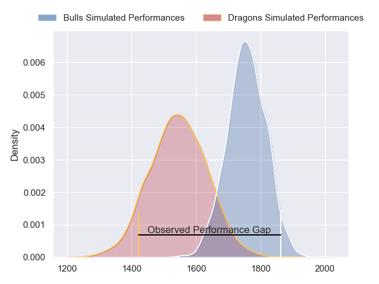
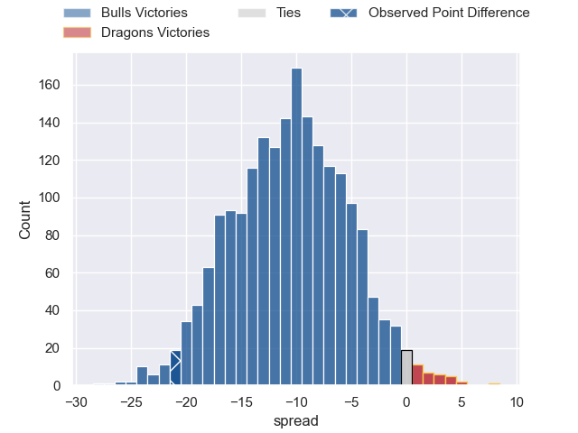
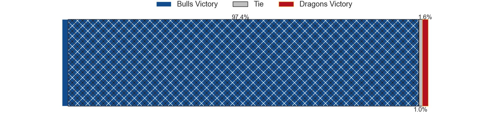
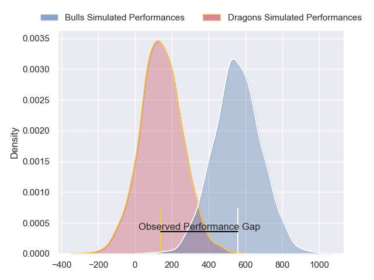
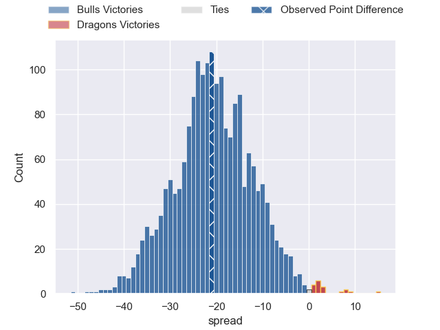

---  
layout: page  
title: Bulls at Dragons; 31-10  
date: 2024-03-23 18:00:00 -0500  
categories: "United Rugby Championship 2023" match review  
---
# Bulls at Dragons; 31-10

# Club Level Predictions

The first set of predictions treats a club as the smallest object, as the club develops its members, organizes a gameplan, and deploys its players as needed for each match. This club model has a prediction of 0.234, which translates to predicting Bulls to win by 10.5.

Our Over/Under is 60.5 - and combined with the spread above, we have a predicted scoreline of 36 to 25

Each club has a rating and a rating deviation (similar to a Glicko rating), and expected performances can be generated. This allows for simulated matches and spreads like the ones below.
## Projected Performances - Club Model

## Projected Spreads - Club Model

## Projected Results - Club Model

# Player Level Predictions - Version 2

Treating teams instead as an entity made up of the currently active players, I have ratings for each player in an altogether different system. These can be combined to form team ratings once teamsheets are announced, weighting starters a bit higher than the reserves. After the match is played, players can be weighted by their minutes on the field, allowing for an accurate measure of the team's composition. With these compiled team ratings, we can make predictions, measure inaccuracy, and update the individual player ratings.
## Prediction without Player Minutes: Bulls by 20.0

Bulls by 25.9 on a neutral pitch

## Projected Performances - Player Model

## Projected Spreads - Player Model

## Projected Results - Player Model

|   Away Minutes | Away Player         |   Away Percentile |   Number |   Home Percentile | Home Player      |   Home Minutes |
|---------------:|:--------------------|------------------:|---------:|------------------:|:-----------------|---------------:|
|             62 | Gerhard Steenekamp  |             94.9  |        1 |              4.06 | Rhodri Jones     |             56 |
|             44 | Jan-Hendrik Wessels |             45.05 |        2 |             38.06 | Brodie Coghlan   |             25 |
|             74 | Wilco Louw          |             99.72 |        3 |             30.06 | Chris Coleman    |             69 |
|             66 | Ruan Vermaak        |             26.7  |        4 |              1.33 | Matthew Screech  |             83 |
|             83 | Ruan Nortje         |             90.66 |        5 |             23.3  | George Nott      |             50 |
|             76 | Marco van Staden    |             93.24 |        6 |             27.15 | Dan Lydiate      |             50 |
|             74 | Celimpilo Gumede    |             54.64 |        7 |             17.64 | Sean Lonsdale    |             83 |
|             83 | Marcell Coetzee     |             94.57 |        8 |             31.11 | Taine Basham     |             56 |
|             56 | Zak Burger          |             89.4  |        9 |             44.28 | Rhodri Williams  |             50 |
|             83 | Chris William Smith |             40.61 |       10 |             25.63 | Will Reed        |             83 |
|             83 | Kurt-Lee Arendse    |             99.56 |       11 |              2.99 | Corey Baldwin    |             83 |
|             83 | Harold Vorster      |             42.04 |       12 |             77.4  | Steffan Hughes   |             83 |
|             83 | Canan Moodie        |             99.88 |       13 |             32.93 | Joe Westwood     |             83 |
|             27 | Sebastian de Klerk  |             44.08 |       14 |             35.77 | Ewan Rosser      |             83 |
|             83 | Willie le Roux      |             97.79 |       15 |             14    | Cai Evans        |             61 |
|             39 | Johan Grobbelaar    |             96.7  |       16 |             87.38 | Elliot Dee       |             58 |
|             21 | Simphiwe Matanzima  |             74.86 |       17 |             59.92 | Rodrigo Martinez |             27 |
|              9 | Mornay Smith        |             78.07 |       18 |            nan    | Luke Yendle      |             14 |
|             17 | Reinhardt Ludwig    |             78.35 |       19 |             21.24 | Ben Carter       |             33 |
|             16 | Nizaam Carr         |             90.62 |       20 |            nan    | Harrison Keddie  |             27 |
|             27 | Embrose Papier      |             95.01 |       21 |             81.23 | Aaron Wainwright |             33 |
|              0 | Johan Goosen        |             85.53 |       22 |              9.56 | Dane Blacker     |             33 |
|             56 | Devon Williams      |             86.24 |       23 |              3.88 | Jared Rosser     |             22 |

