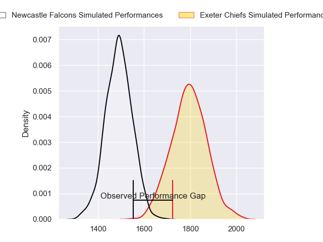
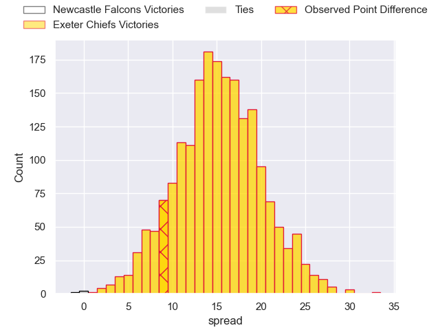
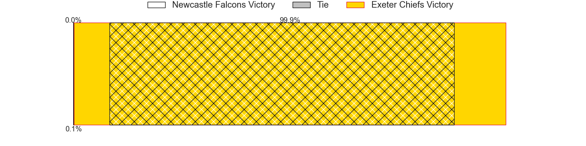
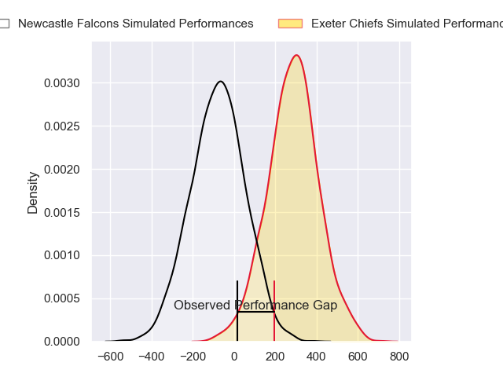
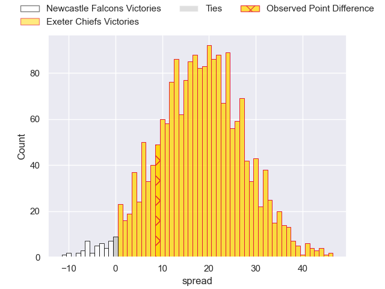
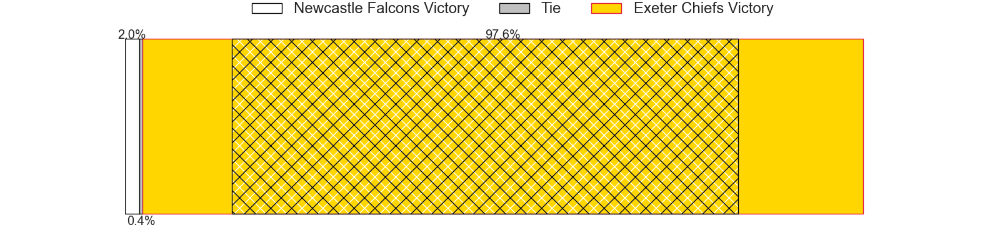

---  
layout: page  
title: Newcastle Falcons at Exeter Chiefs; 16-25  
date: 2024-03-23 18:00:00 -0500  
categories: "Gallagher Premiership 2023" match review  
---
# Newcastle Falcons at Exeter Chiefs; 16-25

# Club Level Predictions

The first set of predictions treats a club as the smallest object, as the club develops its members, organizes a gameplan, and deploys its players as needed for each match. This club model has a prediction of 0.848, which translates to predicting Exeter Chiefs to win by 15.2.

Our Over/Under is 55.5 - and combined with the spread above, we have a predicted scoreline of 20 to 35

Each club has a rating and a rating deviation (similar to a Glicko rating), and expected performances can be generated. This allows for simulated matches and spreads like the ones below.
## Projected Performances - Club Model

## Projected Spreads - Club Model

## Projected Results - Club Model

# Player Level Predictions - Version 2

Treating teams instead as an entity made up of the currently active players, I have ratings for each player in an altogether different system. These can be combined to form team ratings once teamsheets are announced, weighting starters a bit higher than the reserves. After the match is played, players can be weighted by their minutes on the field, allowing for an accurate measure of the team's composition. With these compiled team ratings, we can make predictions, measure inaccuracy, and update the individual player ratings.
## Prediction without Player Minutes: Exeter Chiefs by 20.6

Exeter Chiefs by 15.5 on a neutral pitch

## Projected Performances - Player Model

## Projected Spreads - Player Model

## Projected Results - Player Model

|   Away Minutes | Away Player         |   Away Percentile |   Number |   Home Percentile | Home Player       |   Home Minutes |
|---------------:|:--------------------|------------------:|---------:|------------------:|:------------------|---------------:|
|             45 | Adam Brocklebank    |              2.27 |        1 |             96.6  | Scott Sio         |             69 |
|             77 | Jamie Blamire       |              4.08 |        2 |             91.07 | Jack Yeandle      |             69 |
|             45 | Eduardo Bello       |              2.84 |        3 |             91.78 | Josh Iosefa-Scott |             22 |
|             73 | Philip van der Walt |             19.42 |        4 |             24.88 | Rusiate Tuima     |             76 |
|             80 | Sebastian de Chaves |              7.52 |        5 |             44.17 | Lewis Pearson     |             80 |
|             51 | Freddie Lockwood    |             37.57 |        6 |             65.29 | Jacques Vermeulen |             80 |
|             80 | Guy Pepper          |             10.65 |        7 |             34.71 | Richard Capstick  |             80 |
|             80 | Callum Chick        |              5.43 |        8 |             70.37 | Greg Fisilau      |             61 |
|             78 | Sam Stuart          |              0.62 |        9 |             53.43 | Will Becconsall   |             61 |
|             80 | Brett Connon        |              5.84 |       10 |             27.66 | Harvey Skinner    |             80 |
|             43 | Ben Stevenson       |             20.27 |       11 |             91.14 | Olly Woodburn     |             80 |
|             64 | Rory Jennings       |             63.43 |       12 |             17.01 | Joe Hawkins       |             69 |
|             80 | Tom Penny           |             70.96 |       13 |             31.71 | Zack Wimbush      |             80 |
|             80 | Adam Radwan         |             46.95 |       14 |             22.59 | Dan John          |             80 |
|             80 | Elliott Obatoyinbo  |             15.72 |       15 |              2.46 | Josh Hodge        |             80 |
|              7 | Bryan Byrne         |             71.65 |       16 |             87.96 | Dan Frost         |             11 |
|             35 | Phil Brantingham    |              9.17 |       17 |            nan    | Danny Southworth  |             11 |
|             35 | Richard Palframan   |            nan    |       18 |             21.93 | Marcus Street     |             58 |
|              7 | John Kelly          |            nan    |       19 |             22.21 | Jack Dunne        |              4 |
|             29 | Sam Cross           |             42.84 |       20 |             68.15 | Ross Vintcent     |             19 |
|              2 | Ben Douglas         |            nan    |       21 |             87.94 | Stu Townsend      |             19 |
|             16 | Cameron Hutchison   |             56.87 |       22 |            nan    | Will Haydon-Wood  |              0 |
|             33 | Matias Moroni       |            100    |       23 |            nan    | Will Rigg         |             11 |

