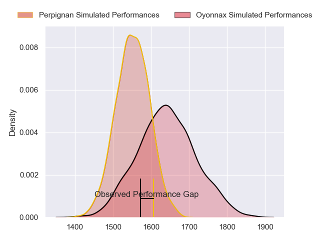
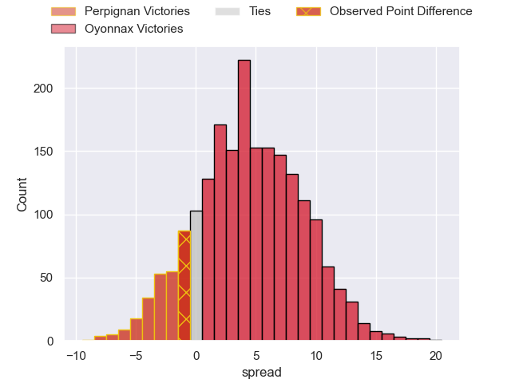
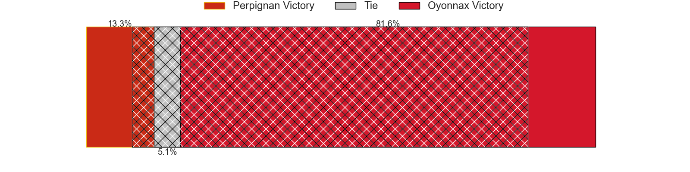
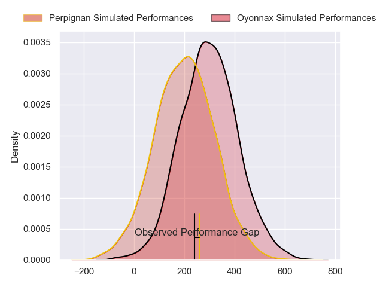
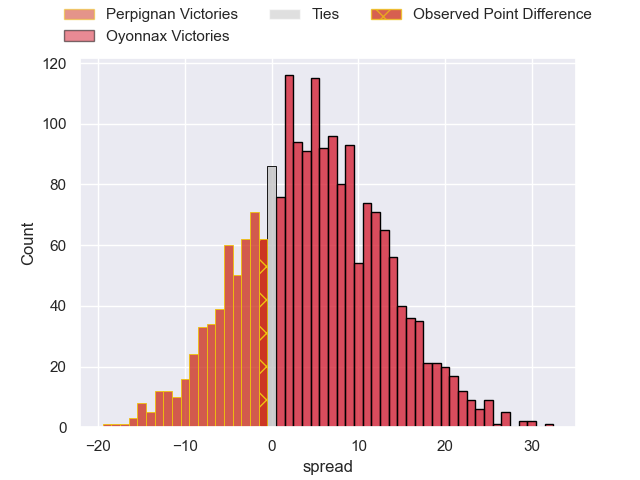
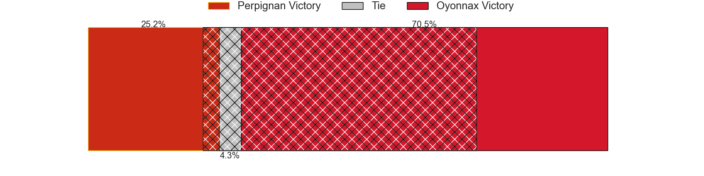

---  
layout: page  
title: Perpignan at Oyonnax; 15-14  
date: 2024-03-23 18:00:00 -0500  
categories: "Top 14 Orange 2023" match review  
---
# Perpignan at Oyonnax; 15-14

# Club Level Predictions

The first set of predictions treats a club as the smallest object, as the club develops its members, organizes a gameplan, and deploys its players as needed for each match. This club model has a prediction of 0.628, which translates to predicting Oyonnax to win by 4.6.

Our Over/Under is 42.5 - and combined with the spread above, we have a predicted scoreline of 19 to 23

Each club has a rating and a rating deviation (similar to a Glicko rating), and expected performances can be generated. This allows for simulated matches and spreads like the ones below.
## Projected Performances - Club Model

## Projected Spreads - Club Model

## Projected Results - Club Model

# Player Level Predictions - Version 2

Treating teams instead as an entity made up of the currently active players, I have ratings for each player in an altogether different system. These can be combined to form team ratings once teamsheets are announced, weighting starters a bit higher than the reserves. After the match is played, players can be weighted by their minutes on the field, allowing for an accurate measure of the team's composition. With these compiled team ratings, we can make predictions, measure inaccuracy, and update the individual player ratings.
## Prediction without Player Minutes: Oyonnax by 6.5

Perpignan by 1.1 on a neutral pitch

## Projected Performances - Player Model

## Projected Spreads - Player Model

## Projected Results - Player Model

|   Away Minutes | Away Player         |   Away Percentile |   Number |   Home Percentile | Home Player         |   Home Minutes |
|---------------:|:--------------------|------------------:|---------:|------------------:|:--------------------|---------------:|
|             51 | Giorgi Tetrashvili  |              3.02 |        1 |             82.23 | Tommy Raynaud       |             64 |
|             30 | Seilala Lam         |             89.71 |        2 |             29.51 | Teddy Durand        |             66 |
|             46 | Nemo Roelofse       |             60.21 |        3 |             44.71 | Christopher Vaotoa  |             62 |
|             80 | Tristan Labouteley  |             13.35 |        4 |             97.82 | Phoenix Battye      |             61 |
|             38 | Posolo Tuilagi      |             31.43 |        5 |             39.08 | Ewan Johnson        |             54 |
|             69 | Patrick Sobela      |             93.81 |        6 |             52.58 | Kevin Lebreton      |             80 |
|             62 | Alan Brazo          |             79.5  |        7 |             29.21 | Loic Credoz         |             80 |
|             65 | Joaquin Oviedo      |             80.25 |        8 |             10.86 | Loic Godener        |             64 |
|             51 | Sadek Deghmache     |              8.94 |        9 |             82.12 | Charlie Cassang     |             73 |
|             80 | Jake McIntyre       |             89.59 |       10 |             89.34 | Domingo Miotti      |             73 |
|             80 | Ali Crossdale       |             52.05 |       11 |             42.75 | Enzo Reybier        |             68 |
|             80 | Afusipa Taumoepeau  |             60.63 |       12 |             74.61 | Theo Millet         |             69 |
|             80 | Alivereti Duguivalu |             14.46 |       13 |             23.57 | Chris Farrell       |             80 |
|             80 | Tavite Veredamu     |             76.08 |       14 |             16.83 | Gavin Stark         |             80 |
|             41 | Tommaso Allan       |             80.59 |       15 |             34.89 | Justin Bouraux      |             61 |
|             50 | Ignacio Ruiz        |             56.31 |       16 |             26.99 | Benjamin Geledan    |             14 |
|             29 | Sacha Lotrian       |             44.99 |       17 |              7.28 | Adrien Bordenave    |             16 |
|             42 | Mathieu Tanguy      |             50.61 |       18 |              7.89 | Victor Lebas        |             28 |
|             26 | So'otala Fa'aso'o   |             90.37 |       19 |             21.97 | Steve Mafi          |             33 |
|             18 | Kelian Galletier    |             14.66 |       20 |            nan    | Ilan El Khattabi    |              7 |
|             29 | Tom Ecochard        |             84.41 |       21 |             72.9  | Lucas Mensa         |             11 |
|             39 | Mathieu Acebes      |             94.57 |       22 |            nan    | Darren Sweetnam     |             26 |
|             34 | Pietro Ceccarelli   |             57.37 |       23 |             82.89 | Irakli Mirtskhulava |             30 |

