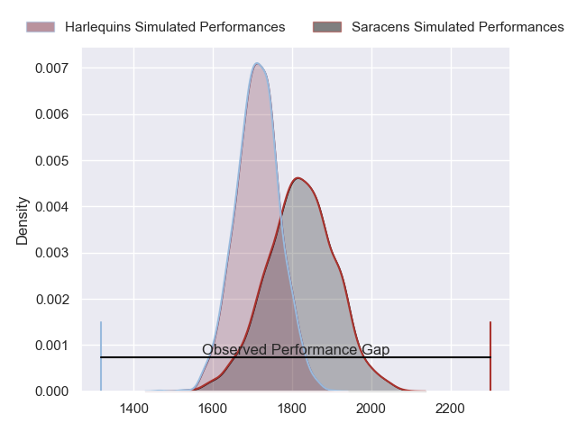
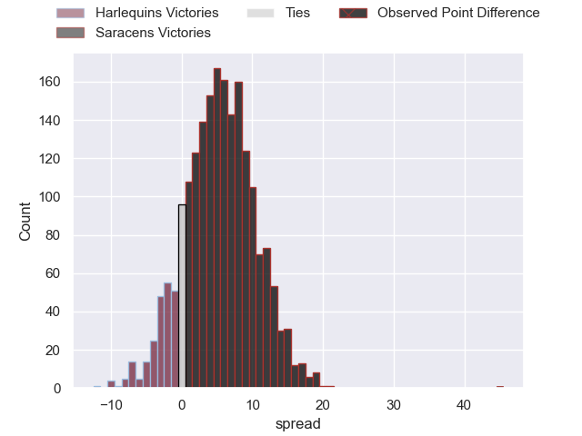
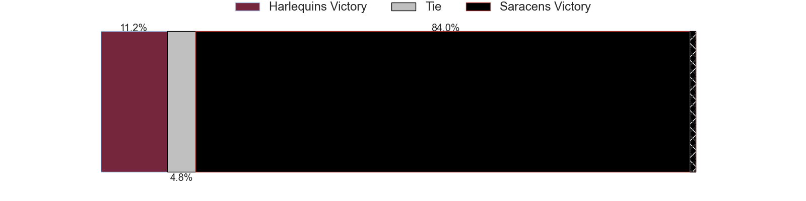
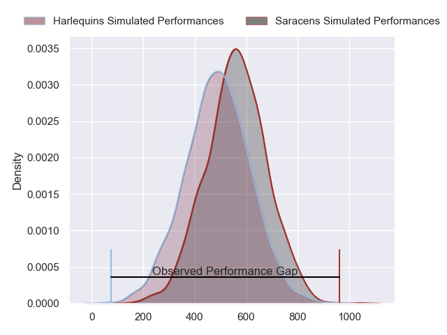
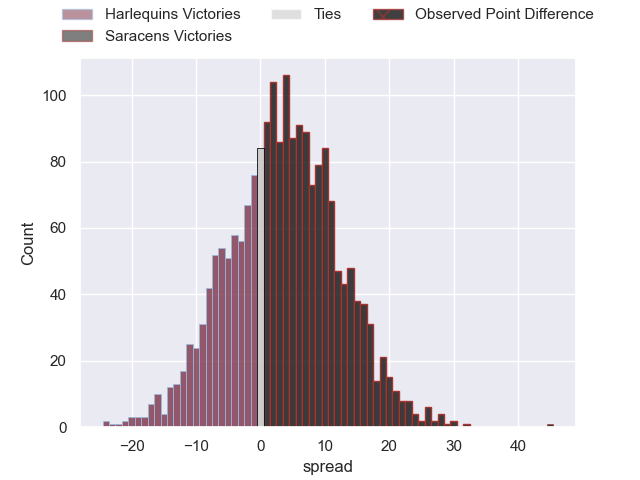
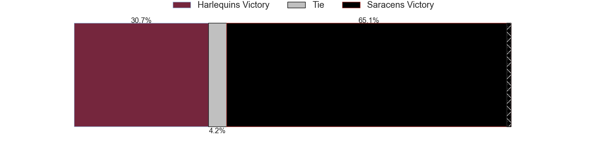

---  
layout: page  
title: Harlequins at Saracens; 7-52  
date: 2024-03-23 18:00:00 -0500  
categories: "Gallagher Premiership 2023" match review  
---
# Harlequins at Saracens; 7-52

# Club Level Predictions

The first set of predictions treats a club as the smallest object, as the club develops its members, organizes a gameplan, and deploys its players as needed for each match. This club model has a prediction of 0.655, which translates to predicting Saracens to win by 5.7.

Our Over/Under is 44.5 - and combined with the spread above, we have a predicted scoreline of 20 to 25

Each club has a rating and a rating deviation (similar to a Glicko rating), and expected performances can be generated. This allows for simulated matches and spreads like the ones below.
## Projected Performances - Club Model

## Projected Spreads - Club Model

## Projected Results - Club Model

# Player Level Predictions - Version 2

Treating teams instead as an entity made up of the currently active players, I have ratings for each player in an altogether different system. These can be combined to form team ratings once teamsheets are announced, weighting starters a bit higher than the reserves. After the match is played, players can be weighted by their minutes on the field, allowing for an accurate measure of the team's composition. With these compiled team ratings, we can make predictions, measure inaccuracy, and update the individual player ratings.
## Prediction without Player Minutes: Saracens by 5.7

Harlequins by 1.1 on a neutral pitch

## Projected Performances - Player Model

## Projected Spreads - Player Model

## Projected Results - Player Model

|   Away Minutes | Away Player       |   Away Percentile |   Number |   Home Percentile | Home Player          |   Home Minutes |
|---------------:|:------------------|------------------:|---------:|------------------:|:---------------------|---------------:|
|             53 | Joe Marler        |             98.3  |        1 |             99.81 | Mako Vunipola        |             51 |
|             63 | Jack Walker       |             16.5  |        2 |             52.43 | Theo Dan             |             51 |
|             53 | Will Collier      |             91.02 |        3 |             79.4  | Christian Judge      |             51 |
|             53 | Joe Launchbury    |             97.09 |        4 |             36.77 | Theo McFarland       |             80 |
|             80 | George Hammond    |             21.72 |        5 |             58.13 | Hugh Tizard          |             57 |
|             73 | Stephan Lewies    |             76.98 |        6 |             93.13 | Juan Martin Gonzalez |             80 |
|             80 | Will Evans        |             65.41 |        7 |             96.91 | Ben Earl             |             65 |
|             80 | Alex Dombrandt    |             82.47 |        8 |             99.01 | Billy Vunipola       |             53 |
|             80 | Danny Care        |            100    |        9 |             78.38 | Ivan van Zyl         |             69 |
|             80 | Marcus Smith      |             83.76 |       10 |             98.98 | Owen Farrell         |             80 |
|             80 | Cadan Murley      |             26.25 |       11 |             76.52 | Alex Lewington       |             80 |
|             80 | Andre Esterhuizen |             97.93 |       12 |             98.54 | Nick Tompkins        |             80 |
|             63 | Oscar Beard       |             65.13 |       13 |             58.44 | Lucio Cinti          |             80 |
|             63 | Louis Lynagh      |             79.96 |       14 |             92.58 | Sean Maitland        |             80 |
|             80 | Tyrone Green      |             73.46 |       15 |             83.05 | Elliot Daly          |             65 |
|             17 | Sam Riley         |             65.63 |       16 |             98.45 | Jamie George         |             29 |
|             27 | Fin Baxter        |             38.66 |       17 |             76.75 | Eroni Mawi           |             29 |
|             27 | Dillon Lewis      |             95.46 |       18 |             33.65 | Marco Riccioni       |             29 |
|             27 | Irne Herbst       |             72.09 |       19 |             86.77 | Nick Isiekwe         |             23 |
|              7 | Will Trenholm     |            nan    |       20 |             17.53 | Tom Willis           |             15 |
|             15 | Max Green         |             58.21 |       21 |             24.86 | Andy Christie        |             27 |
|             17 | Luke Northmore    |             78.25 |       22 |             13.93 | Gareth Simpson       |             11 |
|              2 | Nick David        |             57.7  |       23 |             86    | Alex Goode           |             15 |

