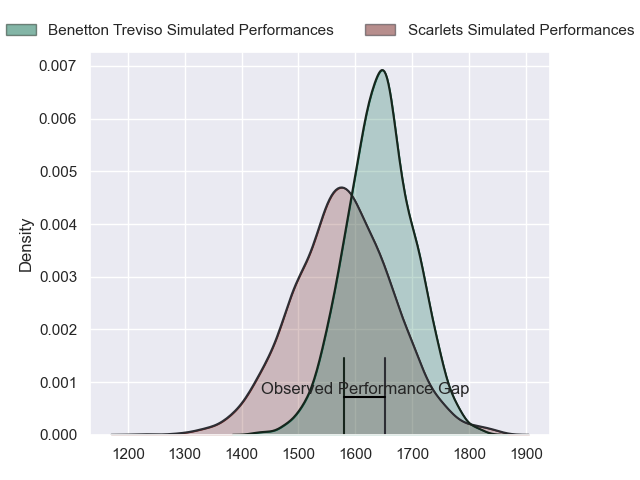
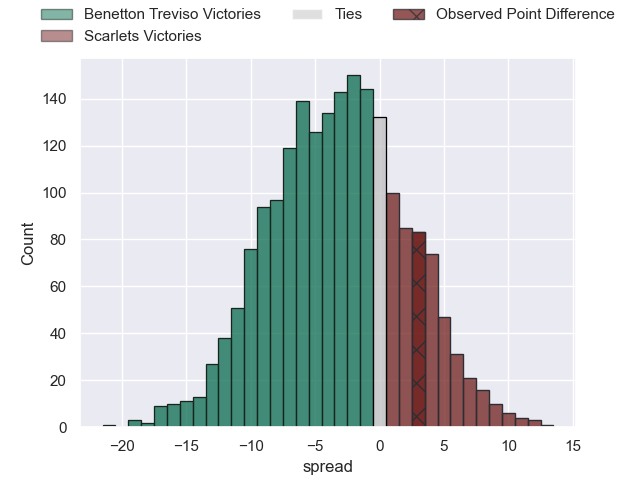
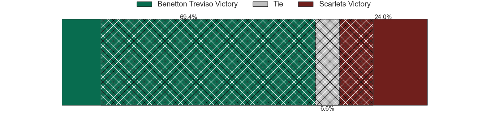
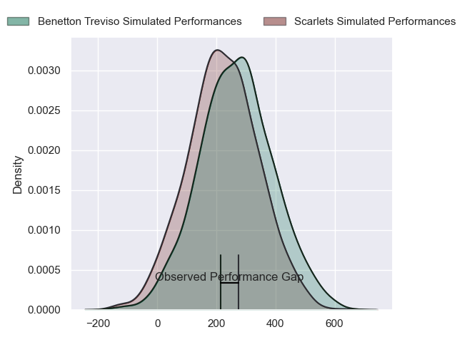
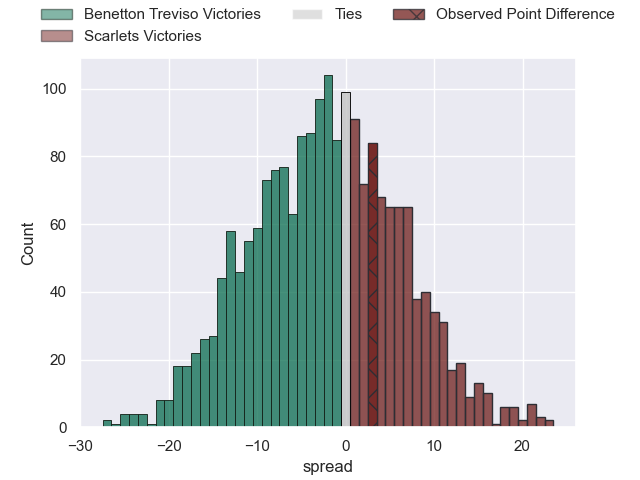

---  
layout: page  
title: Benetton Treviso at Scarlets; 13-16  
date: 2024-03-23 18:00:00 -0500  
categories: "United Rugby Championship 2023" match review  
---
# Benetton Treviso at Scarlets; 13-16

# Club Level Predictions

The first set of predictions treats a club as the smallest object, as the club develops its members, organizes a gameplan, and deploys its players as needed for each match. This club model has a prediction of 0.41, which translates to predicting Benetton Treviso to win by 3.2.

Our Over/Under is 35.5 - and combined with the spread above, we have a predicted scoreline of 19 to 16

Each club has a rating and a rating deviation (similar to a Glicko rating), and expected performances can be generated. This allows for simulated matches and spreads like the ones below.
## Projected Performances - Club Model

## Projected Spreads - Club Model

## Projected Results - Club Model

# Player Level Predictions - Version 2

Treating teams instead as an entity made up of the currently active players, I have ratings for each player in an altogether different system. These can be combined to form team ratings once teamsheets are announced, weighting starters a bit higher than the reserves. After the match is played, players can be weighted by their minutes on the field, allowing for an accurate measure of the team's composition. With these compiled team ratings, we can make predictions, measure inaccuracy, and update the individual player ratings.
## Prediction without Player Minutes: Benetton Treviso by 1.3

Benetton Treviso by 7.0 on a neutral pitch

## Projected Performances - Player Model

## Projected Spreads - Player Model

## Projected Results - Player Model

|   Away Minutes | Away Player         |   Away Percentile |   Number |   Home Percentile | Home Player         |   Home Minutes |
|---------------:|:--------------------|------------------:|---------:|------------------:|:--------------------|---------------:|
|             41 | Federico Zani       |             22.21 |        1 |             62.67 | Kemsley Mathias     |             54 |
|             41 | Siua Maile          |              0.58 |        2 |              5.63 | Shaun Evans         |             75 |
|             73 | Simone Ferrari      |             96.12 |        3 |              9.45 | Harri O'Connor      |             54 |
|             62 | Edoardo Iachizzi    |             71.97 |        4 |             24.27 | Alex Craig          |             87 |
|             87 | Eli Snyman          |             77.43 |        5 |             73.3  | Sam Lousi           |             75 |
|             87 | Alessandro Izekor   |             58.65 |        6 |             39.98 | Teddy Leatherbarrow |             87 |
|             87 | Toa Halafihi        |             75.26 |        7 |             72.85 | Dan Davis           |             87 |
|             45 | Lorenzo Cannone     |             90.86 |        8 |             95.8  | Vaea Fifita         |             72 |
|             52 | Andy Uren           |             16.84 |        9 |             34.72 | Gareth Davies       |             47 |
|             87 | Jacob Umaga         |             71.57 |       10 |             37.06 | Sam Costelow        |             87 |
|             87 | Onisi Ratave        |             30.79 |       11 |             27.8  | Tomi Lewis          |             87 |
|             63 | Filippo Drago       |             30.38 |       12 |             71.93 | Johnny Williams     |             87 |
|             87 | Malakai Fekitoa     |             78.01 |       13 |             44.47 | Jonathan Davies     |             73 |
|             87 | Ignacio Mendy       |             23.37 |       14 |             19.38 | Tom Rogers          |             69 |
|             56 | Rhyno Smith         |             36.12 |       15 |              9.34 | Ioan Lloyd          |             87 |
|             46 | Bautista Bernasconi |            nan    |       16 |             24.08 | Eduan Swart         |             12 |
|             46 | Ivan Nemer          |             81.19 |       17 |             61.53 | Wyn Jones           |             33 |
|             14 | Tiziano Pasquali    |             82.7  |       18 |             20.98 | Sam Wainwright      |             33 |
|             25 | Riccardo Favretto   |             28.98 |       19 |              4.98 | Morgan Jones        |             12 |
|             42 | Manuel Zuliani      |             67.7  |       20 |            nan    | Carwyn Tuipulotu    |             19 |
|             35 | Alessandro Garbisi  |             71.31 |       21 |             70.06 | Kieran Hardy        |             40 |
|             31 | Tomas Albornoz      |             77.16 |       22 |             81.4  | Steffan Evans       |             14 |
|             24 | Leonardo Marin      |             62.94 |       23 |             21.39 | Eddie James         |             14 |

