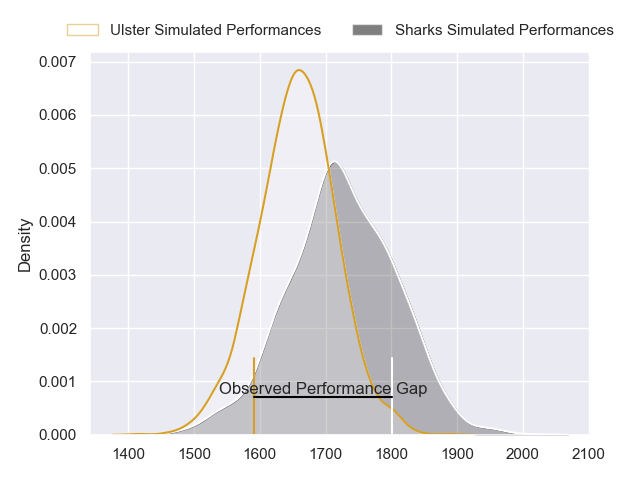
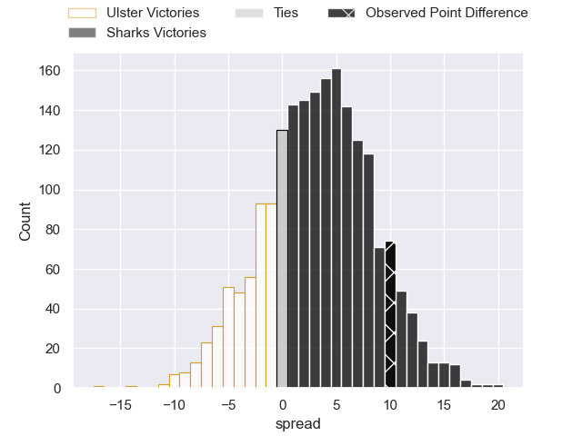
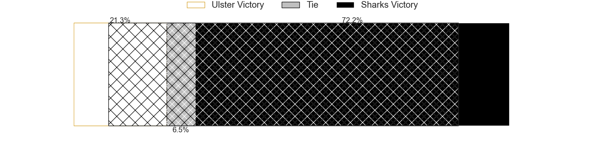
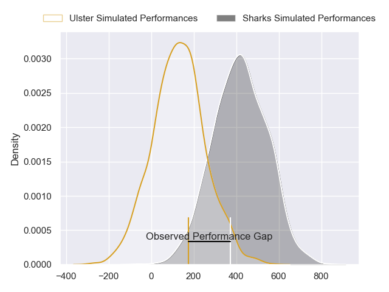
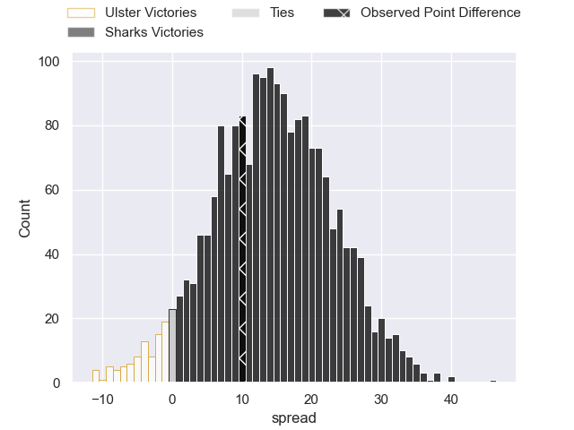

---  
layout: page  
title: Ulster at Sharks; 12-22  
date: 2024-03-23 18:00:00 -0500  
categories: "United Rugby Championship 2023" match review  
---
# Ulster at Sharks; 12-22

# Club Level Predictions

The first set of predictions treats a club as the smallest object, as the club develops its members, organizes a gameplan, and deploys its players as needed for each match. This club model has a prediction of 0.593, which translates to predicting Sharks to win by 3.3.

Our Over/Under is 38.5 - and combined with the spread above, we have a predicted scoreline of 18 to 21

Each club has a rating and a rating deviation (similar to a Glicko rating), and expected performances can be generated. This allows for simulated matches and spreads like the ones below.
## Projected Performances - Club Model

## Projected Spreads - Club Model

## Projected Results - Club Model

# Player Level Predictions - Version 2

Treating teams instead as an entity made up of the currently active players, I have ratings for each player in an altogether different system. These can be combined to form team ratings once teamsheets are announced, weighting starters a bit higher than the reserves. After the match is played, players can be weighted by their minutes on the field, allowing for an accurate measure of the team's composition. With these compiled team ratings, we can make predictions, measure inaccuracy, and update the individual player ratings.
## Prediction without Player Minutes: Sharks by 15.4

Sharks by 11.1 on a neutral pitch

## Projected Performances - Player Model

## Projected Spreads - Player Model

## Projected Results - Player Model

|   Away Minutes | Away Player        |   Away Percentile |   Number |   Home Percentile | Home Player         |   Home Minutes |
|---------------:|:-------------------|------------------:|---------:|------------------:|:--------------------|---------------:|
|             50 | Steven Kitshoff    |             92.82 |        1 |             28.92 | Ntuthuko Mchunu     |             53 |
|             67 | Tom Stewart        |              1.94 |        2 |             96.12 | Bongi Mbonambi      |             70 |
|             64 | Tom O'Toole        |             19.38 |        3 |             36.67 | Hanru Jacobs        |             53 |
|             75 | Kieran Treadwell   |             33.5  |        4 |             98.18 | Eben Etzebeth       |             59 |
|             80 | Iain Henderson     |             88.35 |        5 |             13.47 | Gerbrandt Grobler   |             80 |
|             62 | Harry Sheridan     |             59.56 |        6 |             34.14 | Phepsi Buthelezi    |             80 |
|             80 | David McCann       |             73.42 |        7 |             82.93 | Vincent Tshituka    |             80 |
|             50 | Nick Timoney       |             61.23 |        8 |             36.05 | George Cronje       |              2 |
|             80 | John Cooney        |             79.21 |        9 |             81.29 | Jaden Hendrikse     |             80 |
|             42 | Billy Burns        |             30.46 |       10 |             37.31 | Siya Masuku         |             80 |
|             80 | Mike Lowry         |             50.17 |       11 |             99.78 | Makazole Mapimpi    |             80 |
|             80 | Stuart McCloskey   |             64.16 |       12 |             27.83 | Ethan Hooker        |             74 |
|             80 | James Hume         |             17.5  |       13 |             79.34 | Lukhanyo Am         |             80 |
|             80 | Ethan McIlroy      |             75.19 |       14 |             28.46 | Eduan Keyter        |             80 |
|             74 | Will Addison       |             62.9  |       15 |             84.77 | Aphelele Fassi      |             80 |
|             13 | John Andrew        |             33.98 |       16 |            nan    | Kerron van Vuuren   |             10 |
|             30 | Andrew Warwick     |             30.62 |       17 |             99.24 | Ox Nche             |             27 |
|             16 | Scott Wilson       |            nan    |       18 |             50.85 | Vincent Koch        |             27 |
|              5 | Cormac Izuchukwu   |             52.55 |       19 |             36.41 | Corne Rahl          |             21 |
|             18 | Matty Rea          |             37.46 |       20 |             34.48 | Jeandre Labuschagne |             78 |
|             38 | Nathan Doak        |             14.76 |       21 |            nan    | Cameron Wright      |              0 |
|              6 | Jude Postlethwaite |             50.18 |       22 |             85.79 | Curwin Bosch        |              0 |
|             30 | Sean Reffell       |             67.47 |       23 |             39.61 | Francois Venter     |              6 |

