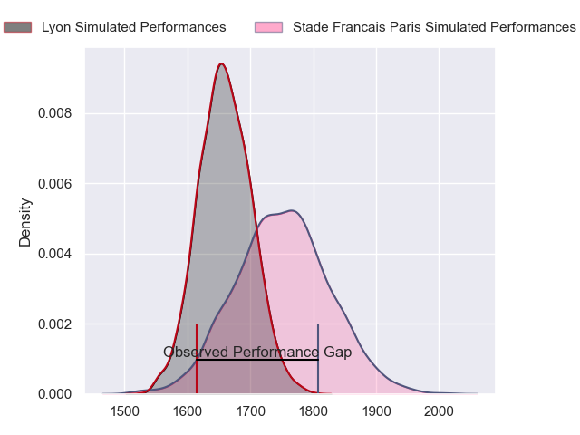
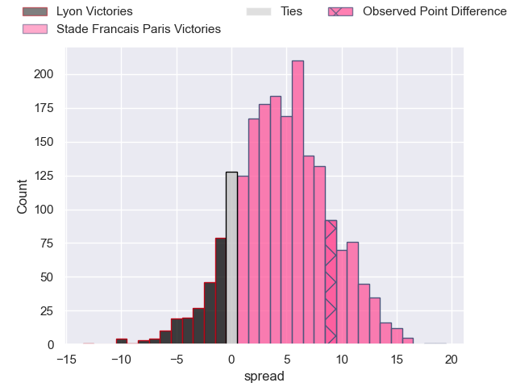
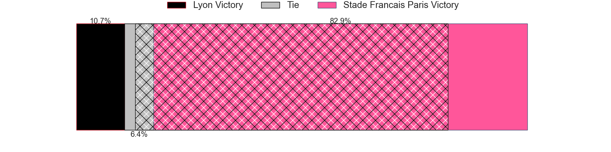
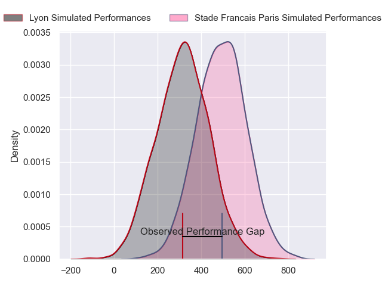
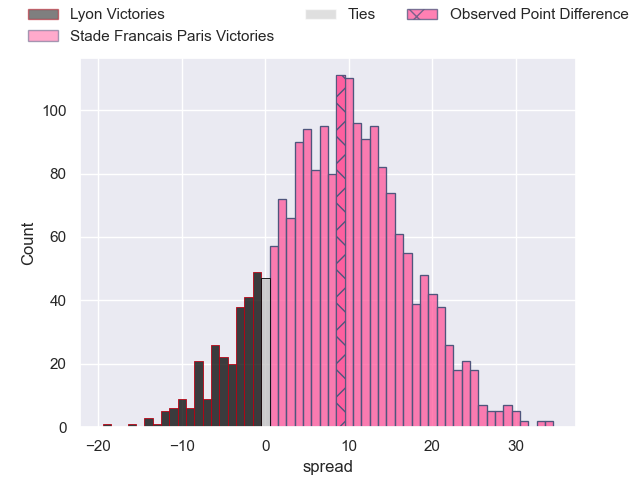
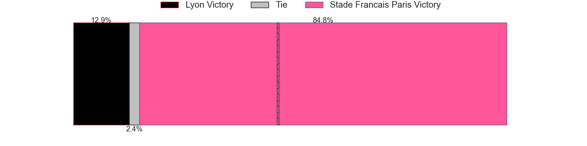

---  
layout: page  
title: Lyon at Stade Francais Paris; 13-22  
date: 2024-03-23 18:00:00 -0500  
categories: "Top 14 Orange 2023" match review  
---
# Lyon at Stade Francais Paris; 13-22

# Club Level Predictions

The first set of predictions treats a club as the smallest object, as the club develops its members, organizes a gameplan, and deploys its players as needed for each match. This club model has a prediction of 0.626, which translates to predicting Stade Francais Paris to win by 4.5.

Our Over/Under is 46.5 - and combined with the spread above, we have a predicted scoreline of 21 to 25

Each club has a rating and a rating deviation (similar to a Glicko rating), and expected performances can be generated. This allows for simulated matches and spreads like the ones below.
## Projected Performances - Club Model

## Projected Spreads - Club Model

## Projected Results - Club Model

# Player Level Predictions - Version 2

Treating teams instead as an entity made up of the currently active players, I have ratings for each player in an altogether different system. These can be combined to form team ratings once teamsheets are announced, weighting starters a bit higher than the reserves. After the match is played, players can be weighted by their minutes on the field, allowing for an accurate measure of the team's composition. With these compiled team ratings, we can make predictions, measure inaccuracy, and update the individual player ratings.
## Prediction without Player Minutes: Stade Francais Paris by 11.5

Stade Francais Paris by 3.3 on a neutral pitch

## Projected Performances - Player Model

## Projected Spreads - Player Model

## Projected Results - Player Model

|   Away Minutes | Away Player          |   Away Percentile |   Number |   Home Percentile | Home Player             |   Home Minutes |
|---------------:|:---------------------|------------------:|---------:|------------------:|:------------------------|---------------:|
|             30 | Sebastien Taofifenua |             13.99 |        1 |             71.55 | Moses Alo-Emile         |             49 |
|             56 | Liam Coltman         |             82.72 |        2 |             96.89 | Mickael Ivaldi          |             49 |
|             47 | Feao Fotuaika        |             60.78 |        3 |             95.37 | Francisco Gomez Kodela  |             49 |
|             73 | Felix Lambey         |             79.61 |        4 |             50    | Paul Gabrillagues       |             60 |
|             59 | Romain Taofifenua    |             45.39 |        5 |             83.13 | Baptiste Pesenti        |             60 |
|             70 | Joel Kpoku           |             54.3  |        6 |             31.39 | Tanginoa Halaifonua     |             80 |
|             66 | Liam Allen           |             67.24 |        7 |             73.88 | Romain Briatte          |             80 |
|             52 | Jordan Taufua        |             93.09 |        8 |              8.89 | Mathieu Hirigoyen       |             60 |
|             80 | Baptiste Couilloud   |             93.14 |        9 |             96.47 | Brad Weber              |             80 |
|             60 | Leo Berdeu           |             65.74 |       10 |             84.26 | Zack Henry              |             70 |
|             80 | Davit Niniashvili    |             83.5  |       11 |             89.15 | Lester Etien            |             80 |
|             80 | Josiah Maraku        |             16.28 |       12 |             88.82 | Jeremy Ward             |             80 |
|             80 | Semi Radradra        |             99.64 |       13 |             89.55 | Joe Marchant            |             80 |
|             80 | Ethan Dumortier      |             52.27 |       14 |             61.68 | Kylan Hamdaoui          |             80 |
|             80 | Alexandre Tchaptchet |             57.49 |       15 |             76.41 | Leo Barre               |             80 |
|             24 | Guillaume Marchand   |             21.94 |       16 |             28.54 | Lucas Peyresblanques    |             31 |
|             50 | Jerome Rey           |             28.26 |       17 |            nan    | Sergo Abramishvili      |             31 |
|             28 | Mickael Guillard     |             69.05 |       18 |             71.84 | Pierre-Henri Azagoh     |             20 |
|             28 | Arno Botha           |             85.68 |       19 |             89.14 | Giovanni Habel-Kueffner |             20 |
|              0 | Liam Rimet           |             44.49 |       20 |            nan    | Hugo Zabalza            |              0 |
|             20 | Paddy Jackson        |             80.96 |       21 |             95.13 | Sekou Macalou           |             20 |
|             24 | Beka Saghinadze      |             88.09 |       22 |             74.62 | Joris Segonds           |             10 |
|             33 | Valentin Simutoga    |            nan    |       23 |             88.94 | Paul Alo-Emile          |             31 |

