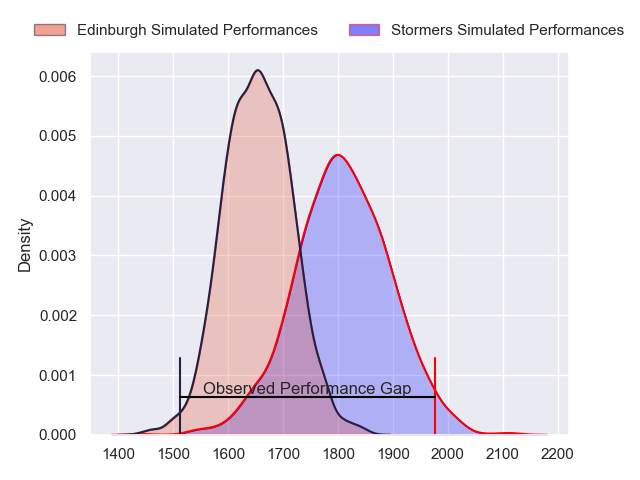
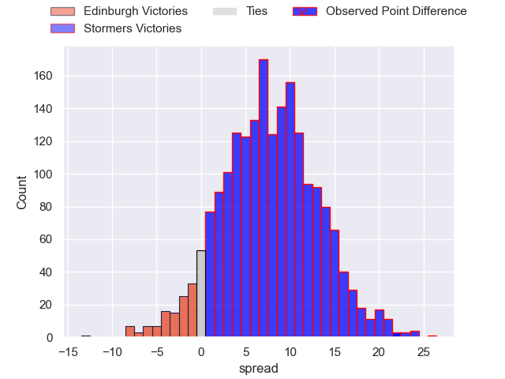
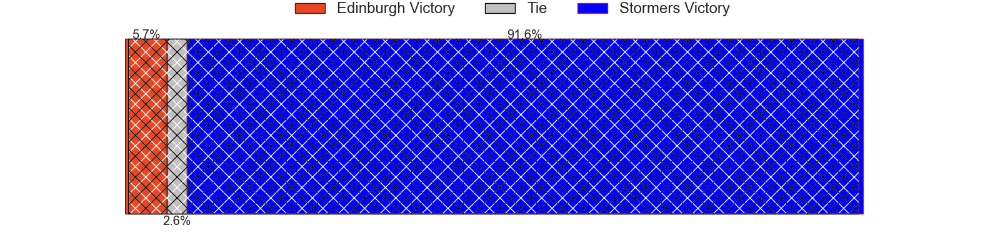
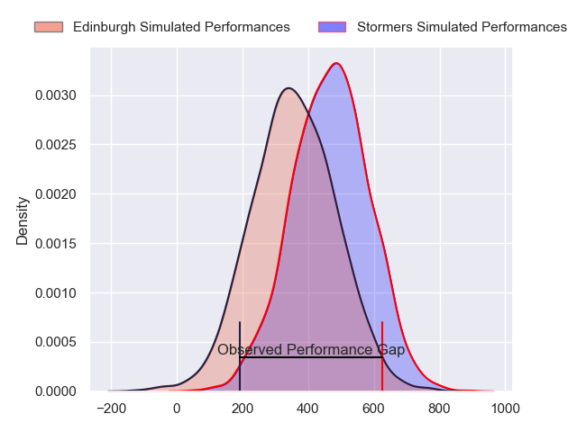
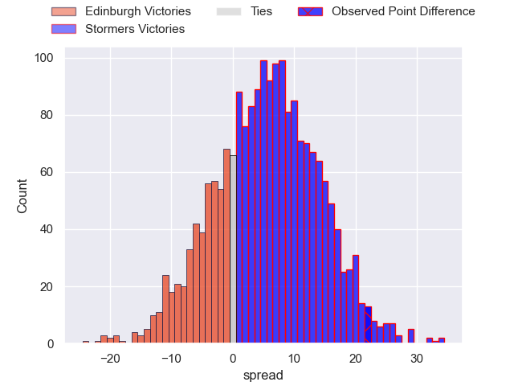
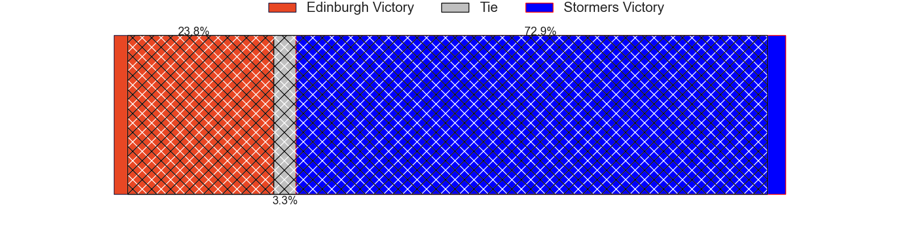

---  
layout: page  
title: Edinburgh at Stormers; 21-43  
date: 2024-03-23 18:00:00 -0500  
categories: "United Rugby Championship 2023" match review  
---
# Edinburgh at Stormers; 21-43

# Club Level Predictions

The first set of predictions treats a club as the smallest object, as the club develops its members, organizes a gameplan, and deploys its players as needed for each match. This club model has a prediction of 0.704, which translates to predicting Stormers to win by 7.7.

Our Over/Under is 48.5 - and combined with the spread above, we have a predicted scoreline of 20 to 28

Each club has a rating and a rating deviation (similar to a Glicko rating), and expected performances can be generated. This allows for simulated matches and spreads like the ones below.
## Projected Performances - Club Model

## Projected Spreads - Club Model

## Projected Results - Club Model

# Player Level Predictions - Version 2

Treating teams instead as an entity made up of the currently active players, I have ratings for each player in an altogether different system. These can be combined to form team ratings once teamsheets are announced, weighting starters a bit higher than the reserves. After the match is played, players can be weighted by their minutes on the field, allowing for an accurate measure of the team's composition. With these compiled team ratings, we can make predictions, measure inaccuracy, and update the individual player ratings.
## Prediction without Player Minutes: Stormers by 7.6

Stormers by 3.0 on a neutral pitch

## Projected Performances - Player Model

## Projected Spreads - Player Model

## Projected Results - Player Model

|   Away Minutes | Away Player      |   Away Percentile |   Number |   Home Percentile | Home Player          |   Home Minutes |
|---------------:|:-----------------|------------------:|---------:|------------------:|:---------------------|---------------:|
|             61 | Boan Venter      |             15.97 |        1 |             99.91 | Brok Harris          |             70 |
|             61 | Dave Cherry      |             55.73 |        2 |             66.6  | Andre-Hugo Venter    |             61 |
|             61 | WP Nel           |             99.43 |        3 |             89.41 | Frans Malherbe       |             41 |
|             61 | Jamie Hodgson    |             38.83 |        4 |             61.65 | Salmaan Moerat       |             65 |
|             81 | Sam Skinner      |             81.43 |        5 |             79.98 | Ruben van Heerden    |             81 |
|             68 | Ben Muncaster    |             27.03 |        6 |              7.33 | Nama Xaba            |             57 |
|             81 | Hamish Watson    |             63    |        7 |             47.88 | Ben-Jason Dixon      |             81 |
|             81 | Viliame Mata     |             79.51 |        8 |             82.72 | Evan Roos            |             81 |
|             69 | Ben Vellacott    |             84.82 |        9 |             87.73 | Paul de Wet          |             61 |
|             81 | Ben Healy        |             84.01 |       10 |             81.22 | Manie Libbok         |             70 |
|             81 | Chris Dean       |              9.3  |       11 |             89.48 | Leolin Zas           |             61 |
|             81 | Matt Currie      |             86.03 |       12 |             91.49 | Daniel du Plessis    |             81 |
|             15 | Mark Bennett     |             67.07 |       13 |             82.75 | Wandisile Simelane   |             81 |
|             81 | Jacob Henry      |             32.89 |       14 |             73.98 | Suleiman Hartzenberg |             81 |
|             81 | Wes Goosen       |             93.61 |       15 |             95.82 | Damian Willemse      |             81 |
|             20 | Patrick Harrison |            nan    |       16 |             60.19 | Joseph Dweba         |             20 |
|             20 | Luan de Bruin    |             27.03 |       17 |            nan    | Lizo Gqoboka         |             11 |
|             20 | Javan Sebastian  |             69.94 |       18 |             77.13 | Neethling Fouche     |             40 |
|             20 | Marshall Sykes   |             88.96 |       19 |            nan    | Connor Evans         |             16 |
|             13 | Tom Dodd         |             36.77 |       20 |             92.35 | Hacjivah Dayimani    |             24 |
|             12 | Charlie Shiel    |            nan    |       21 |             90.23 | Herschel Jantjies    |             20 |
|             24 | Cameron Scott    |            nan    |       22 |             50.25 | Jurie Matthee        |             11 |
|             42 | James Lang       |             94.29 |       23 |             91.25 | Ben Loader           |             20 |

