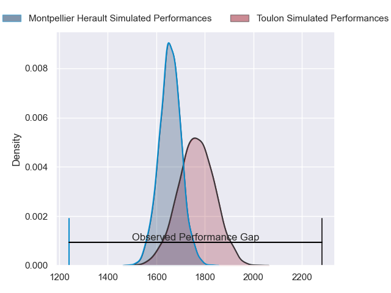
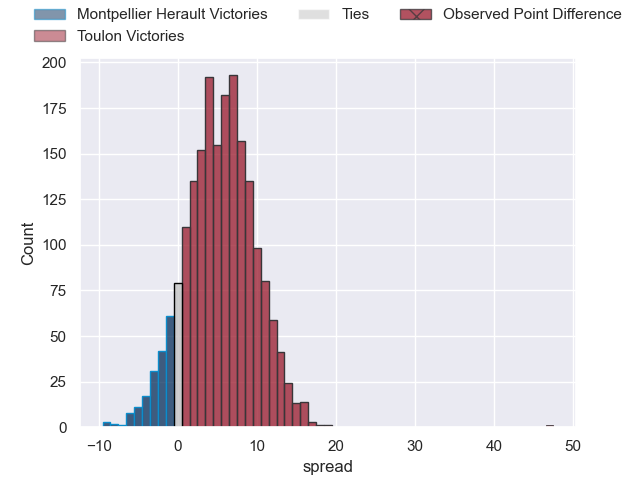
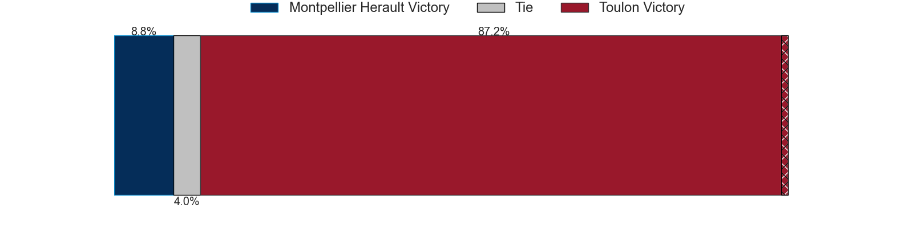
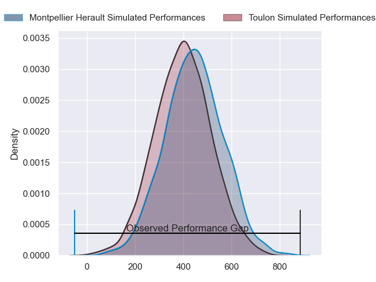
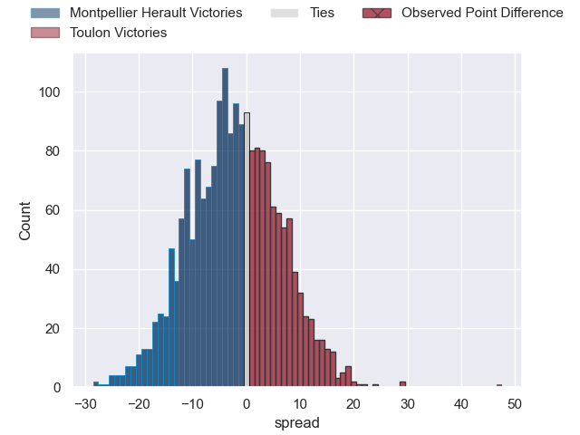

---  
layout: page  
title: Montpellier Herault at Toulon; 7-54  
date: 2024-03-23 18:00:00 -0500  
categories: "Top 14 Orange 2023" match review  
---
# Montpellier Herault at Toulon; 7-54

# Club Level Predictions

The first set of predictions treats a club as the smallest object, as the club develops its members, organizes a gameplan, and deploys its players as needed for each match. This club model has a prediction of 0.647, which translates to predicting Toulon to win by 5.3.

Our Over/Under is 53.5 - and combined with the spread above, we have a predicted scoreline of 24 to 29

Each club has a rating and a rating deviation (similar to a Glicko rating), and expected performances can be generated. This allows for simulated matches and spreads like the ones below.
## Projected Performances - Club Model

## Projected Spreads - Club Model

## Projected Results - Club Model

# Player Level Predictions - Version 2

Treating teams instead as an entity made up of the currently active players, I have ratings for each player in an altogether different system. These can be combined to form team ratings once teamsheets are announced, weighting starters a bit higher than the reserves. After the match is played, players can be weighted by their minutes on the field, allowing for an accurate measure of the team's composition. With these compiled team ratings, we can make predictions, measure inaccuracy, and update the individual player ratings.
## Prediction without Player Minutes: Montpellier Herault by 1.0

Montpellier Herault by 7.9 on a neutral pitch

## Projected Performances - Player Model

## Projected Spreads - Player Model

## Projected Results - Player Model

|   Away Minutes | Away Player                 |   Away Percentile |   Number |   Home Percentile | Home Player            |   Home Minutes |
|---------------:|:----------------------------|------------------:|---------:|------------------:|:-----------------------|---------------:|
|             48 | Baptiste Erdocio            |              7.94 |        1 |             90.45 | Dany Priso             |             54 |
|             31 | Brandon Paenga-Amosa        |             82.33 |        2 |             50.29 | Teddy Baubigny         |             57 |
|             34 | Luka Japaridze              |             73.35 |        3 |             21.55 | Kieran Brookes         |             59 |
|             57 | Yacouba Camara              |             93.08 |        4 |             83.25 | David Ribbans          |             54 |
|             71 | Bastien Chalureau           |             80.83 |        5 |             85.44 | Brian Alainu'uese      |             80 |
|             57 | Nicolaas Janse van Rensburg |             86.6  |        6 |             84.65 | Cornell du Preez       |             68 |
|             28 | Lenni Nouchi                |             52.92 |        7 |             63.69 | Esteban Abadie         |             80 |
|             71 | Sam Simmonds                |             67.65 |        8 |             97.28 | Charles Ollivon        |             69 |
|             68 | Cobus Reinach               |             92.72 |        9 |             80.67 | Ben White              |             33 |
|             69 | Louis Carbonel              |             59.14 |       10 |             96.7  | Dan Biggar             |             50 |
|             80 | Masivesi Dakuwaqa           |             76.85 |       11 |             88.48 | Gabin Villiere         |             80 |
|             80 | Auguste Cadot               |             52    |       12 |             69.99 | Duncan Paia'aua        |             80 |
|             50 | Geoffrey Doumayrou          |             98.06 |       13 |             58.57 | Seta Tuicuvu           |             54 |
|             80 | Ben Lam                     |             98.78 |       14 |             54.6  | Gael Drean             |             80 |
|             80 | Anthony Bouthier            |             71.5  |       15 |             77.4  | Melvyn Jaminet         |             80 |
|             49 | Christopher Tolofua         |             95.53 |       16 |             90.49 | Jack Singleton         |             12 |
|             32 | Enzo Forletta               |             76.18 |       17 |             11.63 | Bruce Devaux           |             26 |
|             52 | Tyler Duguid                |             69.42 |       18 |             70.02 | Swan Rebbadj           |             26 |
|             32 | Clement Doumenc             |            nan    |       19 |             51.32 | Matteo Le Corvec       |             23 |
|             32 | Alexandre Becognee          |             47.31 |       20 |             82.23 | Paolo Garbisi          |             30 |
|             23 | Louis Foursans-Bourdette    |            nan    |       21 |             95.84 | Baptiste Serin         |             47 |
|             30 | Arthur Vincent              |             64.52 |       22 |             86.88 | Leicester Fainga'anuku |             26 |
|             46 | Harry Williams              |             96.98 |       23 |             47.92 | Beka Gigashvili        |             32 |

