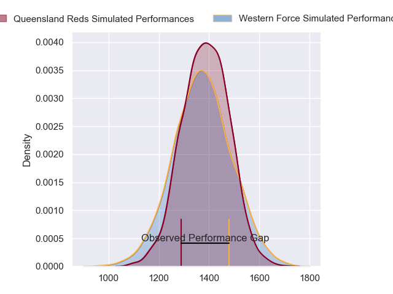
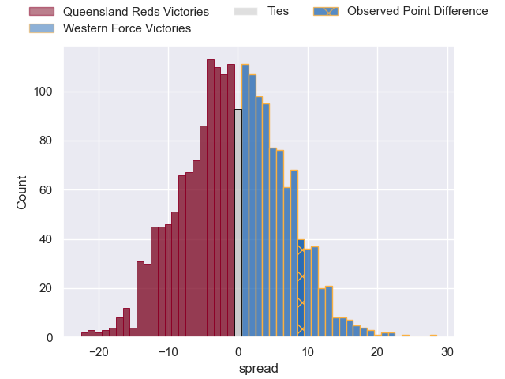
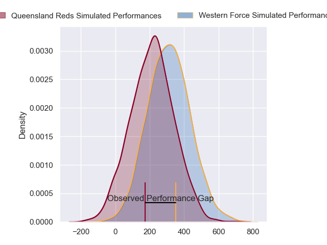
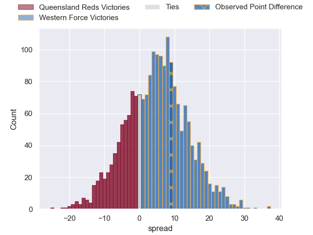
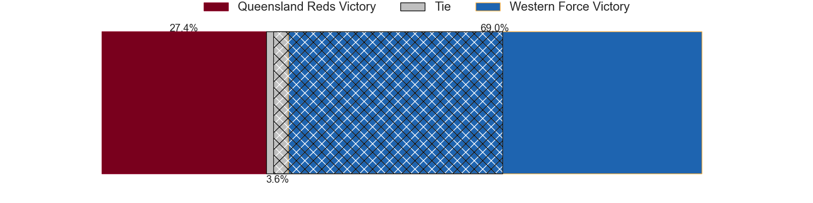

---  
layout: page  
title: Queensland Reds at Western Force; 31-40  
date: 2024-03-23 18:00:00 -0500  
categories: "Super Rugby Pacific 2024" match review  
---
# Queensland Reds at Western Force; 31-40

# Club Level Predictions

The first set of predictions treats a club as the smallest object, as the club develops its members, organizes a gameplan, and deploys its players as needed for each match. This club model has a prediction of 0.481, which translates to predicting Queensland Reds to win by 0.7.

Our Over/Under is 43.5 - and combined with the spread above, we have a predicted scoreline of 22 to 22

Each club has a rating and a rating deviation (similar to a Glicko rating), and expected performances can be generated. This allows for simulated matches and spreads like the ones below.
## Projected Performances - Club Model

## Projected Spreads - Club Model

## Projected Results - Club Model

# Player Level Predictions - Version 2

Treating teams instead as an entity made up of the currently active players, I have ratings for each player in an altogether different system. These can be combined to form team ratings once teamsheets are announced, weighting starters a bit higher than the reserves. After the match is played, players can be weighted by their minutes on the field, allowing for an accurate measure of the team's composition. With these compiled team ratings, we can make predictions, measure inaccuracy, and update the individual player ratings.
## Prediction without Player Minutes: Western Force by 6.3

Western Force by 2.3 on a neutral pitch

## Projected Performances - Player Model

## Projected Spreads - Player Model

## Projected Results - Player Model

|   Away Minutes | Away Player               |   Away Percentile |   Number |   Home Percentile | Home Player           |   Home Minutes |
|---------------:|:--------------------------|------------------:|---------:|------------------:|:----------------------|---------------:|
|             51 | Peni Ravai Kovekalou      |             63.89 |        1 |             31.76 | Ryan Coxon            |             60 |
|             56 | Matt Faessler             |             76.5  |        2 |             58.45 | Tom Horton            |             68 |
|             48 | Zane Nonggorr             |             77.5  |        3 |              8.7  | Santiago Medrano      |             58 |
|             68 | Seru Uru                  |             68.69 |        4 |             93.93 | Tom Franklin          |             80 |
|             80 | Ryan Smith                |             43.57 |        5 |             20.75 | Jeremy Williams       |             27 |
|             80 | Liam Wright               |             96.68 |        6 |              6.64 | Tim Anstee            |             80 |
|             80 | Fraser McReight           |             94.39 |        7 |             16.04 | Carlo Tizzano         |             80 |
|             52 | Harry Wilson              |             67.41 |        8 |             60.49 | Will Harris           |             24 |
|             68 | Tate McDermott            |             83.99 |        9 |             99.79 | Nic White             |             65 |
|             73 | Tom Lynagh                |             76.65 |       10 |             57.87 | Ben Donaldson         |             80 |
|             80 | Mac Grealy                |             80.62 |       11 |             80.73 | Chase Tiatia          |             80 |
|             80 | Hunter Paisami            |             74.12 |       12 |             83.11 | Hamish Stewart        |             80 |
|             52 | Josh Flook                |             44.23 |       13 |             34.63 | Sam Spink             |             80 |
|             80 | Suliasi Vunivalu          |             49.28 |       14 |              8.19 | Bayley Kuenzle        |             80 |
|             80 | Jock Campbell             |             67.81 |       15 |             49.63 | Harry Potter          |             68 |
|             24 | Josh Nasser               |            nan    |       16 |             93.98 | Ben Funnell           |             12 |
|             29 | George Blake              |             48.3  |       17 |            nan    | Josh Bartlett         |             20 |
|             32 | Jeff Toomaga-Allen        |             94.05 |       18 |            nan    | Tiaan Tauakipulu      |             22 |
|             12 | Cormac Daly               |            nan    |       19 |             28.03 | Lopeti Faifua         |             53 |
|             28 | John Bryant               |            nan    |       20 |             88.15 | Reed Prinsep          |             56 |
|             12 | Kalani Thomas             |             64.03 |       21 |             42.62 | Issak Fines-Leleiwasa |             15 |
|              7 | Harry McLaughlin-Phillips |             58.63 |       22 |             11.3  | Max Burey             |             12 |
|             28 | Taj Annan                 |             28.55 |       23 |            nan    | George Poolman        |              0 |

