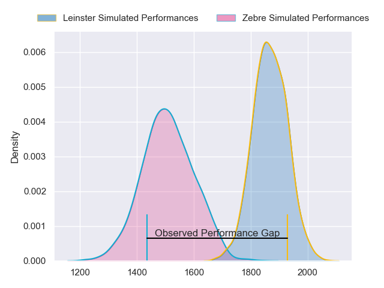
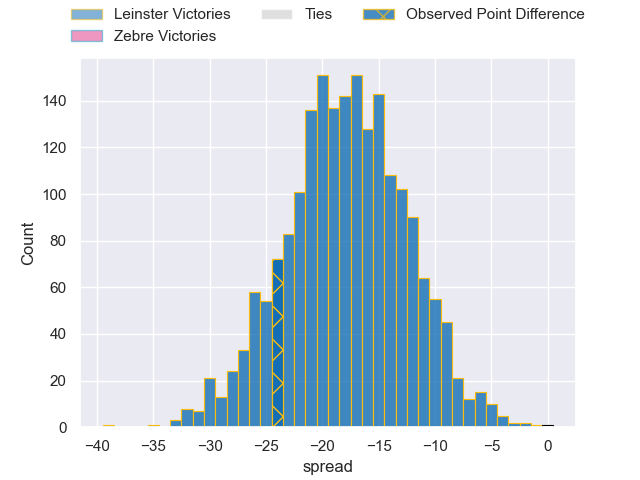
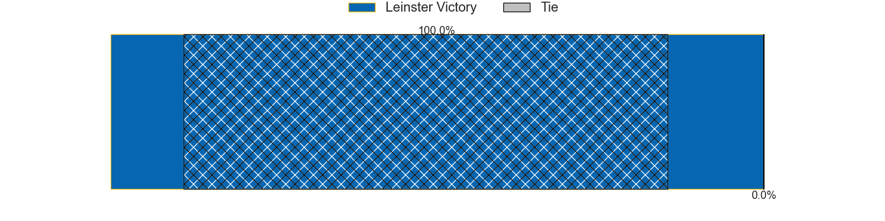
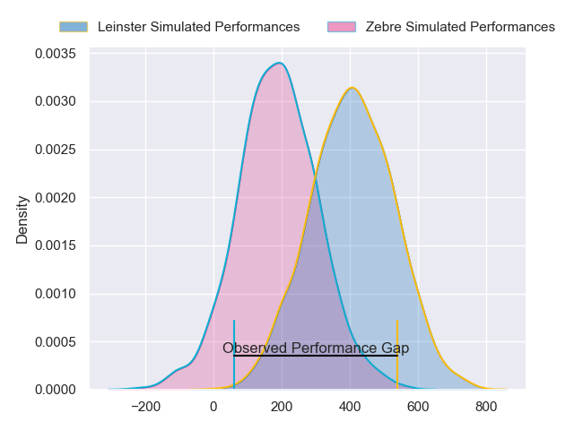
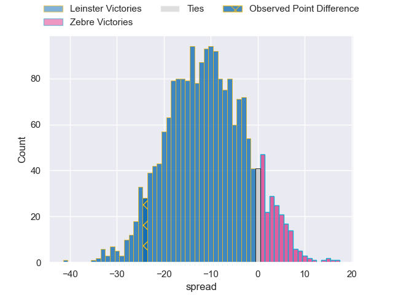
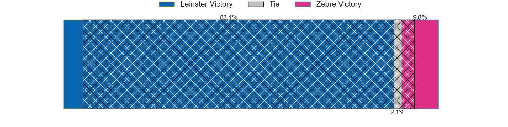

---  
layout: page  
title: Leinster at Zebre; 31-7  
date: 2024-03-23 18:00:00 -0500  
categories: "United Rugby Championship 2023" match review  
---
# Leinster at Zebre; 31-7

# Club Level Predictions

The first set of predictions treats a club as the smallest object, as the club develops its members, organizes a gameplan, and deploys its players as needed for each match. This club model has a prediction of 0.119, which translates to predicting Leinster to win by 17.7.

Our Over/Under is 58.5 - and combined with the spread above, we have a predicted scoreline of 38 to 20

Each club has a rating and a rating deviation (similar to a Glicko rating), and expected performances can be generated. This allows for simulated matches and spreads like the ones below.
## Projected Performances - Club Model

## Projected Spreads - Club Model

## Projected Results - Club Model

# Player Level Predictions - Version 2

Treating teams instead as an entity made up of the currently active players, I have ratings for each player in an altogether different system. These can be combined to form team ratings once teamsheets are announced, weighting starters a bit higher than the reserves. After the match is played, players can be weighted by their minutes on the field, allowing for an accurate measure of the team's composition. With these compiled team ratings, we can make predictions, measure inaccuracy, and update the individual player ratings.
## Prediction without Player Minutes: Leinster by 11.1

Leinster by 15.4 on a neutral pitch

## Projected Performances - Player Model

## Projected Spreads - Player Model

## Projected Results - Player Model

|   Away Minutes | Away Player          |   Away Percentile |   Number |   Home Percentile | Home Player            |   Home Minutes |
|---------------:|:---------------------|------------------:|---------:|------------------:|:-----------------------|---------------:|
|             51 | Ed Byrne             |             91.68 |        1 |             40.74 | Muhamed Hasa           |             51 |
|             51 | Lee Barron           |             58.83 |        2 |             41.55 | Giampietro Ribaldi     |             65 |
|             51 | Thomas Clarkson      |             82.14 |        3 |             39.13 | Juan Pitinari          |             40 |
|             71 | Ross Molony          |             95.75 |        4 |              6.8  | Dave Sisi              |             56 |
|             80 | Brian Deeny          |             59.71 |        5 |              6.19 | Leonard Krumov         |             80 |
|             41 | Will Connors         |             83.73 |        6 |             56.82 | Davide Ruggeri         |             56 |
|             80 | Scott Penny          |             89.92 |        7 |              4.81 | Iacopo Bianchi         |             80 |
|             80 | Max Deegan           |             92.84 |        8 |             30.12 | Giovanni Licata        |             80 |
|             63 | Luke McGrath         |             98.75 |        9 |             32.64 | Gonzalo Garcia         |             65 |
|             63 | Ross Byrne           |             95.94 |       10 |             89.85 | Geronimo Prisciantelli |             80 |
|             80 | Andrew Osborne       |             52.71 |       11 |              7.09 | Simone Gesi            |             80 |
|             80 | Jamie Osborne        |             90.64 |       12 |             70.47 | Fetuli Paea            |             80 |
|             80 | Liam Turner          |             56.01 |       13 |             94.17 | Luca Morisi            |             65 |
|             80 | Rob Russell          |             74.75 |       14 |             53.05 | Scott Gregory          |             51 |
|             44 | Ciaran Frawley       |             64.37 |       15 |              6.88 | Jacopo Trulla          |             80 |
|             29 | John McKee           |             72.04 |       16 |            nan    | Tommaso Di Bartolomeo  |             15 |
|             29 | Michael Milne        |             70.98 |       17 |             46.41 | Luca Rizzoli           |             29 |
|             29 | Michael Ala'alatoa   |             95.18 |       18 |            nan    | Riccardo Genovese      |             40 |
|              9 | Conor O'Tighearnaigh |            nan    |       19 |             87.86 | Matteo Canali          |             24 |
|             39 | Diarmuid Mangan      |            nan    |       20 |             84.77 | Josh Kaifa             |             24 |
|             17 | Fintan Gunne         |            nan    |       21 |              7.9  | Alessandro Fusco       |             15 |
|             17 | Sam Prendergast      |            nan    |       22 |             70.6  | Damiano Mazza          |             15 |
|             36 | Henry McErlean       |             43.24 |       23 |             33.55 | Pierre Bruno           |             29 |

