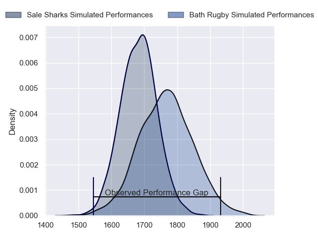
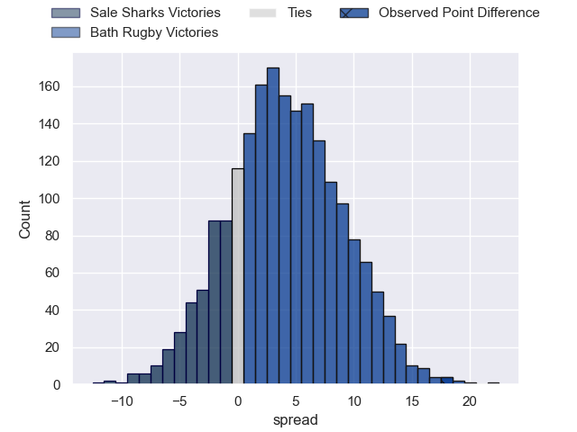
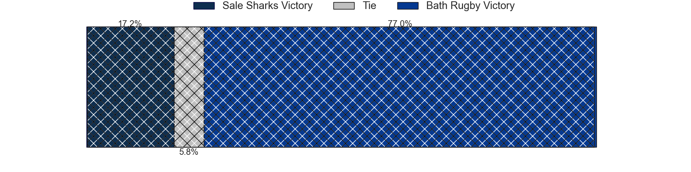
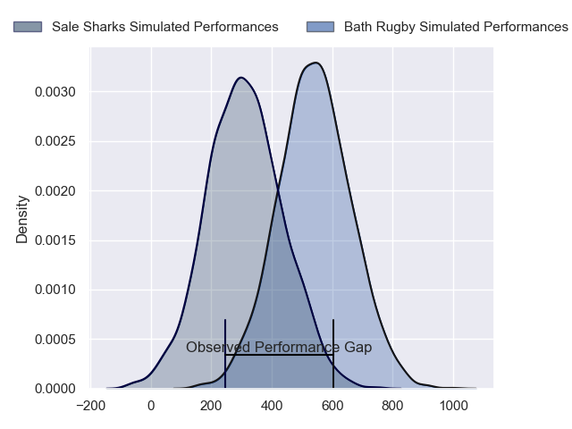
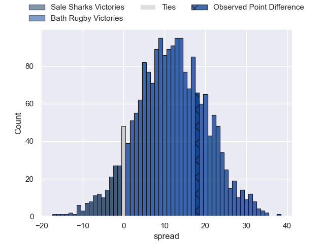
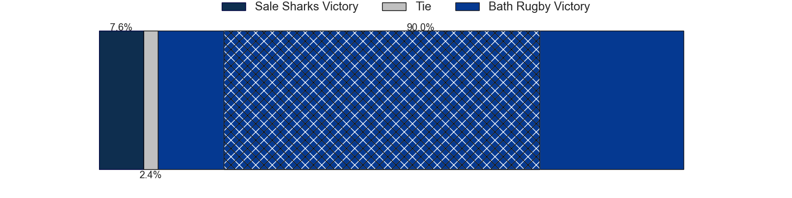

---  
layout: page  
title: Sale Sharks at Bath Rugby; 24-42  
date: 2024-03-24 18:00:00 -0500  
categories: "Gallagher Premiership 2023" match review  
---
# Sale Sharks at Bath Rugby; 24-42

# Club Level Predictions

The first set of predictions treats a club as the smallest object, as the club develops its members, organizes a gameplan, and deploys its players as needed for each match. This club model has a prediction of 0.609, which translates to predicting Bath Rugby to win by 3.9.

Our Over/Under is 40.5 - and combined with the spread above, we have a predicted scoreline of 18 to 22

Each club has a rating and a rating deviation (similar to a Glicko rating), and expected performances can be generated. This allows for simulated matches and spreads like the ones below.
## Projected Performances - Club Model

## Projected Spreads - Club Model

## Projected Results - Club Model

# Player Level Predictions - Version 2

Treating teams instead as an entity made up of the currently active players, I have ratings for each player in an altogether different system. These can be combined to form team ratings once teamsheets are announced, weighting starters a bit higher than the reserves. After the match is played, players can be weighted by their minutes on the field, allowing for an accurate measure of the team's composition. With these compiled team ratings, we can make predictions, measure inaccuracy, and update the individual player ratings.
## Prediction without Player Minutes: Bath Rugby by 12.6

Bath Rugby by 4.8 on a neutral pitch

## Projected Performances - Player Model

## Projected Spreads - Player Model

## Projected Results - Player Model

|   Away Minutes | Away Player          |   Away Percentile |   Number |   Home Percentile | Home Player     |   Home Minutes |
|---------------:|:---------------------|------------------:|---------:|------------------:|:----------------|---------------:|
|             59 | Bevan Rodd           |             89.51 |        1 |             85.82 | Beno Obano      |             69 |
|             54 | Luke Cowan-Dickie    |             81.36 |        2 |             95.73 | Tom Dunn        |             78 |
|             54 | James Harper         |              7.84 |        3 |             93.67 | Thomas du Toit  |             79 |
|             59 | Cobus Wiese          |             80.34 |        4 |             93.57 | Quinn Roux      |             60 |
|             80 | Josh Beaumont        |             69.66 |        5 |             50.12 | Charlie Ewels   |             80 |
|             80 | Ernst van Rhyn       |             87.17 |        6 |             73.2  | Ted Hill        |             80 |
|             80 | Sam Dugdale          |              7.67 |        7 |             90.61 | Sam Underhill   |             73 |
|             78 | Jean-Luc du Preez    |             98.77 |        8 |             65.43 | Alfie Barbeary  |             41 |
|             50 | Gus Warr             |             14.97 |        9 |             76.09 | Ben Spencer     |             78 |
|             80 | George Ford          |             92.39 |       10 |            100    | Finn Russell    |             78 |
|             59 | Arron Reed           |             70.32 |       11 |              7.53 | Will Muir       |             80 |
|             78 | Manu Tuilagi         |             97.45 |       12 |             55.41 | Cameron Redpath |             80 |
|             80 | Robert du Preez      |             35.72 |       13 |             80.44 | Ollie Lawrence  |             80 |
|             80 | Tom Roebuck          |             45.18 |       14 |             90.92 | Joe Cokanasiga  |             80 |
|             80 | Joe Carpenter        |              4.67 |       15 |             94.1  | Matt Gallagher  |             80 |
|             26 | Tommy Taylor         |             14.17 |       16 |              3.88 | Hame Faiva      |              2 |
|             21 | Simon McIntyre       |             91.21 |       17 |             33.84 | Juan Schoeman   |             11 |
|             26 | Asher Opoku-Fordjour |            nan    |       18 |            nan    | Archie Griffin  |              1 |
|             21 | Ben Bamber           |             35.19 |       19 |             88.23 | Elliott Stooke  |             20 |
|              2 | Hyron Andrews        |             31.92 |       20 |             95.42 | Miles Reid      |              7 |
|             30 | Raffi Quirke         |             61.12 |       21 |             68.4  | Louis Schreuder |              2 |
|              2 | Sam James            |             85.3  |       22 |             23.35 | Orlando Bailey  |              2 |
|             21 | Tom O'Flaherty       |             91.36 |       23 |             34.07 | Jaco Coetzee    |             39 |

