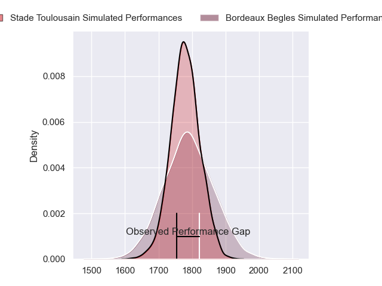
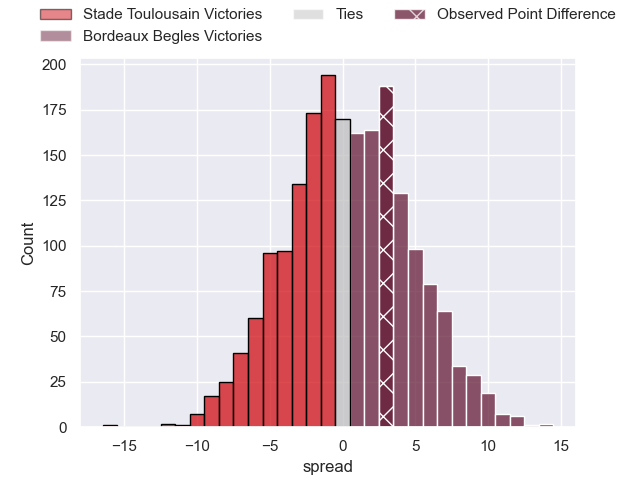
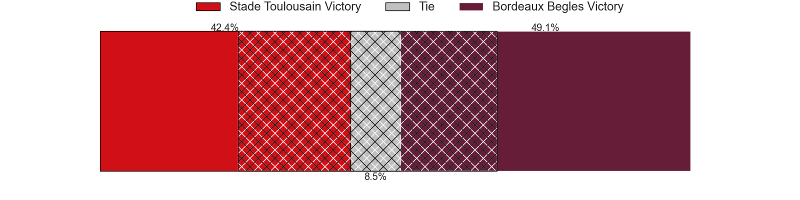
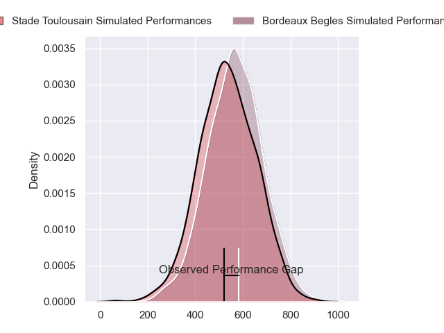
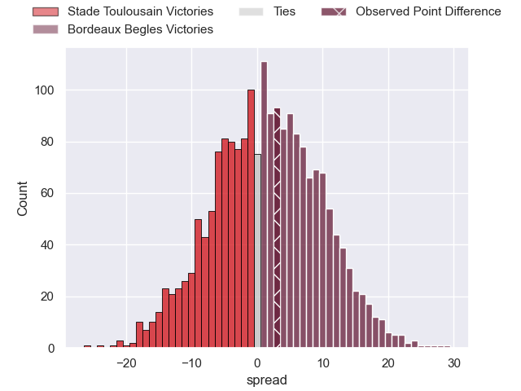
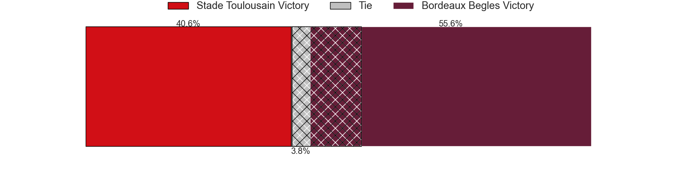

---  
layout: page  
title: Stade Toulousain at Bordeaux Begles; 28-31  
date: 2024-03-24 18:00:00 -0500  
categories: "Top 14 Orange 2023" match review  
---
# Stade Toulousain at Bordeaux Begles; 28-31

# Club Level Predictions

The first set of predictions treats a club as the smallest object, as the club develops its members, organizes a gameplan, and deploys its players as needed for each match. This club model has a prediction of 0.515, which translates to predicting Bordeaux Begles to win by 0.5.

Our Over/Under is 41.5 - and combined with the spread above, we have a predicted scoreline of 21 to 21

Each club has a rating and a rating deviation (similar to a Glicko rating), and expected performances can be generated. This allows for simulated matches and spreads like the ones below.
## Projected Performances - Club Model

## Projected Spreads - Club Model

## Projected Results - Club Model

# Player Level Predictions - Version 2

Treating teams instead as an entity made up of the currently active players, I have ratings for each player in an altogether different system. These can be combined to form team ratings once teamsheets are announced, weighting starters a bit higher than the reserves. After the match is played, players can be weighted by their minutes on the field, allowing for an accurate measure of the team's composition. With these compiled team ratings, we can make predictions, measure inaccuracy, and update the individual player ratings.
## Prediction without Player Minutes: Bordeaux Begles by 5.8

Stade Toulousain by 1.5 on a neutral pitch

## Projected Performances - Player Model

## Projected Spreads - Player Model

## Projected Results - Player Model

|   Away Minutes | Away Player          |   Away Percentile |   Number |   Home Percentile | Home Player        |   Home Minutes |
|---------------:|:---------------------|------------------:|---------:|------------------:|:-------------------|---------------:|
|             45 | Rodrigue Neti        |             54.25 |        1 |             90.93 | Ugo Boniface       |             42 |
|             63 | Julien Marchand      |             98.25 |        2 |             56.89 | Maxime Lamothe     |             63 |
|             45 | Joel Merkler         |             63.99 |        3 |             97.54 | Ben Tameifuna      |             54 |
|             63 | Richie Arnold        |             75    |        4 |             90.05 | Cyril Cazeaux      |             60 |
|             45 | Thibaud Flament      |             89.81 |        5 |             98.42 | Adam Coleman       |             80 |
|             63 | Jack Willis          |             93.59 |        6 |             87.74 | Pierre Bochaton    |             80 |
|             62 | Joshua Brennan       |             72.51 |        7 |             78.24 | Mahamadou Diaby    |             56 |
|             80 | Alexandre Roumat     |             94.81 |        8 |             84.2  | Tevita Tatafu      |             80 |
|             80 | Paul Graou           |             60.08 |        9 |             99.17 | Maxime Lucu        |             80 |
|              4 | Thomas Ramos         |             93.4  |       10 |             96.19 | Matthieu Jalibert  |             54 |
|             80 | Matthis Lebel        |             98.34 |       11 |             19.93 | Pablo Uberti       |             80 |
|             80 | Pita Ahki            |             54.56 |       12 |             76.67 | Yoram Moefana      |             80 |
|             80 | Paul Costes          |             54.31 |       13 |             36.09 | Nicolas Depoortere |             71 |
|             49 | Arthur Retiere       |             94.8  |       14 |             94.35 | Damian Penaud      |             80 |
|             80 | Juan Cruz Mallia     |             98.03 |       15 |             96.81 | Romain Buros       |             66 |
|             17 | Guillaume Cramont    |             78.06 |       16 |             40.39 | Romain Latterrade  |             17 |
|             35 | Cyril Baille         |             94.99 |       17 |            nan    | Lekso Kaulashvili  |             38 |
|             35 | Emmanuel Meafou      |             82.89 |       18 |             89.08 | Guido Petti        |             32 |
|             17 | Theo Ntamack         |             50.12 |       19 |             35.4  | Marko Gazzotti     |             12 |
|             35 | Francois Cros        |             97.94 |       20 |              6.86 | Yann Lesgourgues   |             14 |
|             76 | Antoine Dupont       |             99.24 |       21 |             33.25 | Mateo Garcia       |             26 |
|             31 | Pierre-Louis Barassi |             88.09 |       22 |             52.25 | Ben Tapuai         |              9 |
|             35 | Dorian Aldegheri     |             97.26 |       23 |             38.56 | Toma'akino Taufa   |             26 |

