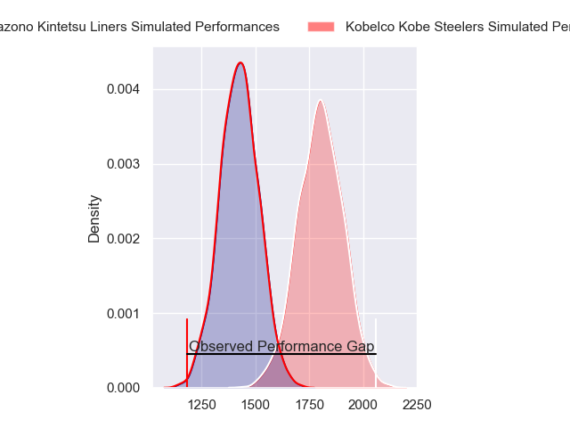
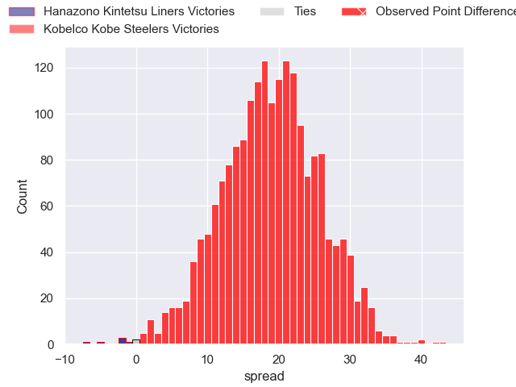
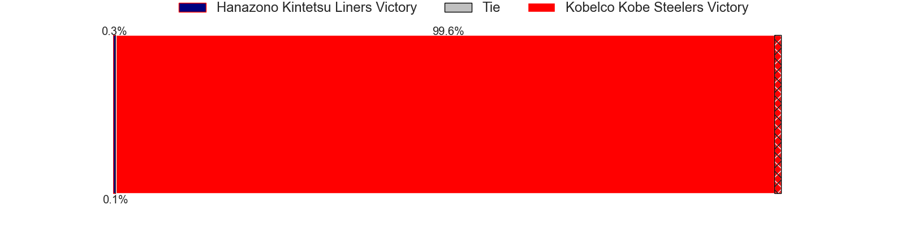

---  
layout: page  
title: Hanazono Kintetsu Liners at Kobelco Kobe Steelers; 17-60  
date: 2024-03-24 18:00:00 -0500  
categories: "Japan Rugby League One 2023" match review  
---
# Hanazono Kintetsu Liners at Kobelco Kobe Steelers; 17-60

# Club Level Predictions

The first set of predictions treats a club as the smallest object, as the club develops its members, organizes a gameplan, and deploys its players as needed for each match. This club model has a prediction of 0.889, which translates to predicting Kobelco Kobe Steelers to win by 18.8.

Our Over/Under is 50.5 - and combined with the spread above, we have a predicted scoreline of 16 to 34

Each club has a rating and a rating deviation (similar to a Glicko rating), and expected performances can be generated. This allows for simulated matches and spreads like the ones below.
## Projected Performances - Club Model

## Projected Spreads - Club Model

## Projected Results - Club Model

