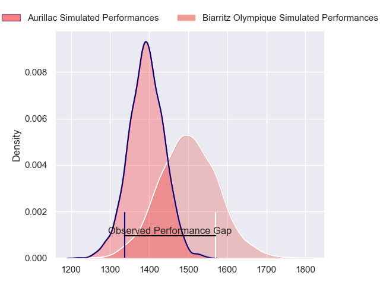
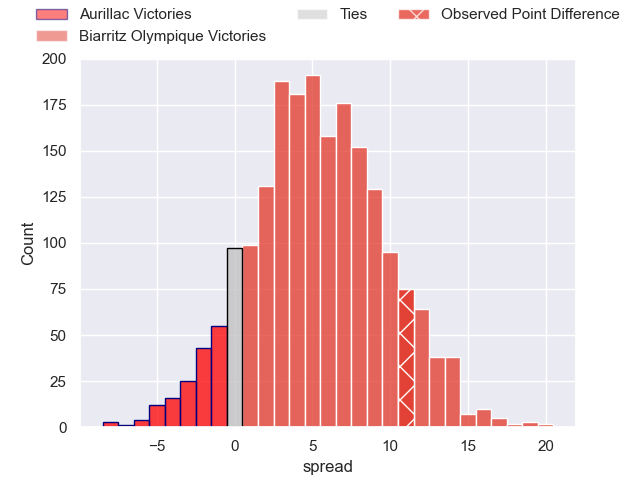
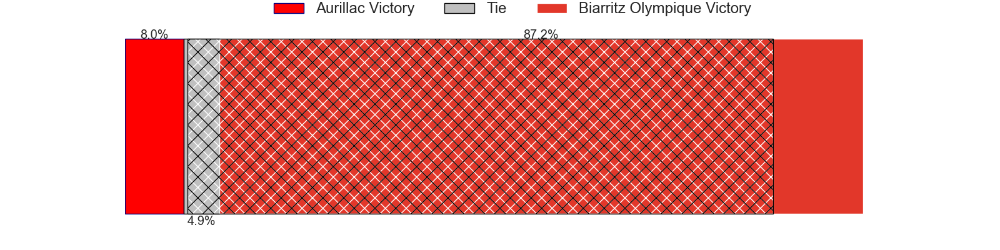
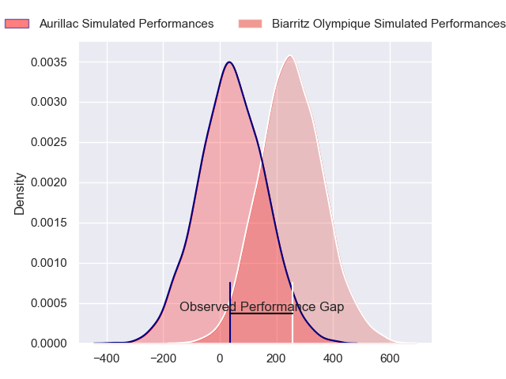
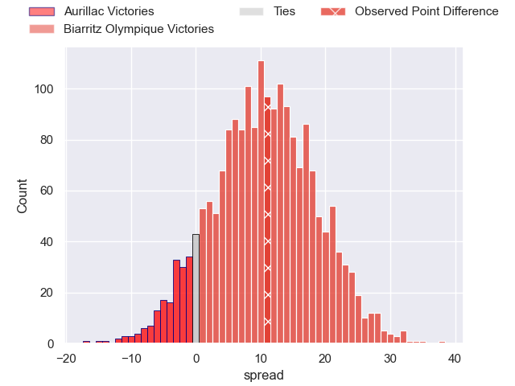
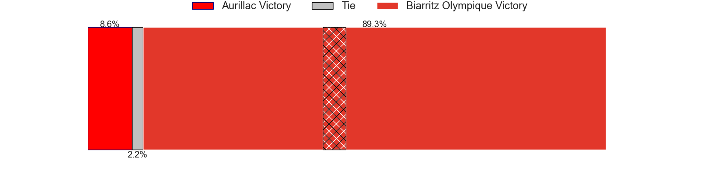

---  
layout: page  
title: Aurillac at Biarritz Olympique; 18-29  
date: 2024-04-05 18:00:00 -0500  
categories: "Pro D2 2023" match review  
---
# Aurillac at Biarritz Olympique; 18-29

# Club Level Predictions

The first set of predictions treats a club as the smallest object, as the club develops its members, organizes a gameplan, and deploys its players as needed for each match. This club model has a prediction of 0.647, which translates to predicting Biarritz Olympique to win by 5.3.

Our Over/Under is 45.5 - and combined with the spread above, we have a predicted scoreline of 20 to 26

Each club has a rating and a rating deviation (similar to a Glicko rating), and expected performances can be generated. This allows for simulated matches and spreads like the ones below.
## Projected Performances - Club Model

## Projected Spreads - Club Model

## Projected Results - Club Model

# Player Level Predictions - Version 2

Treating teams instead as an entity made up of the currently active players, I have ratings for each player in an altogether different system. These can be combined to form team ratings once teamsheets are announced, weighting starters a bit higher than the reserves. After the match is played, players can be weighted by their minutes on the field, allowing for an accurate measure of the team's composition. With these compiled team ratings, we can make predictions, measure inaccuracy, and update the individual player ratings.
## Prediction without Player Minutes: Biarritz Olympique by 10.8

Biarritz Olympique by 1.9 on a neutral pitch

## Projected Performances - Player Model

## Projected Spreads - Player Model

## Projected Results - Player Model

|   Away Minutes | Away Player               |   Away Percentile |   Number |   Home Percentile | Home Player       |   Home Minutes |
|---------------:|:--------------------------|------------------:|---------:|------------------:|:------------------|---------------:|
|             45 | Robert Rodgers            |              8.74 |        1 |             30.39 | Zakaria El Fakir  |             41 |
|             45 | Ronan Loughnane           |             31.37 |        2 |             54.9  | Luteru Tolai      |             49 |
|             45 | Tim Daniel-Meissen        |             23.65 |        3 |              6.84 | Alfie Petch       |             41 |
|             41 | Heath Backhouse           |             81.26 |        4 |              3.58 | Adrian Motoc      |             80 |
|             80 | Cam Dodson                |             72.08 |        5 |             76.01 | Charlie Matthews  |             80 |
|             55 | Théo Cambon               |             11.82 |        6 |             50.64 | Dave O'Callaghan  |             80 |
|             49 | Hugo Huurman              |             65.47 |        7 |             60.25 | Simon Augry       |             45 |
|             80 | Beka Shvangiradze         |             49.27 |        8 |              6.03 | Charlie Francoz   |             54 |
|             49 | David Delarue             |             20.62 |        9 |             39.38 | Pierre Pages      |             64 |
|             55 | Anderson Neisen           |             32    |       10 |             12.5  | Billy Searle      |             80 |
|             80 | Axel Bevia                |             18.35 |       11 |             55.11 | Gervais Cordin    |             80 |
|             80 | Christa Powell            |              9.24 |       12 |             87.27 | Jonathan Joseph   |             60 |
|             80 | Juun Pieters              |             54.5  |       13 |             25.57 | Vincent Martin    |             80 |
|             80 | Jordon Janse Van Rensburg |             18.57 |       14 |             67.5  | Baptiste Fariscot |             80 |
|             80 | AJ Coertzen               |             64.09 |       15 |             75.81 | Joe Jonas         |              9 |
|             39 | Martial Rolland           |             37.11 |       16 |             30.35 | Steeve Barry      |             71 |
|             35 | Alexandre Plantier        |             64.77 |       17 |             21.18 | Kevin Tougne      |             39 |
|             35 | Luka Nioradze             |             12.55 |       18 |             85.38 | Mohamed Haouas    |             39 |
|             35 | Thomas Cretu              |             33.9  |       19 |             38.01 | Temo Matiu        |             35 |
|             31 | Mikheil Alania            |             25.42 |       20 |             68.04 | Bastien Soury     |             31 |
|             31 | Didier Tison              |             33.26 |       21 |             65.75 | Nafi Ma'afu       |             26 |
|             25 | Latuka Maituku            |              6.37 |       22 |             77.55 | Yann David        |             20 |
|             25 | Hugo Bastard              |             32.29 |       23 |             47.5  | Imanol Biscay     |             16 |

