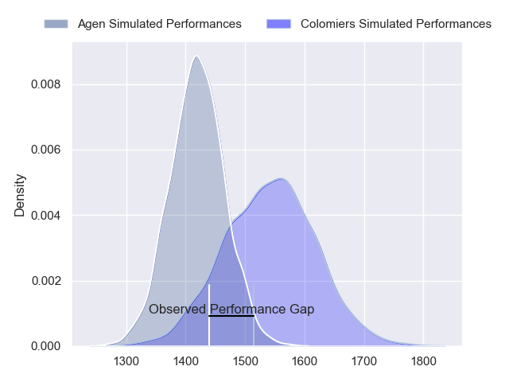
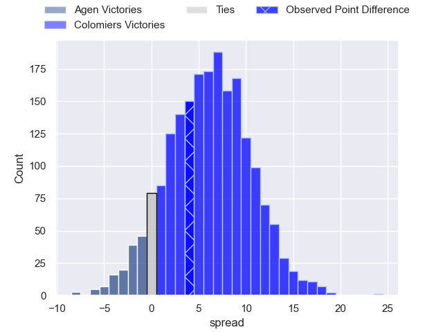
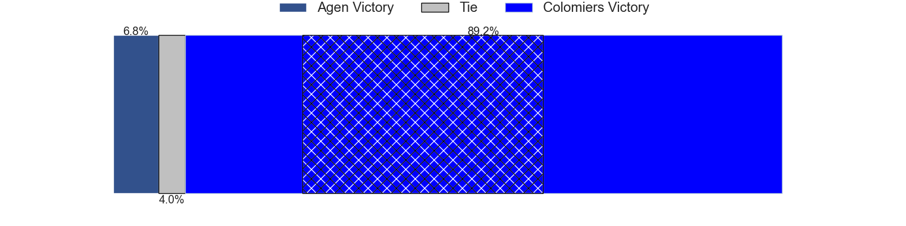
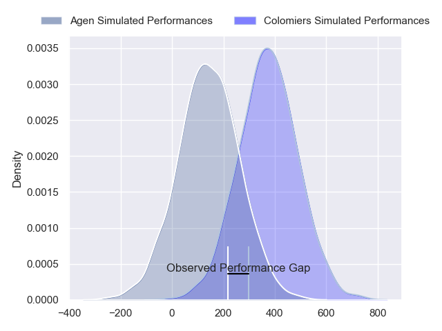
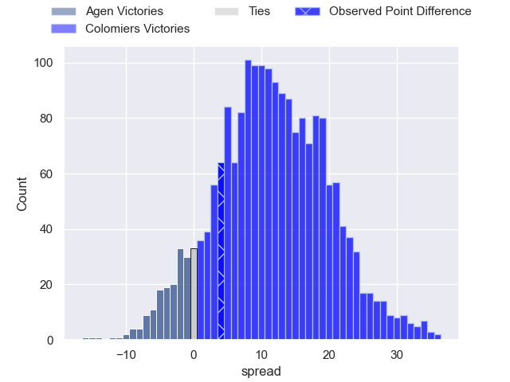
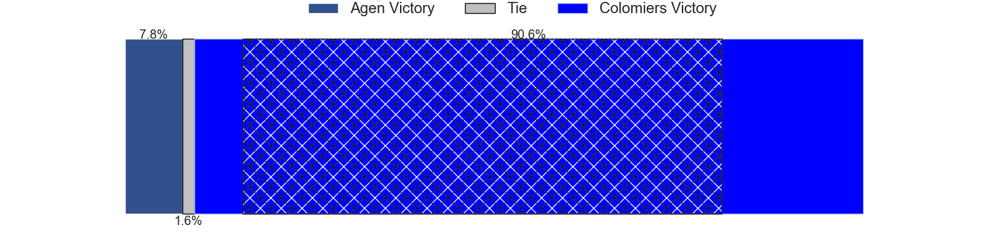

---  
layout: page  
title: Agen at Colomiers; 18-22  
date: 2024-04-05 18:00:00 -0500  
categories: "Pro D2 2023" match review  
---
# Agen at Colomiers; 18-22

# Club Level Predictions

The first set of predictions treats a club as the smallest object, as the club develops its members, organizes a gameplan, and deploys its players as needed for each match. This club model has a prediction of 0.668, which translates to predicting Colomiers to win by 6.1.

Our Over/Under is 48.5 - and combined with the spread above, we have a predicted scoreline of 21 to 27

Each club has a rating and a rating deviation (similar to a Glicko rating), and expected performances can be generated. This allows for simulated matches and spreads like the ones below.
## Projected Performances - Club Model

## Projected Spreads - Club Model

## Projected Results - Club Model

# Player Level Predictions - Version 2

Treating teams instead as an entity made up of the currently active players, I have ratings for each player in an altogether different system. These can be combined to form team ratings once teamsheets are announced, weighting starters a bit higher than the reserves. After the match is played, players can be weighted by their minutes on the field, allowing for an accurate measure of the team's composition. With these compiled team ratings, we can make predictions, measure inaccuracy, and update the individual player ratings.
## Prediction without Player Minutes: Colomiers by 14.0

Colomiers by 6.2 on a neutral pitch

## Projected Performances - Player Model

## Projected Spreads - Player Model

## Projected Results - Player Model

|   Away Minutes | Away Player        |   Away Percentile |   Number |   Home Percentile | Home Player        |   Home Minutes |
|---------------:|:-------------------|------------------:|---------:|------------------:|:-------------------|---------------:|
|             50 | Florent Guion      |             14.43 |        1 |             27.54 | Thomas Dubois      |             52 |
|             50 | Clement Martinez   |             56.47 |        2 |             30.78 | Andrew Ready       |             52 |
|             50 | Alex Burin         |             65.24 |        3 |             68    | Hugo Pirlet        |             55 |
|             50 | Joe Maksymiw       |              9.07 |        4 |             83.17 | Romain Bezian      |             55 |
|             80 | William Demotte    |             88.9  |        5 |             78.88 | Maxime Granouillet |             80 |
|             50 | Julien Lebian      |             25.38 |        6 |             51.91 | Anthony Coletta    |             55 |
|             80 | Arnaud Duputs      |             82.27 |        7 |             89.34 | Aldric Lescure     |             80 |
|             61 | Fotu Lokotui       |             27.32 |        8 |             69.27 | Joseva Tamani      |             80 |
|             34 | Sonatane Takulua   |             10.62 |        9 |             63.75 | Ugo Seguela        |             75 |
|             80 | Thomas Vincent     |             67.5  |       10 |              0.5  | Brett Herron       |             80 |
|             80 | Iban Etcheverry    |             41.45 |       11 |             96.04 | Rodrigo Marta      |             80 |
|             80 | Clement Garrigues  |             63.03 |       12 |             61.22 | Ray Nu'u           |             80 |
|             80 | Theo Belan         |             58.46 |       13 |             51.26 | Paul Pimienta      |             68 |
|             80 | Timilai Rokoduru   |             62.51 |       14 |             87.2  | Vincent Pinto      |             80 |
|             68 | Romain Darchen     |             52.62 |       15 |              6.23 | Valentin Saurs     |             75 |
|             46 | Dorian Bellot      |             43.96 |       16 |             77.3  | Guillaume Tartas   |             28 |
|             30 | Beau Farrance      |             46.82 |       17 |            nan    | Toma Kolokilagi    |             28 |
|             30 | Valentin Gayraud   |             31.29 |       18 |             85    | Michael Simutoga   |             25 |
|             30 | Antoine Erbani     |             93.32 |       19 |             43.32 | Janse Roux         |             25 |
|             30 | Pierre Jouvin      |             16.86 |       20 |             49.13 | Alexis Caumel      |             25 |
|             30 | Hans Lombard-Buret |             69.04 |       21 |             44.78 | Fabien Perrin      |             12 |
|             19 | Martin Devergie    |             14.15 |       22 |             53.12 | Thomas Girard      |              5 |
|             12 | Ben Volavola       |             38.25 |       23 |             44.17 | Arthur Diaz        |              5 |

