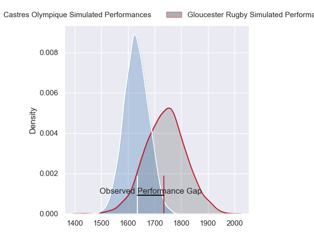
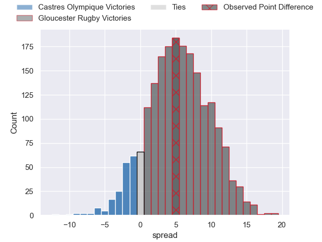
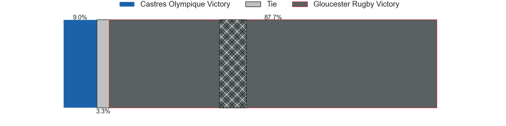
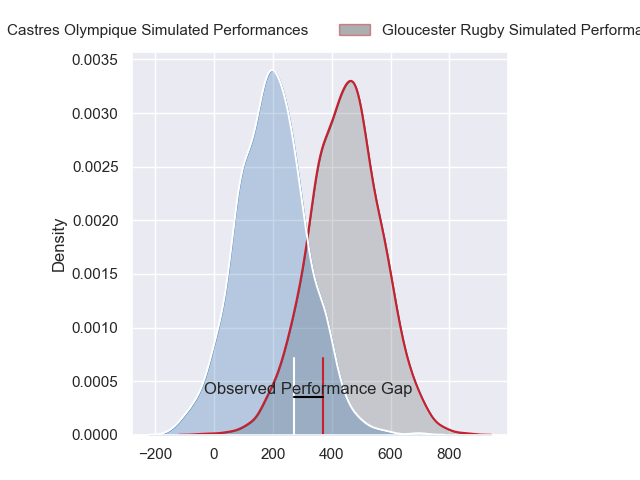
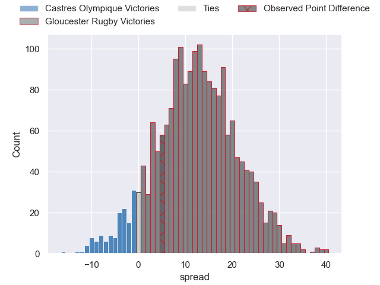
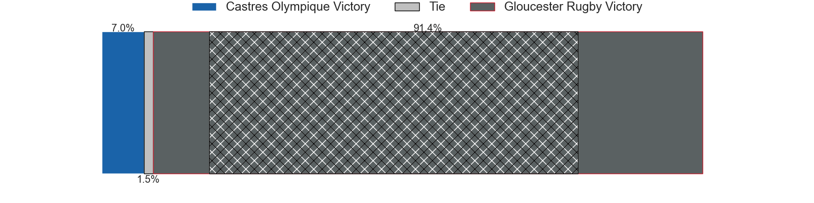

---  
layout: page  
title: Castres Olympique at Gloucester Rugby; 25-30  
date: 2024-04-05 18:00:00 -0500  
categories: "European Rugby Challenge Cup 2023" match review  
---
# Castres Olympique at Gloucester Rugby; 25-30

# Club Level Predictions

The first set of predictions treats a club as the smallest object, as the club develops its members, organizes a gameplan, and deploys its players as needed for each match. This club model has a prediction of 0.651, which translates to predicting Gloucester Rugby to win by 5.5.

Our Over/Under is 54.5 - and combined with the spread above, we have a predicted scoreline of 25 to 30

Each club has a rating and a rating deviation (similar to a Glicko rating), and expected performances can be generated. This allows for simulated matches and spreads like the ones below.
## Projected Performances - Club Model

## Projected Spreads - Club Model

## Projected Results - Club Model

# Player Level Predictions - Version 2

Treating teams instead as an entity made up of the currently active players, I have ratings for each player in an altogether different system. These can be combined to form team ratings once teamsheets are announced, weighting starters a bit higher than the reserves. After the match is played, players can be weighted by their minutes on the field, allowing for an accurate measure of the team's composition. With these compiled team ratings, we can make predictions, measure inaccuracy, and update the individual player ratings.
## Prediction without Player Minutes: Gloucester Rugby by 14.4

Gloucester Rugby by 6.3 on a neutral pitch

## Projected Performances - Player Model

## Projected Spreads - Player Model

## Projected Results - Player Model

|   Away Minutes | Away Player          |   Away Percentile |   Number |   Home Percentile | Home Player         |   Home Minutes |
|---------------:|:---------------------|------------------:|---------:|------------------:|:--------------------|---------------:|
|             59 | Quentin Walcker      |             75.02 |        1 |             79.87 | Val Rapava-Ruskin   |             62 |
|             45 | Gaetan Barlot        |             79.61 |        2 |             55.1  | Santiago Socino     |             62 |
|             56 | Aurelien Azar        |             51.76 |        3 |             90.12 | Kirill Gotovtsev    |             67 |
|             53 | Ryno Pieterse        |             50.72 |        4 |             80.19 | Freddie Clarke      |             82 |
|             82 | Florent Vanverberghe |             65.63 |        5 |             45.47 | Freddie Thomas      |             62 |
|             82 | Baptiste Delaporte   |             77.06 |        6 |             89.69 | Ruan Ackermann      |             62 |
|             62 | Gauthier Maravat     |              3.48 |        7 |             43.8  | Lewis Ludlow        |             72 |
|             82 | Yann Peysson         |             72.68 |        8 |             68.78 | Zach Mercer         |             82 |
|             53 | Gauthier Doubrere    |             45    |        9 |             25.62 | Stephen Varney      |             82 |
|             82 | Pierre Popelin       |             55    |       10 |             62.75 | Charlie Atkinson    |             82 |
|             82 | Filipo Nakosi        |             81.65 |       11 |             86.3  | Ollie Thorley       |             82 |
|             77 | Jack Goodhue         |             96.04 |       12 |             33.97 | Sebastien Atkinson  |             82 |
|             82 | Joris Dupont         |             43.46 |       13 |             84.99 | Max Llewellyn       |             77 |
|             82 | Josaia Raisuqe       |             76.9  |       14 |             68.06 | Jonny May           |             82 |
|             59 | Julien Dumora        |             43.14 |       15 |             90.77 | Santiago Carreras   |             82 |
|             37 | Loris Zarantonello   |             37.65 |       16 |             33.73 | Adam McBurney       |             20 |
|             23 | Wayan de Benedittis  |            nan    |       17 |             10.16 | Mayco Vivas         |             20 |
|             26 | Levan Chilachava     |             82.24 |       18 |             17.38 | Jamal Ford-Robinson |             15 |
|             29 | Leone Nakarawa       |             93.91 |       19 |             89.02 | Cameron Jordan      |             10 |
|             20 | Mathieu Babillot     |             24.91 |       20 |             90.85 | Albert Tuisue       |             20 |
|             29 | Jeremy Fernandez     |             21.04 |       21 |             35.34 | Jack Clement        |             20 |
|              5 | Adrien Seguret       |             15.49 |       22 |             35.62 | Charlie Chapman     |              0 |
|             23 | Theo Chabouni        |            nan    |       23 |             79.83 | Chris Harris        |              5 |

