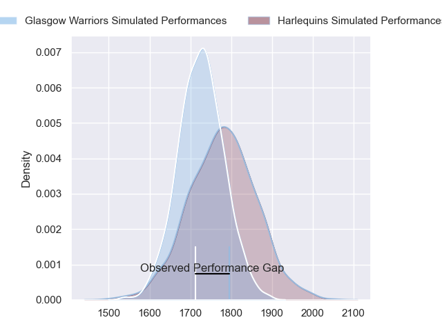
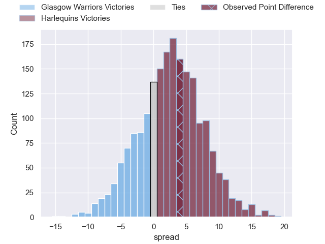
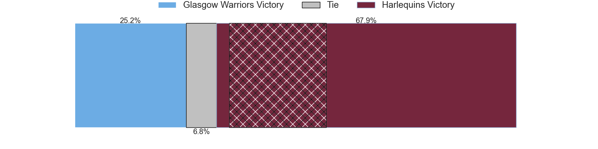
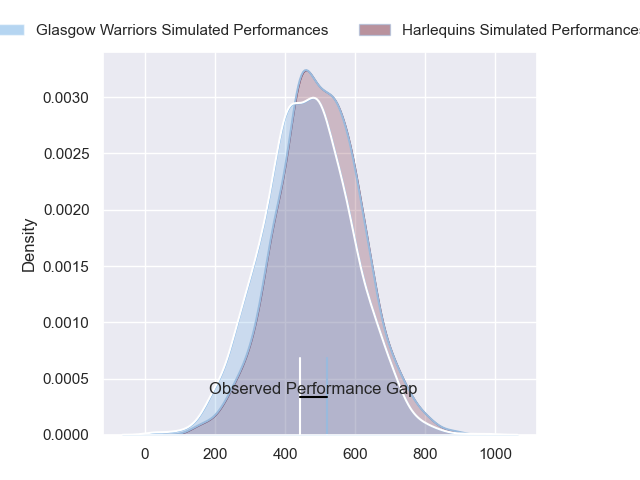
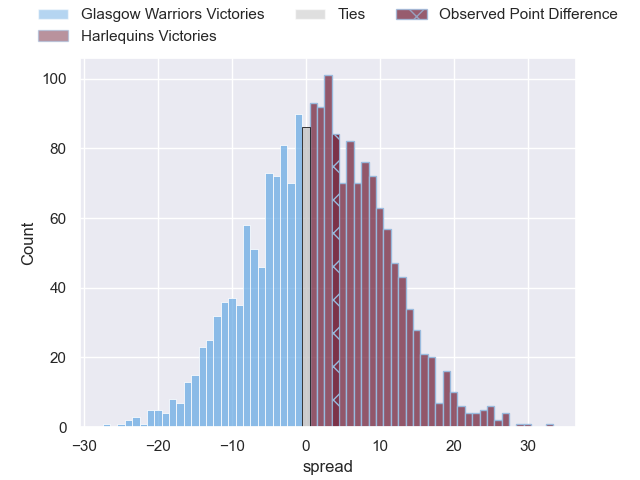

---  
layout: page  
title: Glasgow Warriors at Harlequins; 24-28  
date: 2024-04-05 18:00:00 -0500  
categories: "European Rugby Champions Cup 2023" match review  
---
# Glasgow Warriors at Harlequins; 24-28

# Club Level Predictions

The first set of predictions treats a club as the smallest object, as the club develops its members, organizes a gameplan, and deploys its players as needed for each match. This club model has a prediction of 0.566, which translates to predicting Harlequins to win by 2.4.

Our Over/Under is 60.5 - and combined with the spread above, we have a predicted scoreline of 29 to 32

Each club has a rating and a rating deviation (similar to a Glicko rating), and expected performances can be generated. This allows for simulated matches and spreads like the ones below.
## Projected Performances - Club Model

## Projected Spreads - Club Model

## Projected Results - Club Model

# Player Level Predictions - Version 2

Treating teams instead as an entity made up of the currently active players, I have ratings for each player in an altogether different system. These can be combined to form team ratings once teamsheets are announced, weighting starters a bit higher than the reserves. After the match is played, players can be weighted by their minutes on the field, allowing for an accurate measure of the team's composition. With these compiled team ratings, we can make predictions, measure inaccuracy, and update the individual player ratings.
## Prediction without Player Minutes: Harlequins by 1.8

Glasgow Warriors by 5.6 on a neutral pitch

## Projected Performances - Player Model

## Projected Spreads - Player Model

## Projected Results - Player Model

|   Away Minutes | Away Player       |   Away Percentile |   Number |   Home Percentile | Home Player       |   Home Minutes |
|---------------:|:------------------|------------------:|---------:|------------------:|:------------------|---------------:|
|             60 | Nathan McBeth     |             55.46 |        1 |             32.48 | Fin Baxter        |             41 |
|             60 | Johnny Matthews   |             33.53 |        2 |             20.98 | Jack Walker       |             69 |
|             60 | Zander Fagerson   |             99.34 |        3 |             92.12 | Will Collier      |             58 |
|             60 | Max Williamson    |             46.18 |        4 |             71.96 | Irne Herbst       |             54 |
|             80 | Scott Cummings    |             97.26 |        5 |             17.18 | George Hammond    |             65 |
|             60 | Matt Fagerson     |             96.06 |        6 |             82.1  | Stephan Lewies    |             76 |
|             80 | Rory Darge        |             80.07 |        7 |             72.54 | Will Evans        |             80 |
|             80 | Jack Dempsey      |             36.34 |        8 |             86.1  | Alex Dombrandt    |             80 |
|             80 | George Horne      |             99.58 |        9 |            100    | Danny Care        |             80 |
|             69 | Tom Jordan        |             44    |       10 |             85.75 | Marcus Smith      |             80 |
|             22 | Kyle Rowe         |             84.14 |       11 |             35.67 | Cadan Murley      |             80 |
|             80 | Sione Tuipulotu   |             57.38 |       12 |             97.84 | Andre Esterhuizen |             80 |
|             80 | Stafford McDowall |             91.96 |       13 |             66.63 | Oscar Beard       |             80 |
|             80 | Kyle Steyn        |             95.92 |       14 |             83.58 | Louis Lynagh      |             80 |
|             80 | Josh McKay        |             51.62 |       15 |             78.3  | Tyrone Green      |             80 |
|             20 | Gregor Hiddleston |             58.82 |       16 |             65.1  | Sam Riley         |             11 |
|             20 | Oli Kebble        |             95.92 |       17 |             97.82 | Joe Marler        |             39 |
|             20 | Lucio Sordoni     |             91.74 |       18 |             93.64 | Dillon Lewis      |             22 |
|             20 | Sintu Manjezi     |             63.6  |       19 |             95.82 | Joe Launchbury    |             26 |
|              0 | Ally Miller       |             27.23 |       20 |            nan    | Will Trenholm     |             15 |
|             20 | Henco Venter      |             97.32 |       21 |            nan    | Tom Lawday        |              4 |
|             58 | Jamie Dobie       |             67.92 |       22 |             54.79 | Max Green         |              0 |
|             11 | Duncan Weir       |             79    |       23 |             38.84 | Cameron Anderson  |              0 |

