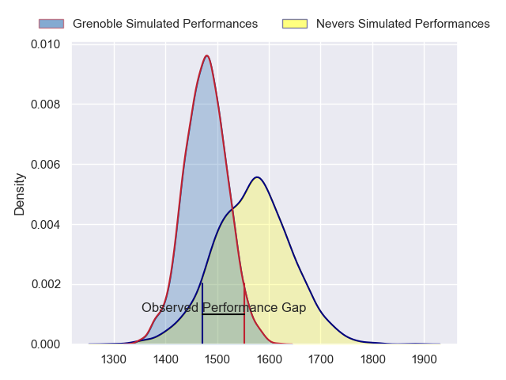
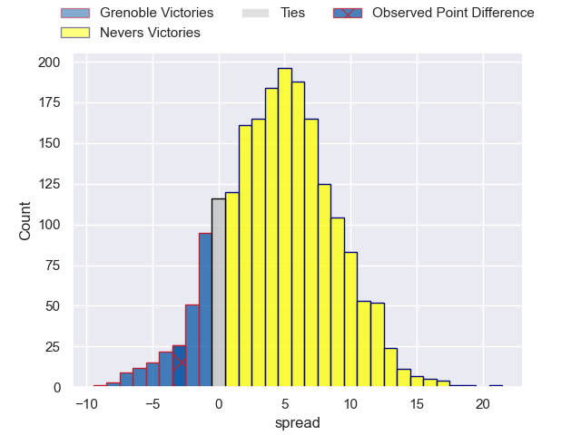
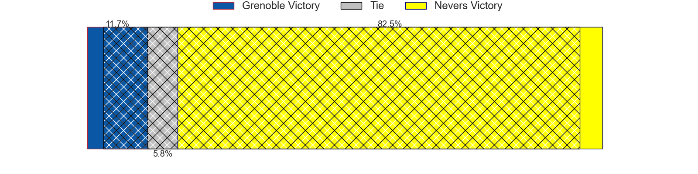
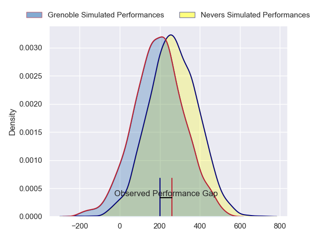
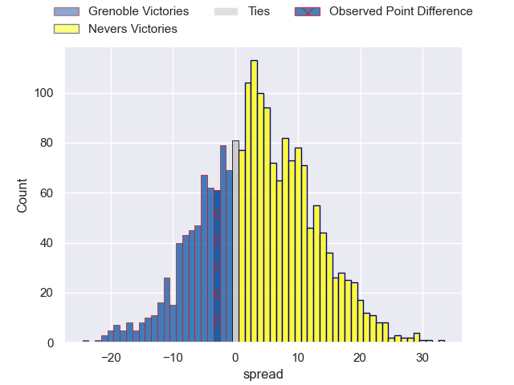
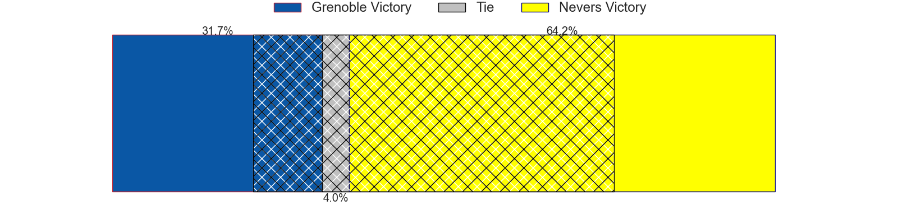

---  
layout: page  
title: Grenoble at Nevers; 22-19  
date: 2024-04-05 18:00:00 -0500  
categories: "Pro D2 2023" match review  
---
# Grenoble at Nevers; 22-19

# Club Level Predictions

The first set of predictions treats a club as the smallest object, as the club develops its members, organizes a gameplan, and deploys its players as needed for each match. This club model has a prediction of 0.63, which translates to predicting Nevers to win by 4.7.

Our Over/Under is 28.5 - and combined with the spread above, we have a predicted scoreline of 12 to 16

Each club has a rating and a rating deviation (similar to a Glicko rating), and expected performances can be generated. This allows for simulated matches and spreads like the ones below.
## Projected Performances - Club Model

## Projected Spreads - Club Model

## Projected Results - Club Model

# Player Level Predictions - Version 2

Treating teams instead as an entity made up of the currently active players, I have ratings for each player in an altogether different system. These can be combined to form team ratings once teamsheets are announced, weighting starters a bit higher than the reserves. After the match is played, players can be weighted by their minutes on the field, allowing for an accurate measure of the team's composition. With these compiled team ratings, we can make predictions, measure inaccuracy, and update the individual player ratings.
## Prediction without Player Minutes: Nevers by 5.3

Nevers by 1.6 on a neutral pitch

## Projected Performances - Player Model

## Projected Spreads - Player Model

## Projected Results - Player Model

|   Away Minutes | Away Player                 |   Away Percentile |   Number |   Home Percentile | Home Player         |   Home Minutes |
|---------------:|:----------------------------|------------------:|---------:|------------------:|:--------------------|---------------:|
|             50 | Eli Eglaine                 |             22.7  |        1 |             67.62 | Kamaliele Tufele    |             43 |
|             59 | Barnabé Massa               |             74.51 |        2 |             52.55 | Elia Elia           |             80 |
|             63 | Irakli Aptsiauri            |             81.48 |        3 |             58.88 | Ilia Kaikatsishvili |             43 |
|             64 | Thomas Lainault             |             55.85 |        4 |             51.07 | Chris Gabriel       |             15 |
|             52 | Pierce Phillips             |             64.92 |        5 |             12.53 | Makatuki Polutele   |             80 |
|             80 | Jose Madeira                |             91.31 |        6 |             78.79 | Julien Kazubek      |             80 |
|             80 | Steeve Blanc-Mappaz         |             73.23 |        7 |             85.63 | Hugues Bastide      |             50 |
|             41 | Tala Gray                   |             39.02 |        8 |             86.83 | Jason-Colin Fraser  |             66 |
|             64 | Barnabe Couilloud           |              6.04 |        9 |              8.12 | Hugo Bouyssou       |             67 |
|             80 | Sam Davies                  |             83.25 |       10 |             28.25 | Shaun Reynolds      |             80 |
|             80 | Karim Qadiri                |             50.28 |       11 |             41.9  | Arthur Mathiron     |             80 |
|             80 | Bautista Ezcurra            |             96.28 |       12 |             82.95 | Rudy Derrieux       |             80 |
|             80 | Atunaisa Taulanga Vaka Manu |             17.41 |       13 |             68.79 | Alifereti Loaloa    |             80 |
|             80 | Wilfried Hulleu             |             86.86 |       14 |             53.23 | Christian Ambadiang |             80 |
|             80 | Hugo Trouilloud             |             22.19 |       15 |             73.32 | Kylian Jaminet      |             80 |
|             39 | Pio Muarua                  |             62.93 |       16 |             34.37 | Lado Chachanidze    |             65 |
|             30 | Luka Goginava               |             57.08 |       17 |             25.93 | Cleopas Kundiona    |             37 |
|             28 | Brandon Nansen              |             49.52 |       18 |             63.53 | Aitor Kitutu        |             37 |
|             21 | Lilian Rossi                |             46.08 |       19 |             71.61 | Luka Plataret       |             30 |
|             17 | Siua Halanukonuka           |             62.11 |       20 |             52.2  | Robin Dione         |             14 |
|             16 | Max Clement                 |             53.25 |       21 |              9.38 | Guillaume Manevy    |             13 |
|             16 | Thibaut Martel              |             34.15 |       22 |            nan    | nan                 |            nan |

