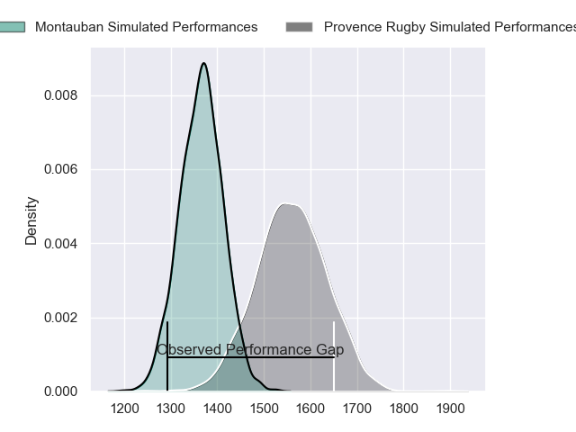
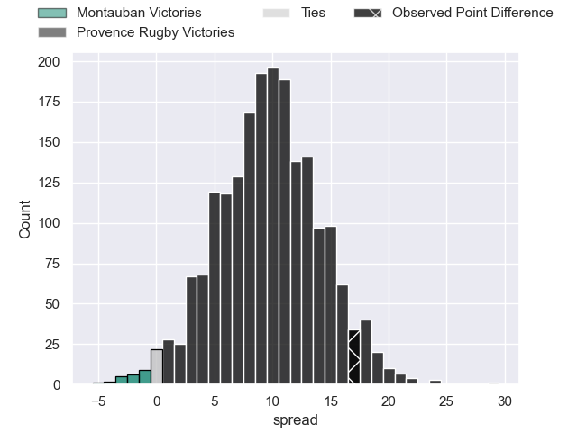
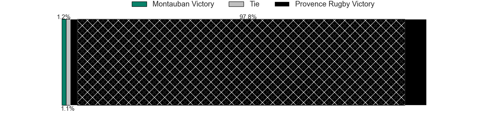
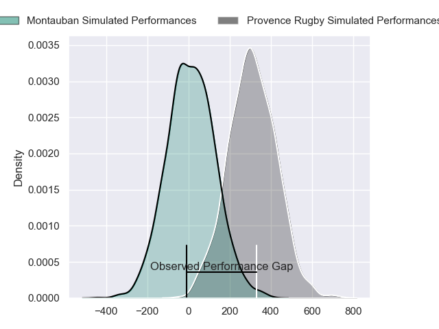
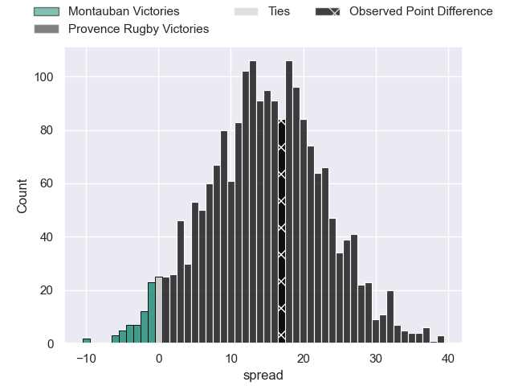
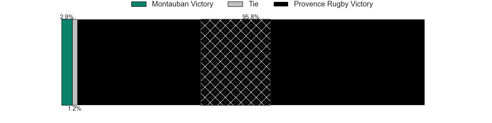

---  
layout: page  
title: Montauban at Provence Rugby; 12-29  
date: 2024-04-05 18:00:00 -0500  
categories: "Pro D2 2023" match review  
---
# Montauban at Provence Rugby; 12-29

# Club Level Predictions

The first set of predictions treats a club as the smallest object, as the club develops its members, organizes a gameplan, and deploys its players as needed for each match. This club model has a prediction of 0.751, which translates to predicting Provence Rugby to win by 9.7.

Our Over/Under is 41.5 - and combined with the spread above, we have a predicted scoreline of 16 to 25

Each club has a rating and a rating deviation (similar to a Glicko rating), and expected performances can be generated. This allows for simulated matches and spreads like the ones below.
## Projected Performances - Club Model

## Projected Spreads - Club Model

## Projected Results - Club Model

# Player Level Predictions - Version 2

Treating teams instead as an entity made up of the currently active players, I have ratings for each player in an altogether different system. These can be combined to form team ratings once teamsheets are announced, weighting starters a bit higher than the reserves. After the match is played, players can be weighted by their minutes on the field, allowing for an accurate measure of the team's composition. With these compiled team ratings, we can make predictions, measure inaccuracy, and update the individual player ratings.
## Prediction without Player Minutes: Provence Rugby by 16.4

Provence Rugby by 10.7 on a neutral pitch

## Projected Performances - Player Model

## Projected Spreads - Player Model

## Projected Results - Player Model

|   Away Minutes | Away Player             |   Away Percentile |   Number |   Home Percentile | Home Player           |   Home Minutes |
|---------------:|:------------------------|------------------:|---------:|------------------:|:----------------------|---------------:|
|             54 | Malino Vanai            |              0.38 |        1 |             68.57 | Federico Wegrzyn      |             80 |
|             57 | Kevin Firmin            |              6.47 |        2 |             89.22 | Lucas Martin          |             80 |
|             54 | Mirian Burduli          |              2.56 |        3 |             98.86 | Tomas Francis         |             48 |
|             50 | Frank Bradshaw          |             85.44 |        4 |             79.71 | Jérôme Dufour         |             56 |
|             50 | Lewis Bean              |             24.7  |        5 |             52.03 | Clément Chartier      |             80 |
|             80 | Kyllian Ringuet         |             26.3  |        6 |             76.71 | Teimana Harrison      |             53 |
|             80 | Otar Giorgadze          |             53.65 |        7 |             58.86 | Charly Gambini        |             80 |
|             50 | Quentin Witt            |             19.51 |        8 |             29.27 | Carl Axtens           |             46 |
|             50 | Yoan Cottin             |             64.17 |        9 |             66.46 | Joris Cazenave        |             48 |
|             80 | Jérôme Bosviel          |             78.05 |       10 |             84.25 | Jimmy Gopperth        |             56 |
|             80 | Romain Fonnicola        |             39.75 |       11 |             77.12 | Sione Tui             |             80 |
|             80 | Maxime Mathy            |              9.48 |       12 |             84.27 | Kaveinga Finau        |             80 |
|             80 | Simon Renda             |             54.02 |       13 |             29.65 | Eto Bainivalu         |             53 |
|             80 | Josua Vici              |             19.25 |       14 |             11.72 | Adrien Lapegue-Lafaye |             80 |
|             54 | Semesa Rokoduguni       |             84.71 |       15 |             42.39 | Léo Drouet            |             80 |
|             30 | Taumua Lui Sanft Naeata |             13.9  |       16 |             65.12 | Guillaume Piazzoli    |             34 |
|             30 | Shaun Venter            |              3.96 |       17 |             63.25 | Paul Mallez           |             32 |
|             30 | Kevin Gimeno            |              4.06 |       18 |             52.5  | Arthur Coville        |             32 |
|             30 | Noa Kanika              |             58.98 |       19 |             35.65 | Dorian Lavernhe       |             27 |
|             26 | Victor Delmas           |             42.07 |       20 |             49.22 | Jean Charles Orioli   |             27 |
|             26 | Thomas Larregain        |              8.98 |       21 |             81    | Enzo Selponi          |             24 |
|             26 | Nicolas Agnesi          |            nan    |       22 |              0.6  | Andres Zafra Tarazona |             24 |
|             23 | German Kessler          |             40.39 |       23 |            nan    | nan                   |            nan |

