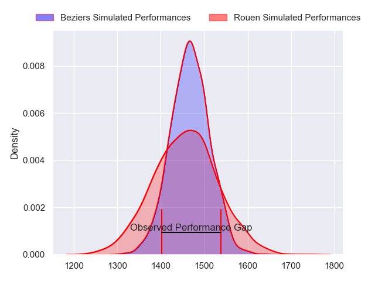
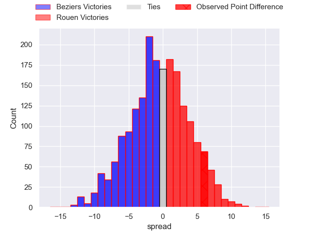
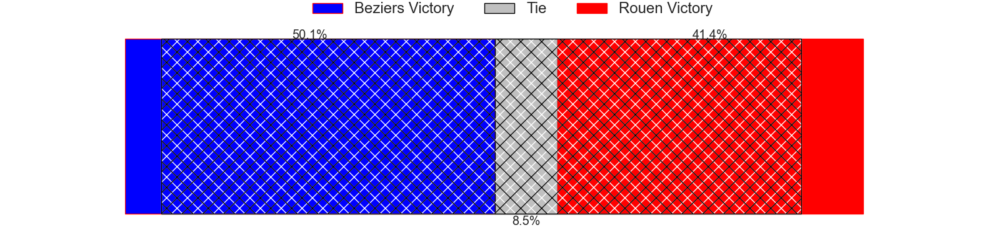
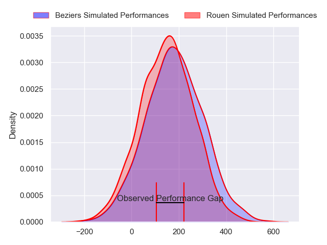
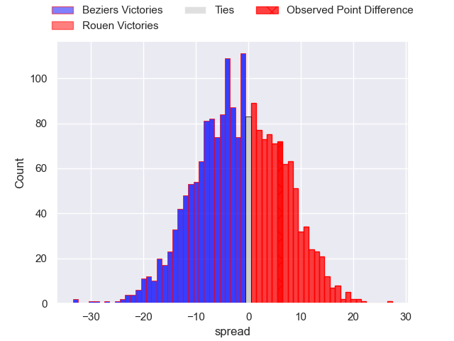

---  
layout: page  
title: Beziers at Rouen; 14-20  
date: 2024-04-05 18:00:00 -0500  
categories: "Pro D2 2023" match review  
---
# Beziers at Rouen; 14-20

# Club Level Predictions

The first set of predictions treats a club as the smallest object, as the club develops its members, organizes a gameplan, and deploys its players as needed for each match. This club model has a prediction of 0.487, which translates to predicting Beziers to win by 0.4.

Our Over/Under is 45.5 - and combined with the spread above, we have a predicted scoreline of 23 to 23

Each club has a rating and a rating deviation (similar to a Glicko rating), and expected performances can be generated. This allows for simulated matches and spreads like the ones below.
## Projected Performances - Club Model

## Projected Spreads - Club Model

## Projected Results - Club Model

# Player Level Predictions - Version 2

Treating teams instead as an entity made up of the currently active players, I have ratings for each player in an altogether different system. These can be combined to form team ratings once teamsheets are announced, weighting starters a bit higher than the reserves. After the match is played, players can be weighted by their minutes on the field, allowing for an accurate measure of the team's composition. With these compiled team ratings, we can make predictions, measure inaccuracy, and update the individual player ratings.
## Prediction without Player Minutes: Beziers by 1.3

Beziers by 4.5 on a neutral pitch

## Projected Performances - Player Model

## Projected Spreads - Player Model

## Projected Results - Player Model

|   Away Minutes | Away Player         |   Away Percentile |   Number |   Home Percentile | Home Player        |   Home Minutes |
|---------------:|:--------------------|------------------:|---------:|------------------:|:-------------------|---------------:|
|             52 | Giorgi Akhaladze    |             24.31 |        1 |             22.32 | Elias El Ansari    |             41 |
|             52 | Wilmar Arnoldi      |             74.71 |        2 |              4.31 | Jeremie Maurouard  |             60 |
|             47 | Marco Trauth        |             66.19 |        3 |             38.08 | Cody Thomas        |             80 |
|             55 | Clément Bitz        |             63.84 |        4 |             45.35 | John-Charles Astle |             80 |
|             80 | Hans N'kinsi        |              4.87 |        5 |             39.98 | Will Witty         |             52 |
|             55 | Pierrick Gunther    |              0.81 |        6 |             87.02 | Tienie Burger      |             80 |
|             80 | Otonuku Jr Pauta    |             72.77 |        7 |             48.2  | Samuel Maximin     |             80 |
|             80 | Thomas Hoarau       |             17.8  |        8 |             55.61 | Abdelkarim Fofana  |             59 |
|             80 | Samuel Marques      |             91.04 |        9 |             60.21 | Florent Campeggia  |             60 |
|             80 | Tim Nanai-Williams  |             89.44 |       10 |             88    | Franck Pourteau    |             60 |
|             80 | Paul Reau           |             55.95 |       11 |             69.2  | Paul Vallee        |             65 |
|             57 | Taleta Tupuola      |             59.06 |       12 |             35.29 | JT Jackson         |             80 |
|             80 | Maxime Espeut       |             49.94 |       13 |              7.32 | Opetera Peleseuma  |             80 |
|             80 | Raffaele Storti     |             89.92 |       14 |             63.99 | Benjamin Descamps  |             80 |
|             52 | Gabin Lorre         |             89.28 |       15 |             81.55 | Baptiste Mouchous  |             80 |
|             33 | Jon Zabala Arrieta  |             76.45 |       16 |             70.28 | Antoine Fournier   |             13 |
|             28 | Victor Dreuille     |             22.94 |       17 |             24.11 | Jean Leleu         |             28 |
|             28 | Francisco Fernandes |             19.56 |       18 |             76.83 | Soso Bekoshvili    |             26 |
|             28 | Jose Luis Gonzalez  |             80.78 |       19 |             48.09 | Lucas Costa        |             21 |
|             25 | Pierre Gayraud      |             17.06 |       20 |             48.75 | Edgar Retiere      |             20 |
|             25 | Clement Ancely      |             79.95 |       21 |             73.96 | Maxime Sidobre     |             20 |
|             23 | Paul Recor          |             63.15 |       22 |             38.43 | Efi Ma'afu         |             20 |
|            nan | nan                 |            nan    |       23 |              8.52 | Alex Luatua        |             15 |

