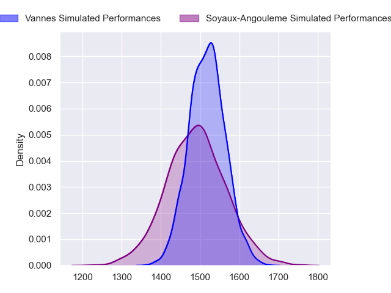
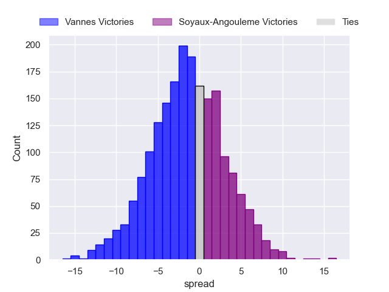
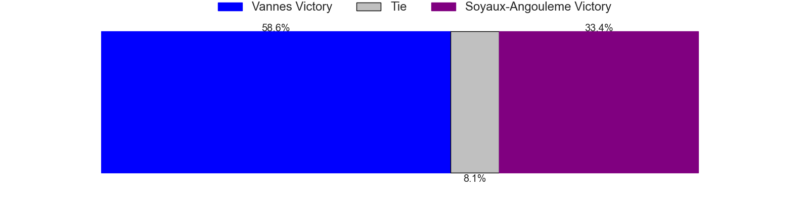
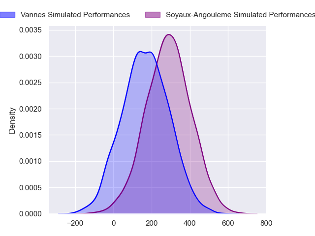
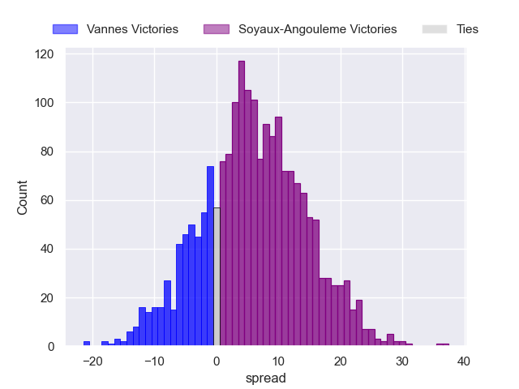
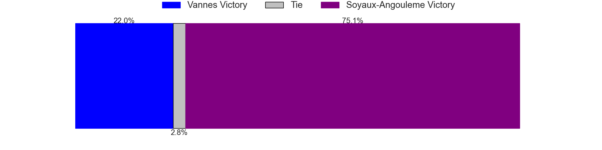

---  
layout: page  
title: Vannes at Soyaux-Angouleme; 22-22  
date: 2024-04-05 18:00:00 -0500  
categories: "Pro D2 2023" match review  
---
# Vannes at Soyaux-Angouleme; 22-22

# Club Level Predictions

The first set of predictions treats a club as the smallest object, as the club develops its members, organizes a gameplan, and deploys its players as needed for each match. This club model has a prediction of 0.463, which translates to predicting Vannes to win by 1.3.

Our Over/Under is 46.5 - and combined with the spread above, we have a predicted scoreline of 24 to 22

Each club has a rating and a rating deviation (similar to a Glicko rating), and expected performances can be generated. This allows for simulated matches and spreads like the ones below.
## Projected Performances - Club Model

## Projected Spreads - Club Model

## Projected Results - Club Model

# Player Level Predictions - Version 2

Treating teams instead as an entity made up of the currently active players, I have ratings for each player in an altogether different system. These can be combined to form team ratings once teamsheets are announced, weighting starters a bit higher than the reserves. After the match is played, players can be weighted by their minutes on the field, allowing for an accurate measure of the team's composition. With these compiled team ratings, we can make predictions, measure inaccuracy, and update the individual player ratings.
## Prediction without Player Minutes: Soyaux-Angouleme by 5.4

Soyaux-Angouleme by 1.4 on a neutral pitch

## Projected Performances - Player Model

## Projected Spreads - Player Model

## Projected Results - Player Model

|   Away Minutes | Away Player             |   Away Percentile |   Number |   Home Percentile | Home Player        |   Home Minutes |
|---------------:|:------------------------|------------------:|---------:|------------------:|:-------------------|---------------:|
|             57 | Andy Bordelai           |             87.65 |        1 |             65.43 | Luca Tabarot       |             53 |
|             49 | Cyril Blanchard         |             32.16 |        2 |             16.27 | Motu Matu'u        |             41 |
|             57 | Paga Tafili             |             92.31 |        3 |             34.19 | Omar Dahir         |             53 |
|             80 | Joe Edwards             |             91.71 |        4 |             55.73 | Maxence Lemardelet |             80 |
|             61 | Mattéo Desjeux          |             17.42 |        5 |             84.25 | Sikeli Nabou       |             80 |
|             49 | Karl Chateau            |             18.08 |        6 |              5.68 | Gautier Gibouin    |             51 |
|             80 | Gregoire Bazin          |             30.82 |        7 |             84.7  | Nicolas Martins    |             80 |
|             34 | Sione Kalamafoni        |             45.37 |        8 |             38.78 | Hubert Texier      |             41 |
|             80 | Michael Ruru            |             91.88 |        9 |             49.58 | Manu Saubusse      |             67 |
|             80 | Maxime Lafage           |             94.5  |       10 |             83.75 | Ben Botica         |             80 |
|             80 | Romaric Camou           |             75.88 |       11 |             32.84 | Inaki Ayarza       |             80 |
|             80 | Alex Arrate             |             14.89 |       12 |             85.95 | George Tilsley     |             80 |
|             45 | Robin Taccola           |             48.86 |       13 |             83.91 | Ledua Mau          |             80 |
|             80 | Théo Bastardie          |             65.46 |       14 |             64.78 | Eoghan Barrett     |             80 |
|             69 | Thibault Debaes         |             57.86 |       15 |             63.34 | Jules Dubecq       |             80 |
|             46 | Eric Marks              |             14.8  |       16 |             58.43 | Patxi Bidart       |             39 |
|             35 | Jules Le Bail           |             37.5  |       17 |             66.71 | William Greatbanks |             39 |
|             31 | Juan Bautista Pedemonte |             23.17 |       18 |             83.43 | Germain Burgaud    |             29 |
|             31 | Théo Beziat             |             53.92 |       19 |             95.06 | Sami Zouhair       |             27 |
|             23 | Charles-Henri Berguet   |             31.53 |       20 |             18.9  | Yassine Boutemane  |             27 |
|             23 | Phil Kite               |             80.63 |       21 |              5.42 | Adrien Bau         |             13 |
|             19 | Matthieu Uhila          |            nan    |       22 |            nan    | nan                |            nan |
|             11 | Paul Surano             |             54.11 |       23 |            nan    | nan                |            nan |

