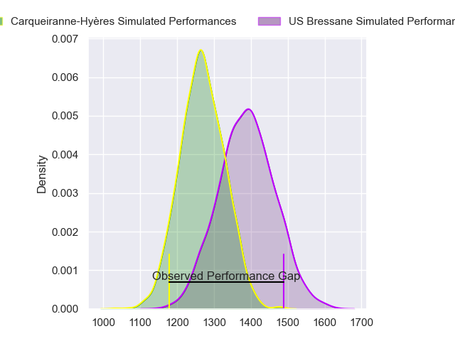
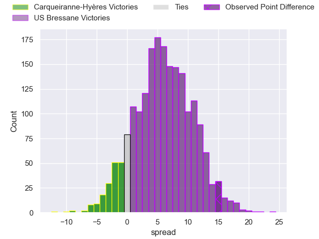
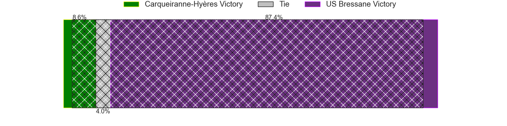
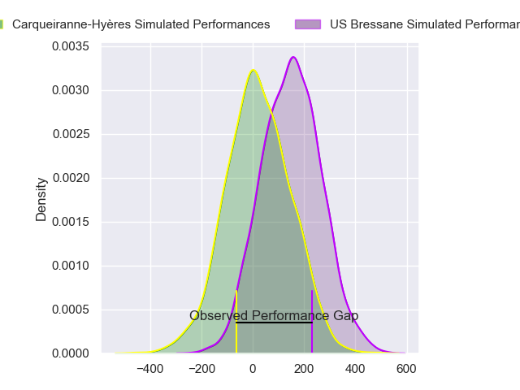
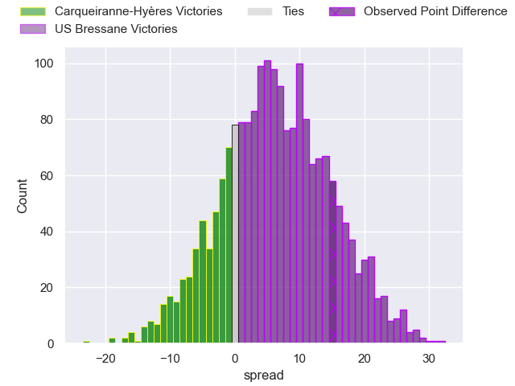
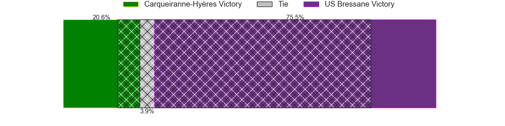

---  
layout: page  
title: Carqueiranne-Hyeres at US Bressane; 20-35  
date: 2024-04-05 18:00:00 -0500  
categories: "Nationale 2023" match review  
---
# Carqueiranne-Hyeres at US Bressane; 20-35

# Club Level Predictions

The first set of predictions treats a club as the smallest object, as the club develops its members, organizes a gameplan, and deploys its players as needed for each match. This club model has a prediction of 0.661, which translates to predicting US Bressane to win by 5.9.

Our Over/Under is 40.5 - and combined with the spread above, we have a predicted scoreline of 17 to 23

Each club has a rating and a rating deviation (similar to a Glicko rating), and expected performances can be generated. This allows for simulated matches and spreads like the ones below.
## Projected Performances - Club Model

## Projected Spreads - Club Model

## Projected Results - Club Model

# Player Level Predictions - Version 2

Treating teams instead as an entity made up of the currently active players, I have ratings for each player in an altogether different system. These can be combined to form team ratings once teamsheets are announced, weighting starters a bit higher than the reserves. After the match is played, players can be weighted by their minutes on the field, allowing for an accurate measure of the team's composition. With these compiled team ratings, we can make predictions, measure inaccuracy, and update the individual player ratings.
## Prediction without Player Minutes: US Bressane by 7.7

US Bressane by 3.9 on a neutral pitch

## Projected Performances - Player Model

## Projected Spreads - Player Model

## Projected Results - Player Model

|   Away Minutes | Away Player         |   Away Percentile |   Number |   Home Percentile | Home Player          |   Home Minutes |
|---------------:|:--------------------|------------------:|---------:|------------------:|:---------------------|---------------:|
|             48 | Sti Sithole         |             72.65 |        1 |             54.99 | Quentin Drancourt    |             58 |
|             48 | Theo Lachaud        |              0.39 |        2 |             27.25 | Louis Dasalmartini   |             80 |
|             48 | Costel Burtila      |             43.87 |        3 |             10.92 | Atonio Ulutuipalelei |             23 |
|             54 | Josaia Cama         |             33.89 |        4 |             51.43 | Grégoire Demangel    |             80 |
|             80 | Nathan Gendre       |             67.54 |        5 |             11.69 | Louis Bruinsma       |             80 |
|             51 | Spike Salman        |              1.16 |        6 |             70.92 | Loic Baradel         |             80 |
|             80 | Joachim Beaumont    |             93.16 |        7 |             75.43 | Lucas Lyons          |             28 |
|             80 | Andre Gorin         |              9.51 |        8 |             39.27 | Kavekini Tabu        |             55 |
|             80 | Jérémy Fleury       |             80.62 |        9 |             30.83 | Robin Graulle        |             45 |
|             80 | Enzo Miot           |             13    |       10 |             70.25 | Thibault Olender     |             45 |
|             62 | Paul Gadea          |             94.11 |       11 |             49.15 | Élie De Fleurian     |             80 |
|             80 | Romain Leveque      |              1.68 |       12 |             58.58 | Benjamin Doy         |             80 |
|             80 | Dylan Sage          |             30.85 |       13 |             60.14 | Dimitri Doucet       |             32 |
|             80 | Josselyn Bouchon    |              6.34 |       14 |             49.49 | Thibaut Perrette     |             80 |
|             80 | Ionel Melinte       |              5.99 |       15 |             80.55 | Florent Massip       |             80 |
|             32 | Eli Serra-Miglietti |              4.56 |       16 |             21.08 | Teo Bordenave        |             22 |
|             32 | Yan Tabarot         |             98.24 |       17 |             58.59 | Erich de Jager       |             57 |
|             32 | Miguel Mathieu      |             26.78 |       18 |             48.29 | Wael May             |             25 |
|             26 | Marius Pellegrin    |             41.71 |       19 |             48.32 | Nail Ait Naceur      |             52 |
|             29 | Nicolas Baquer      |              2.09 |       20 |             49.38 | Jeremy Valencot      |             35 |
|             18 | Theo Moitrier       |             40.58 |       21 |              7.75 | Christian Lacombe    |             35 |
|            nan | nan                 |            nan    |       22 |             11.04 | Alexandre Badet      |             48 |

