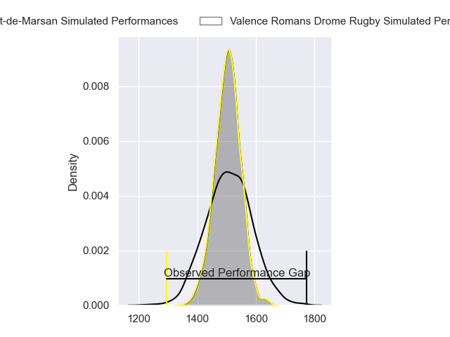
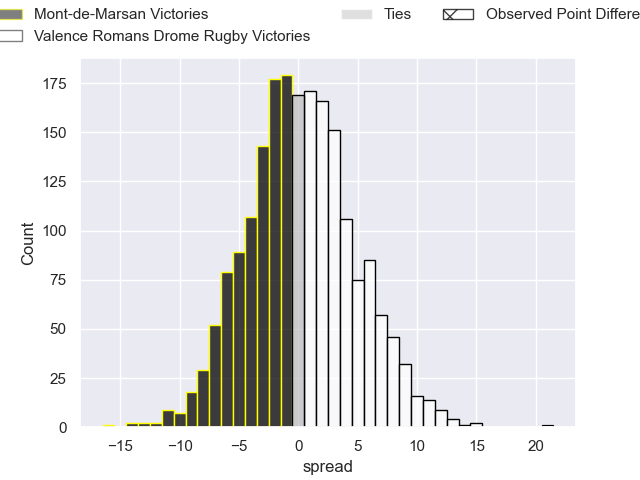
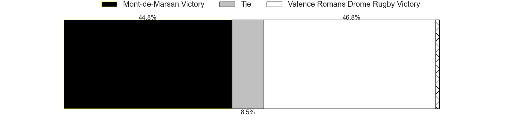
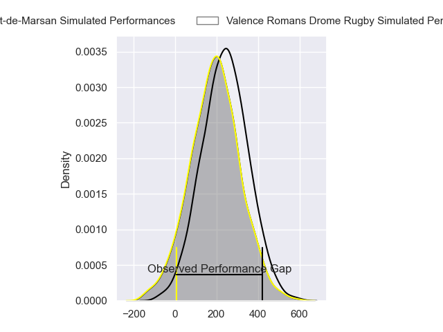
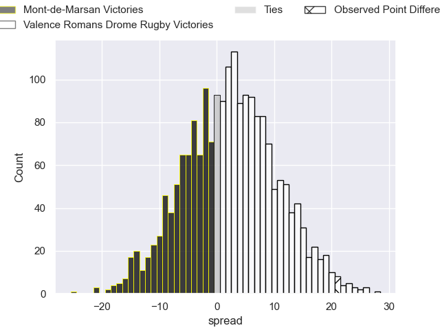
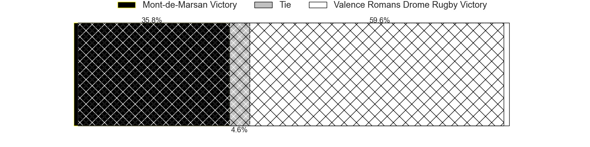

---  
layout: page  
title: Mont-de-Marsan at Valence Romans Drome Rugby; 17-38  
date: 2024-04-05 18:00:00 -0500  
categories: "Pro D2 2023" match review  
---
# Mont-de-Marsan at Valence Romans Drome Rugby; 17-38

# Club Level Predictions

The first set of predictions treats a club as the smallest object, as the club develops its members, organizes a gameplan, and deploys its players as needed for each match. This club model has a prediction of 0.511, which translates to predicting Valence Romans Drome Rugby to win by 0.4.

Our Over/Under is 43.5 - and combined with the spread above, we have a predicted scoreline of 22 to 22

Each club has a rating and a rating deviation (similar to a Glicko rating), and expected performances can be generated. This allows for simulated matches and spreads like the ones below.
## Projected Performances - Club Model

## Projected Spreads - Club Model

## Projected Results - Club Model

# Player Level Predictions - Version 2

Treating teams instead as an entity made up of the currently active players, I have ratings for each player in an altogether different system. These can be combined to form team ratings once teamsheets are announced, weighting starters a bit higher than the reserves. After the match is played, players can be weighted by their minutes on the field, allowing for an accurate measure of the team's composition. With these compiled team ratings, we can make predictions, measure inaccuracy, and update the individual player ratings.
## Prediction without Player Minutes: Valence Romans Drome Rugby by 0.8

Mont-de-Marsan by 2.1 on a neutral pitch

## Projected Performances - Player Model

## Projected Spreads - Player Model

## Projected Results - Player Model

|   Away Minutes | Away Player               |   Away Percentile |   Number |   Home Percentile | Home Player          |   Home Minutes |
|---------------:|:--------------------------|------------------:|---------:|------------------:|:---------------------|---------------:|
|             61 | Jean-Luc Innocente        |              9.97 |        1 |             56.51 | Anthony Aléo         |             56 |
|             51 | Samuel Lagrange           |             53.14 |        2 |              2.75 | Cyril Deligny        |             45 |
|             63 | Anthony Alves             |              9.88 |        3 |             35.52 | Chris Talakai        |             56 |
|             80 | Nicolas Garrault          |             67.78 |        4 |             57.52 | Ryan McCauley        |             80 |
|             41 | Andrei Ostrikov           |             66.35 |        5 |             75.78 | Florian Goumat       |             63 |
|             80 | Aurélien Lisena           |             56.08 |        6 |              4.4  | Éloi Massot          |             51 |
|             80 | Leo Banos                 |             82.5  |        7 |              0.23 | Mathieu Vachon       |             59 |
|             41 | Veresa Tuqovu Ramototabua |             59.51 |        8 |             89.51 | Ioane Iashagashvili  |             80 |
|             69 | Kevin Viallard            |             34.17 |        9 |             81.88 | Thomas Lhusero       |             69 |
|             80 | Willie du Plessis         |             86.5  |       10 |             80.25 | Joris Moura          |             59 |
|             41 | Eroni Sau                 |             75.08 |       11 |             90.26 | Mosese Mawalu        |             80 |
|             80 | Patricio Fernandez        |             40.82 |       12 |             85.23 | Ben Neiceru          |             80 |
|             55 | Nacani Wakaya             |             85.71 |       13 |             79.95 | Anatole Pauvert      |             80 |
|             80 | Pierre Sayerse            |             69.42 |       14 |             95.81 | Adam Vargas          |             80 |
|             80 | Simao Broeiro Bento       |             14.71 |       15 |             93.52 | Charles Bouldoire    |             80 |
|             39 | Mike Faleafa              |             28.29 |       16 |             73.73 | Dorian Marco Pena    |             35 |
|             39 | Théo Cortes               |             55.86 |       17 |             46.23 | Axel Bruchet         |             29 |
|             39 | Myles Edwards             |             21.24 |       18 |              7.03 | Julien Royer         |             24 |
|             29 | Florian Dufour            |             43.53 |       19 |             39.98 | Gareth Milasinovich  |             24 |
|             25 | Gatien Masse              |             44.54 |       20 |             71.22 | Sven Bernat Girlando |             21 |
|             19 | Thomas Bultel             |             54.23 |       21 |             31.25 | Lucas Meret          |             21 |
|             17 | Mattéo Lalanne            |             64.86 |       22 |             59.31 | Yassine Maamry       |             17 |
|             11 | Nicolas Darquier          |             44.79 |       23 |             56.46 | Léopold Dupas        |             11 |

