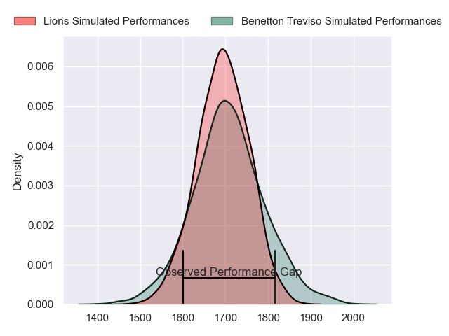
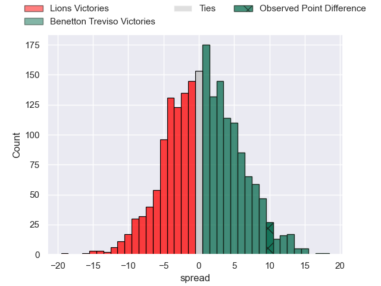
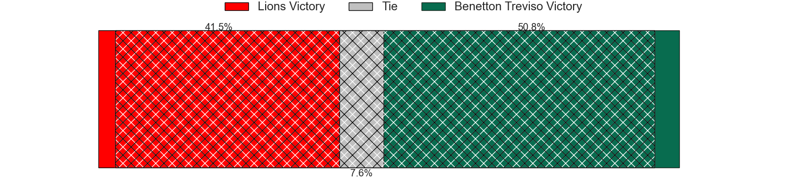
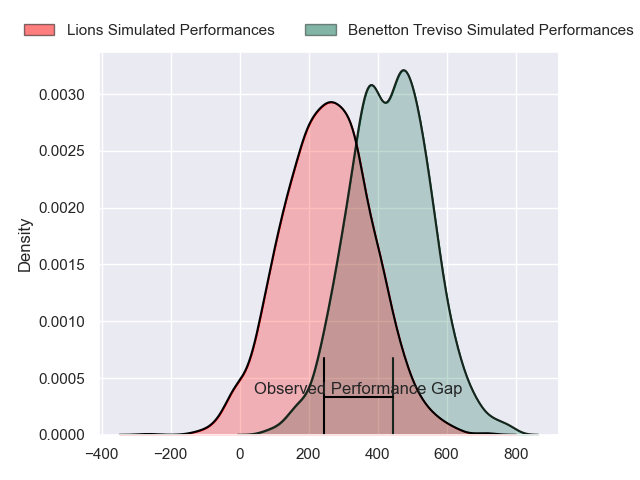
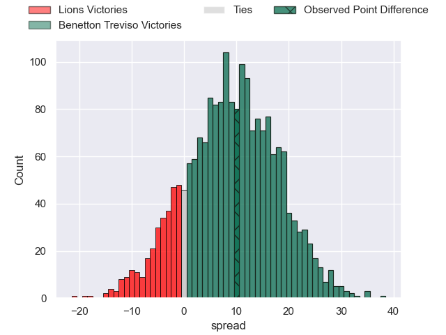
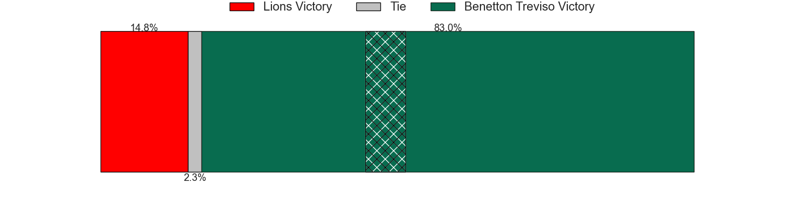

---  
layout: page  
title: Lions at Benetton Treviso; 17-27  
date: 2024-04-06 18:00:00 -0500  
categories: "European Rugby Challenge Cup 2023" match review  
---
# Lions at Benetton Treviso; 17-27

# Club Level Predictions

The first set of predictions treats a club as the smallest object, as the club develops its members, organizes a gameplan, and deploys its players as needed for each match. This club model has a prediction of 0.522, which translates to predicting Benetton Treviso to win by 0.8.

Our Over/Under is 54.5 - and combined with the spread above, we have a predicted scoreline of 27 to 28

Each club has a rating and a rating deviation (similar to a Glicko rating), and expected performances can be generated. This allows for simulated matches and spreads like the ones below.
## Projected Performances - Club Model

## Projected Spreads - Club Model

## Projected Results - Club Model

# Player Level Predictions - Version 2

Treating teams instead as an entity made up of the currently active players, I have ratings for each player in an altogether different system. These can be combined to form team ratings once teamsheets are announced, weighting starters a bit higher than the reserves. After the match is played, players can be weighted by their minutes on the field, allowing for an accurate measure of the team's composition. With these compiled team ratings, we can make predictions, measure inaccuracy, and update the individual player ratings.
## Prediction without Player Minutes: Benetton Treviso by 11.0

Benetton Treviso by 5.8 on a neutral pitch

## Projected Performances - Player Model

## Projected Spreads - Player Model

## Projected Results - Player Model

|   Away Minutes | Away Player            |   Away Percentile |   Number |   Home Percentile | Home Player         |   Home Minutes |
|---------------:|:-----------------------|------------------:|---------:|------------------:|:--------------------|---------------:|
|             56 | Morgan Naude           |             40.08 |        1 |             89.74 | Thomas Gallo        |             45 |
|             75 | Jaco Visagie           |             72.75 |        2 |             98.63 | Giacomo Nicotera    |             80 |
|             67 | Conraad van Vuuren     |             54.42 |        3 |             96.01 | Simone Ferrari      |             45 |
|             64 | Willem Alberts         |             46.3  |        4 |             65.51 | Niccolo Cannone     |             80 |
|             55 | Darrien-Lane Landsberg |             34.96 |        5 |             73.63 | Eli Snyman          |             64 |
|             80 | JC Pretorius           |             80.88 |        6 |             54.81 | Alessandro Izekor   |             80 |
|             80 | Emmanuel Tshituka      |             63.15 |        7 |             87.49 | Sebastian Negri     |             46 |
|             68 | Hanru Sirgel           |             95.61 |        8 |             71.95 | Toa Halafihi        |             51 |
|             73 | Morne van den Berg     |             85.21 |        9 |             70    | Alessandro Garbisi  |             80 |
|             80 | Jordan Hendrikse       |             66    |       10 |             69.5  | Jacob Umaga         |             58 |
|             80 | Rabz Maxwane           |             44.17 |       11 |             32.96 | Onisi Ratave        |             80 |
|             80 | Zander du Plessis      |             39.14 |       12 |             78.27 | Malakai Fekitoa     |             78 |
|             74 | Erich Cronje           |             13.81 |       13 |             93.16 | Juan Ignacio Brex   |             80 |
|             80 | Stean Pienaar          |             87.66 |       14 |             88.24 | Tommaso Menoncello  |             80 |
|             80 | Andries Coetzee        |             38.4  |       15 |             88.78 | Rhyno Smith         |             80 |
|              5 | Morne Brandon          |            nan    |       16 |            nan    | Bautista Bernasconi |             29 |
|             24 | Ruan Dreyer            |             99.15 |       17 |            nan    | Mirco Spagnolo      |             35 |
|             13 | Ruan Smith             |            nan    |       18 |             62.2  | Giosue Zilocchi     |             35 |
|             25 | Ruan Delport           |            nan    |       19 |             96.18 | Federico Ruzza      |             16 |
|             16 | Izan Esterhuizen       |            nan    |       20 |              8.05 | Henry Time-Stowers  |              0 |
|             12 | Francke Horn           |             98.05 |       21 |             90.98 | Lorenzo Cannone     |             34 |
|              7 | Nico Steyn             |            nan    |       22 |             16.46 | Andy Uren           |              2 |
|              6 | Manuel Rass            |            nan    |       23 |             79.25 | Tomas Albornoz      |             22 |

