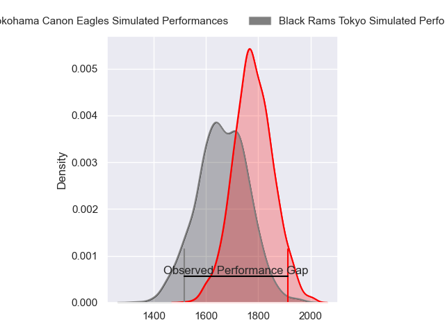
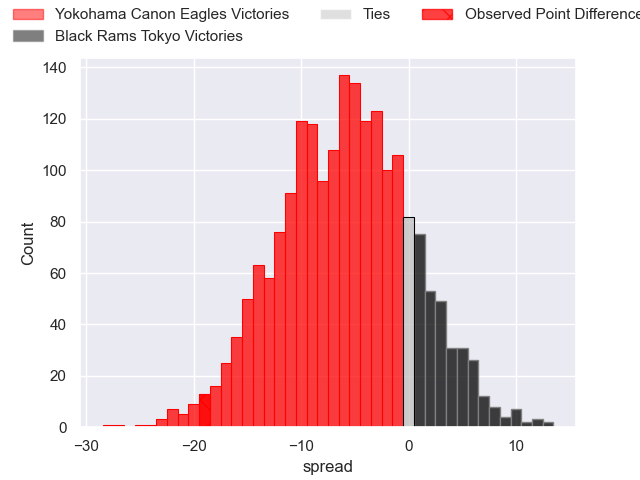
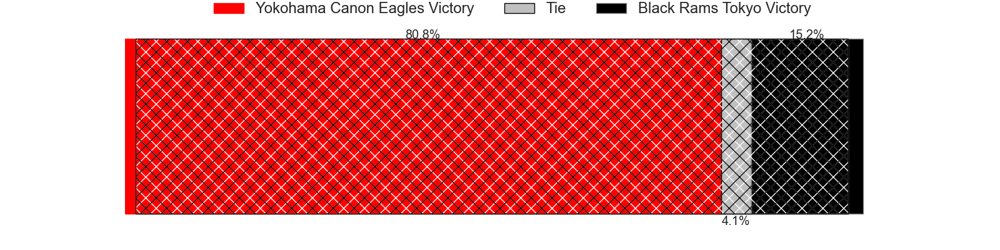
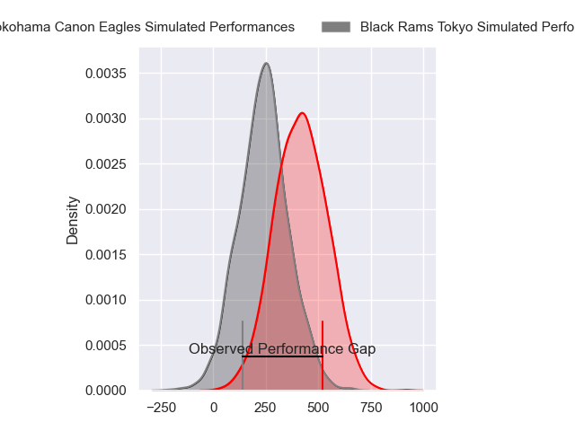
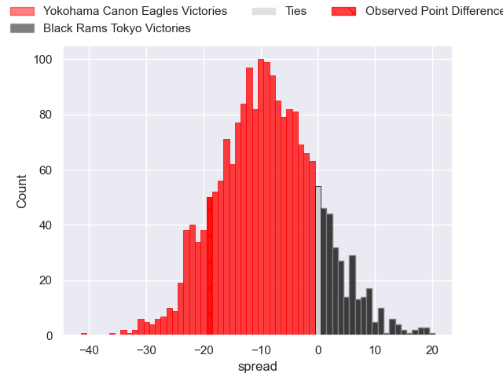
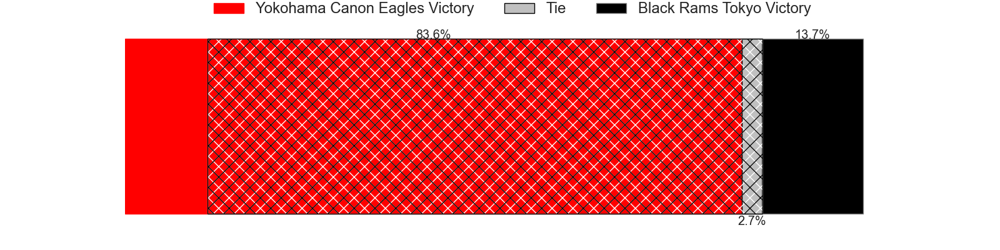

---  
layout: page  
title: Yokohama Canon Eagles at Black Rams Tokyo; 31-12  
date: 2024-04-06 18:00:00 -0500  
categories: "Japan Rugby League One 2023" match review  
---
# Yokohama Canon Eagles at Black Rams Tokyo; 31-12

# Club Level Predictions

The first set of predictions treats a club as the smallest object, as the club develops its members, organizes a gameplan, and deploys its players as needed for each match. This club model has a prediction of 0.337, which translates to predicting Yokohama Canon Eagles to win by 6.0.

Our Over/Under is 63.5 - and combined with the spread above, we have a predicted scoreline of 35 to 29

Each club has a rating and a rating deviation (similar to a Glicko rating), and expected performances can be generated. This allows for simulated matches and spreads like the ones below.
## Projected Performances - Club Model

## Projected Spreads - Club Model

## Projected Results - Club Model

# Player Level Predictions - Version 2

Treating teams instead as an entity made up of the currently active players, I have ratings for each player in an altogether different system. These can be combined to form team ratings once teamsheets are announced, weighting starters a bit higher than the reserves. After the match is played, players can be weighted by their minutes on the field, allowing for an accurate measure of the team's composition. With these compiled team ratings, we can make predictions, measure inaccuracy, and update the individual player ratings.
## Prediction without Player Minutes: Yokohama Canon Eagles by 8.9

Yokohama Canon Eagles by 12.2 on a neutral pitch

## Projected Performances - Player Model

## Projected Spreads - Player Model

## Projected Results - Player Model

|   Away Minutes | Away Player              |   Away Percentile |   Number |   Home Percentile | Home Player       |   Home Minutes |
|---------------:|:-------------------------|------------------:|---------:|------------------:|:------------------|---------------:|
|             60 | Takato Okabe             |             96.96 |        1 |             55.08 | Kazuma Nishi      |             74 |
|             60 | Shunta Nakamura          |             89.8  |        2 |             34.71 | Hinata Takei      |             63 |
|             60 | Ryosuke Iwaihara         |             78.54 |        3 |             27.45 | Shohei Oyama      |             40 |
|             43 | Max Douglas              |             84.84 |        4 |             40.33 | Harrison Fox      |             40 |
|             80 | Matt Philip              |             70.17 |        5 |              3.22 | Mike Stolberg     |             80 |
|             80 | Kobus Van Dyk            |             91.08 |        6 |             15.64 | Amato Fakatava    |             40 |
|             58 | Naoto Shimada            |             81    |        7 |             67.09 | Brodi McCurran    |             80 |
|             80 | Amanaki Mafi             |             94.63 |        8 |             87.07 | Nathan Hughes     |             74 |
|             55 | Kouki Arai               |             72.71 |        9 |             56.25 | Syota Yamamoto    |             50 |
|             80 | Yu Tamura                |             81.5  |       10 |             67.75 | Kohei Horigome    |             80 |
|             73 | Masayoshi Takezawa       |             51.76 |       11 |             67.95 | Netani Vakayalia  |             27 |
|             80 | Yusuke Kajimura          |             94    |       12 |             81.99 | Matt McGahan      |             80 |
|             73 | Rohan Janse van Rensburg |             84.63 |       13 |             62.91 | Ryohei Isoda      |             80 |
|             80 | Viliame Takayawa         |             95.13 |       14 |             35.79 | Daisuke Nishikawa |             80 |
|             80 | Jumpei Ogura             |             98.75 |       15 |             65.59 | Isaac Lucas       |             80 |
|             37 | Liaki Moli               |              6.92 |       16 |             23.41 | Yuta Kurihara     |             53 |
|             25 | Toshiki Amano            |             69.38 |       17 |             42.48 | Reijiro Yamamoto  |             40 |
|             22 | Sione Halasili           |             76.13 |       18 |             73.6  | Paddy Ryan        |             40 |
|             20 | Shin Kawamura            |            nan    |       19 |             33.17 | Otoya Kihara      |             40 |
|             20 | Chang Ho Ahn             |             52.71 |       20 |            nan    | Takanobu Minami   |             30 |
|             20 | Tatsuro Sugimoto         |              4.27 |       21 |            nan    | Masaaki Onishi    |             17 |
|              7 | Inoke Burua              |             78.37 |       22 |             35.12 | Samuel Waqabaca   |              6 |
|              7 | SP Marais                |             94.48 |       23 |            nan    | Kosei Nakamura    |              6 |

