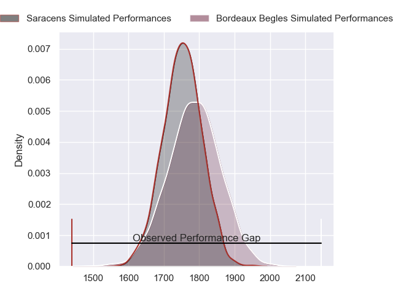
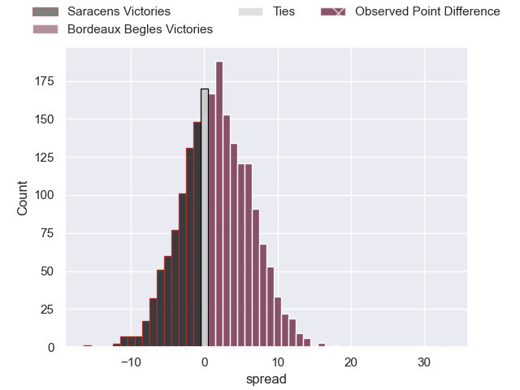
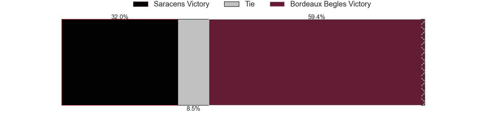
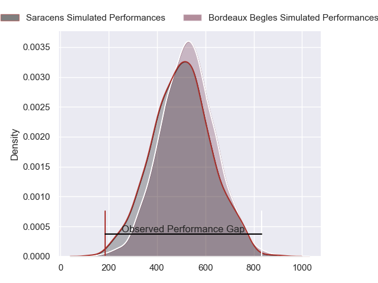
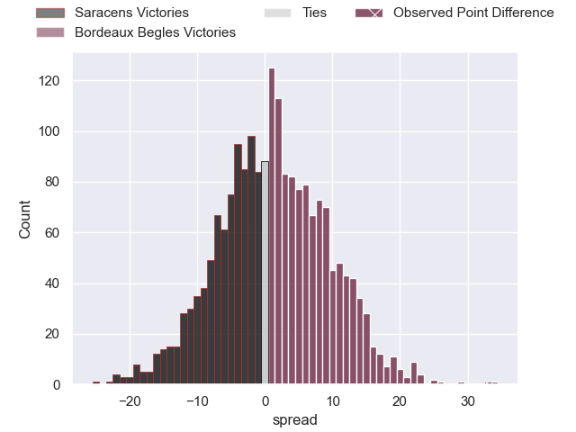
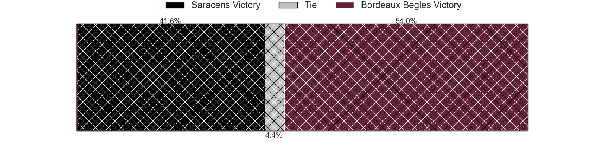

---  
layout: page  
title: Saracens at Bordeaux Begles; 12-45  
date: 2024-04-06 18:00:00 -0500  
categories: "European Rugby Champions Cup 2023" match review  
---
# Saracens at Bordeaux Begles; 12-45

# Club Level Predictions

The first set of predictions treats a club as the smallest object, as the club develops its members, organizes a gameplan, and deploys its players as needed for each match. This club model has a prediction of 0.549, which translates to predicting Bordeaux Begles to win by 1.7.

Our Over/Under is 60.5 - and combined with the spread above, we have a predicted scoreline of 29 to 31

Each club has a rating and a rating deviation (similar to a Glicko rating), and expected performances can be generated. This allows for simulated matches and spreads like the ones below.
## Projected Performances - Club Model

## Projected Spreads - Club Model

## Projected Results - Club Model

# Player Level Predictions - Version 2

Treating teams instead as an entity made up of the currently active players, I have ratings for each player in an altogether different system. These can be combined to form team ratings once teamsheets are announced, weighting starters a bit higher than the reserves. After the match is played, players can be weighted by their minutes on the field, allowing for an accurate measure of the team's composition. With these compiled team ratings, we can make predictions, measure inaccuracy, and update the individual player ratings.
## Prediction without Player Minutes: Bordeaux Begles by 2.4

Saracens by 4.8 on a neutral pitch

## Projected Performances - Player Model

## Projected Spreads - Player Model

## Projected Results - Player Model

|   Away Minutes | Away Player          |   Away Percentile |   Number |   Home Percentile | Home Player          |   Home Minutes |
|---------------:|:---------------------|------------------:|---------:|------------------:|:---------------------|---------------:|
|             50 | Mako Vunipola        |             99.62 |        1 |             74.45 | Jefferson Poirot     |             56 |
|             50 | Jamie George         |             97.65 |        2 |             51.57 | Maxime Lamothe       |             59 |
|             50 | Christian Judge      |             75.12 |        3 |             96.49 | Ben Tameifuna        |             54 |
|             80 | Maro Itoje           |             94.15 |        4 |             89.14 | Cyril Cazeaux        |             65 |
|             51 | Hugh Tizard          |             47.26 |        5 |             97.97 | Adam Coleman         |             56 |
|             80 | Theo McFarland       |             19.24 |        6 |             69.87 | Antoine Miquel       |             80 |
|             80 | Ben Earl             |             95.94 |        7 |             85.05 | Pete Samu            |             80 |
|             61 | Billy Vunipola       |             97.8  |        8 |             83.9  | Tevita Tatafu        |             61 |
|             57 | Ivan van Zyl         |             72.08 |        9 |             98.75 | Maxime Lucu          |             65 |
|             80 | Alex Goode           |             77.25 |       10 |             38    | Mateo Garcia         |             80 |
|             80 | Alex Lewington       |             68.86 |       11 |             72.93 | Louis Bielle-Biarrey |             80 |
|             80 | Nick Tompkins        |             97.12 |       12 |             73.59 | Yoram Moefana        |             80 |
|             80 | Lucio Cinti          |             46.1  |       13 |             79.35 | Nicolas Depoortere   |             73 |
|             66 | Sean Maitland        |             90.03 |       14 |             94.79 | Damian Penaud        |             80 |
|             68 | Elliot Daly          |             80.8  |       15 |             96.51 | Romain Buros         |             80 |
|             30 | Theo Dan             |             54.31 |       16 |             10.39 | Romain Latterrade    |             21 |
|             30 | Eroni Mawi           |             76.92 |       17 |             87.37 | Lekso Kaulashvili    |             24 |
|             30 | Marco Riccioni       |             36.09 |       18 |             28.87 | Carlu Sadie          |             26 |
|             29 | Juan Martin Gonzalez |             92    |       19 |             73.39 | Kane Douglas         |             24 |
|             19 | Tom Willis           |             19.35 |       20 |             24.82 | Thomas Jolmes        |             15 |
|             23 | Gareth Simpson       |             14.17 |       21 |             84.59 | Guido Petti          |             19 |
|             12 | Manu Vunipola        |             43.75 |       22 |              7.29 | Yann Lesgourgues     |             15 |
|             14 | Olly Hartley         |             18.01 |       23 |             10.87 | Pablo Uberti         |              7 |

