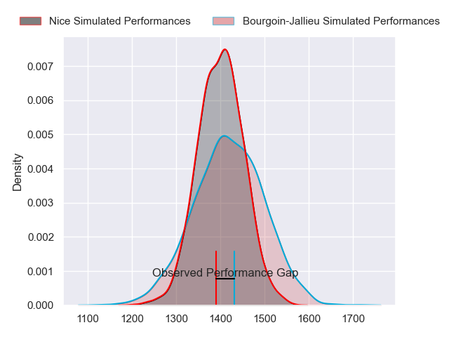
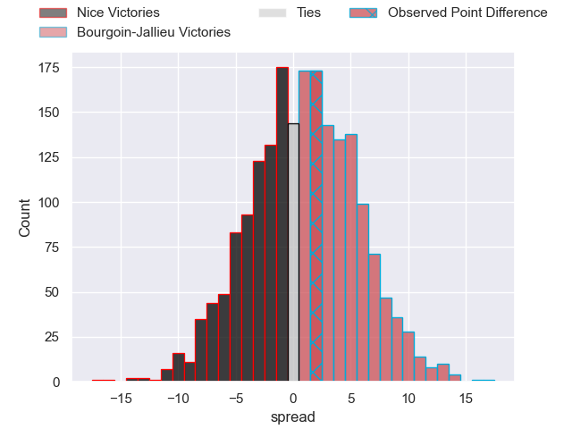
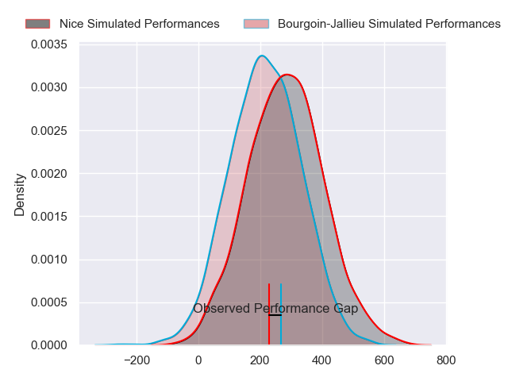
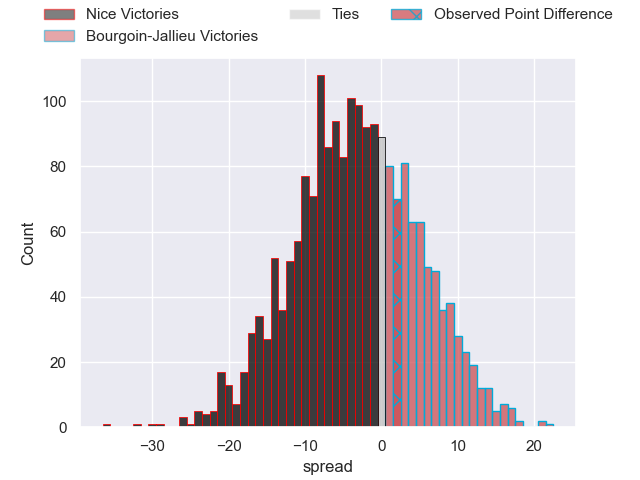
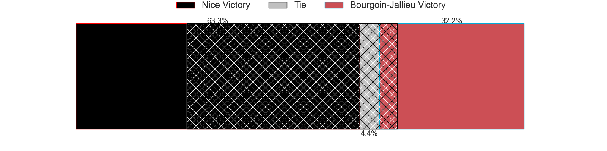

---  
layout: page  
title: Nice at Bourgoin-Jallieu; 23-25  
date: 2024-04-06 18:00:00 -0500  
categories: "Nationale 2023" match review  
---
# Nice at Bourgoin-Jallieu; 23-25

# Club Level Predictions

The first set of predictions treats a club as the smallest object, as the club develops its members, organizes a gameplan, and deploys its players as needed for each match. This club model has a prediction of 0.526, which translates to predicting Bourgoin-Jallieu to win by 0.9.

Our Over/Under is 40.5 - and combined with the spread above, we have a predicted scoreline of 20 to 21

Each club has a rating and a rating deviation (similar to a Glicko rating), and expected performances can be generated. This allows for simulated matches and spreads like the ones below.
## Projected Performances - Club Model

## Projected Spreads - Club Model

## Projected Results - Club Model

# Player Level Predictions - Version 2

Treating teams instead as an entity made up of the currently active players, I have ratings for each player in an altogether different system. These can be combined to form team ratings once teamsheets are announced, weighting starters a bit higher than the reserves. After the match is played, players can be weighted by their minutes on the field, allowing for an accurate measure of the team's composition. With these compiled team ratings, we can make predictions, measure inaccuracy, and update the individual player ratings.
## Prediction without Player Minutes: Nice by 2.1

Nice by 9.6 on a neutral pitch

## Projected Performances - Player Model

## Projected Spreads - Player Model

## Projected Results - Player Model

|   Away Minutes | Away Player               |   Away Percentile |   Number |   Home Percentile | Home Player           |   Home Minutes |
|---------------:|:--------------------------|------------------:|---------:|------------------:|:----------------------|---------------:|
|             57 | Jules Martinez            |              4.65 |        1 |             60.02 | Rémy Gaborit          |             56 |
|             57 | Sione Anga'aelangi        |             76.08 |        2 |             80.39 | Maxime Castant        |             48 |
|             68 | Nicolas Ciancio           |              7.98 |        3 |             38.65 | Rossouw De Klerk      |             30 |
|             80 | Tom Murday                |             99.4  |        4 |             32.94 | Robin Gascou          |             41 |
|             72 | Martin Freytes            |             51.19 |        5 |             20.76 | Poutasi Luafutu       |             59 |
|             52 | Louis Suaud               |             97.57 |        6 |             12.17 | Kevin Rivoire         |             44 |
|             80 | Bastien Berenguel         |             17.03 |        7 |             36.5  | Matteo Broeders       |             80 |
|             66 | Ramiha Tarrel Tia Smiler  |              6.1  |        8 |             12.2  | Aitor Hourcade        |             80 |
|             52 | Jules Solinas             |             89.58 |        9 |             49.79 | Martin Doan           |             64 |
|             80 | Romain Riguet             |             82.5  |       10 |             89.75 | Nicolas Vuillemin     |             64 |
|             80 | Andrzej Charlat           |             95.7  |       11 |             20.27 | Paul-Hugo Champ       |             80 |
|             80 | Luca Cutayar              |              9.96 |       12 |              8.28 | Aviata Silago         |             80 |
|             66 | Agustin Ormaechea         |              1.92 |       13 |             69.51 | Gaby Lovobalavu       |             80 |
|             80 | Simon Delas               |             91.51 |       14 |              3.4  | Remi Bouet            |             80 |
|             80 | David Odiete              |             88.53 |       15 |             99    | Antoine Renaud        |             80 |
|             23 | Sunia Vola                |             84.24 |       16 |             47.67 | Romain Favaretto      |             24 |
|             23 | Santiago Benjamin Ovejero |             63.73 |       17 |             10    | Killian Tripier       |             32 |
|             12 | Kevin Yameogo             |            nan    |       18 |              4.18 | Maxime Calliet        |             50 |
|              8 | Thibault Rey              |              2.39 |       19 |             23.39 | Léandre Cotte         |             39 |
|             28 | Arthur Vignolles          |             60.14 |       20 |             51.22 | Theophile Cotte       |             21 |
|             14 | Johann Afonso Grundlingh  |             83.08 |       21 |             12.63 | Kevin Chaudouard      |             36 |
|             28 | Matéo Jeune-Joly          |             17.5  |       22 |             79.17 | Tomas Munilla lo Duca |             16 |
|             14 | Pierre Le Huby            |             20.45 |       23 |              5.44 | Christopher Bosch     |             16 |

