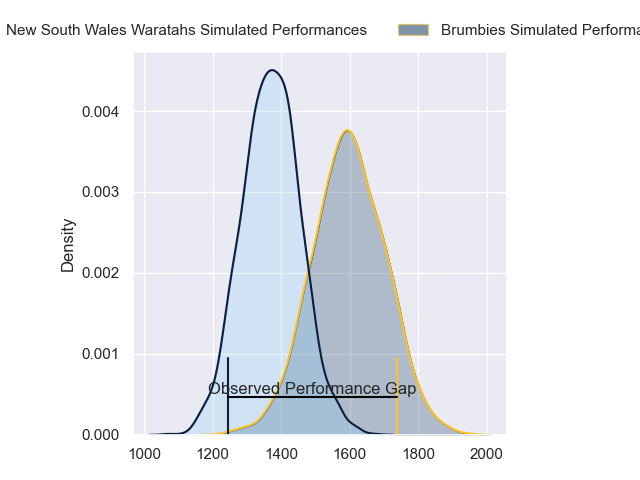
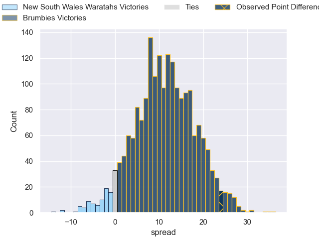
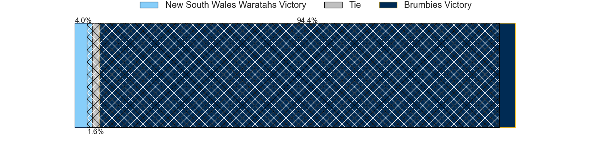
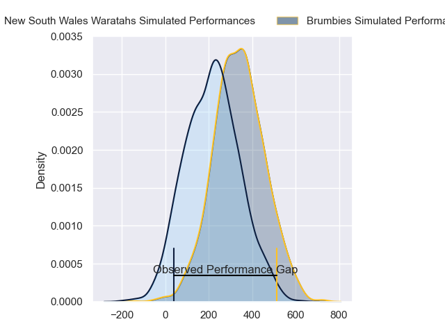
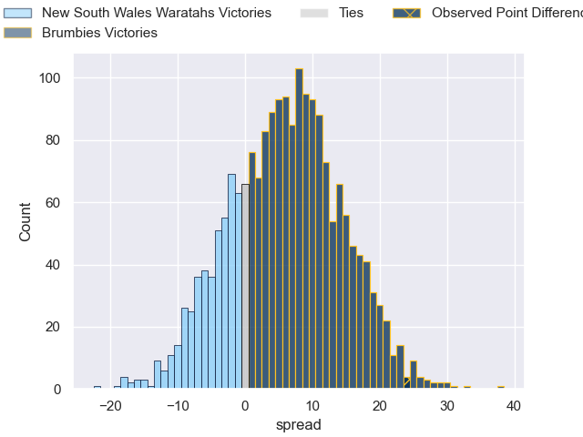
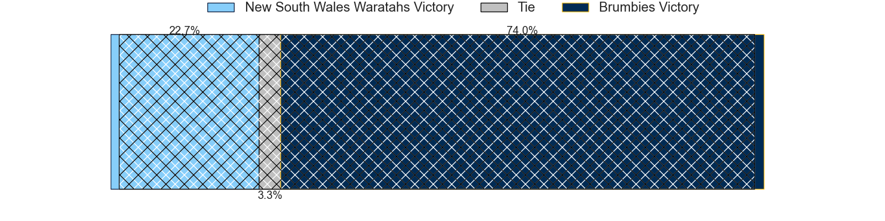

---  
layout: page  
title: New South Wales Waratahs at Brumbies; 16-40  
date: 2024-04-06 18:00:00 -0500  
categories: "Super Rugby Pacific 2024" match review  
---
# New South Wales Waratahs at Brumbies; 16-40

# Club Level Predictions

The first set of predictions treats a club as the smallest object, as the club develops its members, organizes a gameplan, and deploys its players as needed for each match. This club model has a prediction of 0.777, which translates to predicting Brumbies to win by 11.2.

Our Over/Under is 52.5 - and combined with the spread above, we have a predicted scoreline of 21 to 32

Each club has a rating and a rating deviation (similar to a Glicko rating), and expected performances can be generated. This allows for simulated matches and spreads like the ones below.
## Projected Performances - Club Model

## Projected Spreads - Club Model

## Projected Results - Club Model

# Player Level Predictions - Version 2

Treating teams instead as an entity made up of the currently active players, I have ratings for each player in an altogether different system. These can be combined to form team ratings once teamsheets are announced, weighting starters a bit higher than the reserves. After the match is played, players can be weighted by their minutes on the field, allowing for an accurate measure of the team's composition. With these compiled team ratings, we can make predictions, measure inaccuracy, and update the individual player ratings.
## Prediction without Player Minutes: Brumbies by 6.9

Brumbies by 2.2 on a neutral pitch

## Projected Performances - Player Model

## Projected Spreads - Player Model

## Projected Results - Player Model

|   Away Minutes | Away Player              |   Away Percentile |   Number |   Home Percentile | Home Player      |   Home Minutes |
|---------------:|:-------------------------|------------------:|---------:|------------------:|:-----------------|---------------:|
|             18 | Angus Bell               |             89.08 |        1 |             93.73 | James Slipper    |             61 |
|             76 | Julian Heaven            |             43.33 |        2 |             70.2  | Billy Pollard    |             61 |
|             52 | Harry Johnson-Holmes     |             66.86 |        3 |             42.45 | Sefo Kautai      |             52 |
|             80 | Jed Holloway             |             27.21 |        4 |             59.55 | Darcy Swain      |             57 |
|             52 | Fergus Lee-Warner        |             25.3  |        5 |             56.8  | Nick Frost       |             80 |
|             80 | Lachlan Swinton          |             14.6  |        6 |             97.68 | Rob Valetini     |             61 |
|             80 | Charlie Gamble           |             73    |        7 |             73.12 | Tom Hooper       |             80 |
|             69 | Hugh Sinclair            |             17.32 |        8 |             53.17 | Charlie Cale     |             80 |
|             61 | Jake Gordon              |             86.46 |        9 |             25.83 | Harrison Goddard |             63 |
|             52 | Tane Edmed               |             35.75 |       10 |             85.5  | Noah Lolesio     |             71 |
|             80 | Dylan Pietsch            |             71.23 |       11 |             58.32 | Corey Toole      |             80 |
|             52 | Lalakai Foketi           |             77.31 |       12 |             59.42 | Tamati Tua       |             75 |
|             80 | Joey Walton              |             82.35 |       13 |             56.3  | Hudson Creighton |             80 |
|             80 | Mark Nawaqanitawase      |             42.7  |       14 |             91.05 | Ollie Sapsford   |             80 |
|             80 | Max Jorgensen            |             62.34 |       15 |             73.82 | Tom Wright       |             80 |
|              4 | Theo Fourie              |            nan    |       16 |             85.88 | Connal McInerney |             19 |
|             62 | Hayden Thompson-Stringer |             91.83 |       17 |             13.11 | Fred Kaihea      |             19 |
|             28 | Tom Ross                 |             27.26 |       18 |             63.44 | Rhys Van Nek     |             28 |
|             28 | Miles Amatosero          |              5.13 |       19 |             98.69 | Cadeyrn Neville  |             23 |
|             11 | Sione Misiloi            |            nan    |       20 |             54.11 | Luke Reimer      |             19 |
|             19 | Teddy Wilson             |            nan    |       21 |            nan    | Klayton Thorn    |             17 |
|             28 | Will Harrison            |            nan    |       22 |             69.75 | Jack Debreczeni  |              9 |
|             28 | Izaia Perese             |             53.3  |       23 |            nan    | Declan Meredith  |              5 |

