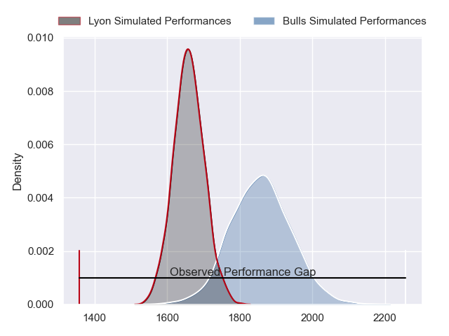
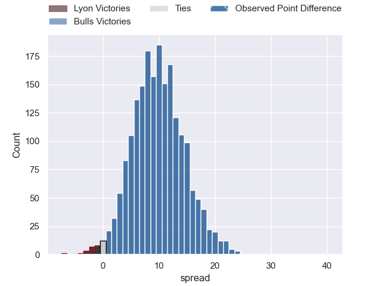
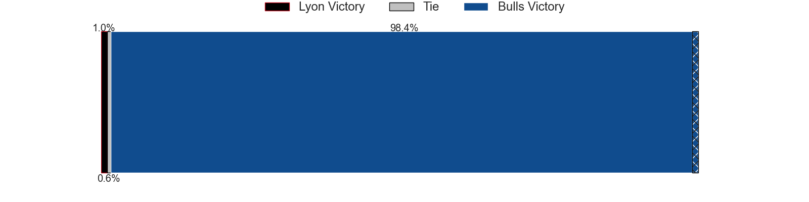
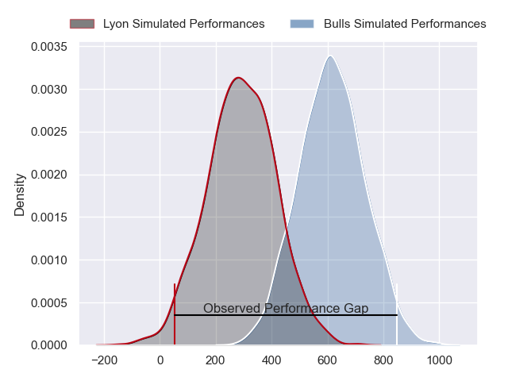
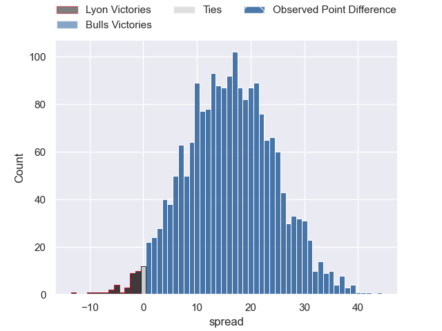
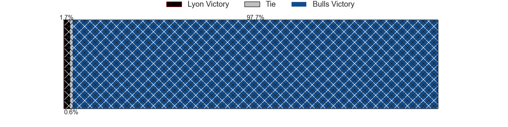

---  
layout: page  
title: Lyon at Bulls; 19-59  
date: 2024-04-06 18:00:00 -0500  
categories: "European Rugby Champions Cup 2023" match review  
---
# Lyon at Bulls; 19-59

# Club Level Predictions

The first set of predictions treats a club as the smallest object, as the club develops its members, organizes a gameplan, and deploys its players as needed for each match. This club model has a prediction of 0.757, which translates to predicting Bulls to win by 10.0.

Our Over/Under is 50.5 - and combined with the spread above, we have a predicted scoreline of 20 to 30

Each club has a rating and a rating deviation (similar to a Glicko rating), and expected performances can be generated. This allows for simulated matches and spreads like the ones below.
## Projected Performances - Club Model

## Projected Spreads - Club Model

## Projected Results - Club Model

# Player Level Predictions - Version 2

Treating teams instead as an entity made up of the currently active players, I have ratings for each player in an altogether different system. These can be combined to form team ratings once teamsheets are announced, weighting starters a bit higher than the reserves. After the match is played, players can be weighted by their minutes on the field, allowing for an accurate measure of the team's composition. With these compiled team ratings, we can make predictions, measure inaccuracy, and update the individual player ratings.
## Prediction without Player Minutes: Bulls by 20.5

Bulls by 15.9 on a neutral pitch

## Projected Performances - Player Model

## Projected Spreads - Player Model

## Projected Results - Player Model

|   Away Minutes | Away Player        |   Away Percentile |   Number |   Home Percentile | Home Player                     |   Home Minutes |
|---------------:|:-------------------|------------------:|---------:|------------------:|:--------------------------------|---------------:|
|             64 | Vivien Devisme     |             69.33 |        1 |             93.35 | Gerhard Steenekamp              |             55 |
|             46 | Guillaume Marchand |             21.57 |        2 |             95.88 | Johan Grobbelaar                |             47 |
|             51 | Paulo Tafili       |             42.64 |        3 |             99.43 | Wilco Louw                      |             47 |
|             51 | Theo William       |             27.8  |        4 |             21.36 | Ruan Vermaak                    |             63 |
|             46 | Loann Goujon       |             50.12 |        5 |             45.58 | Jacob Frederick Nel Van Heerden |             80 |
|             80 | Marvin Okuya       |             42.06 |        6 |             95.48 | Marcell Coetzee                 |             80 |
|             80 | Beka Saghinadze    |             84.94 |        7 |             78.45 | Reinhardt Ludwig                |             80 |
|             55 | Jordan Taufua      |             92.44 |        8 |             89.76 | Elrigh Louw                     |             70 |
|             64 | Martin Page-Relo   |             75.42 |        9 |             94.17 | Embrose Papier                  |             70 |
|             80 | Paddy Jackson      |             79.5  |       10 |             84.5  | Johan Goosen                    |             60 |
|             80 | Monty Ioane        |             98.41 |       11 |             98.75 | Kurt-Lee Arendse                |             80 |
|             80 | Kyle Godwin        |             62.06 |       12 |             94.72 | David Kriel                     |             80 |
|             80 | Alfred Parisien    |             65.07 |       13 |             99.16 | Canan Moodie                    |             80 |
|             60 | Xavier Mignot      |             54.7  |       14 |             43.6  | Sebastian de Klerk              |             80 |
|             80 | Thaakir Abrahams   |             15.46 |       15 |             97.01 | Willie le Roux                  |             60 |
|             34 | Yanis Charcosset   |             50.78 |       16 |             99.41 | Akker van der Merwe             |             33 |
|             29 | Demba Bamba        |             92.02 |       17 |             77.49 | Simphiwe Matanzima              |             25 |
|             16 | Ave Jonathan Maalo |            nan    |       18 |             78.73 | Mornay Smith                    |             33 |
|             34 | Mickael Guillard   |             69.21 |       19 |             82.46 | Janko Swanepoel                 |             17 |
|             29 | Arno Botha         |             88.54 |       20 |             91.77 | Nizaam Carr                     |             10 |
|             25 | Maxime Gouzou      |             37.07 |       21 |             86.04 | Zak Burger                      |             10 |
|             20 | Ethan Dumortier    |             61.72 |       22 |             35.5  | Chris William Smith             |             20 |
|             16 | Liam Rimet         |             43.33 |       23 |             84.79 | Devon Williams                  |             20 |

