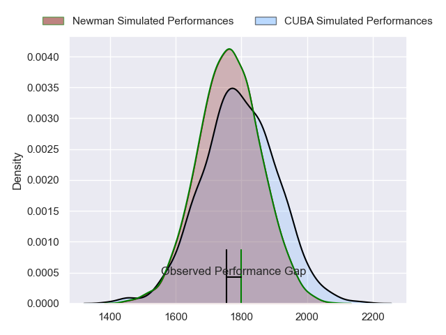
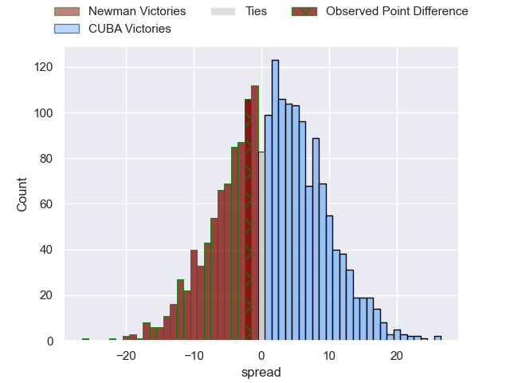
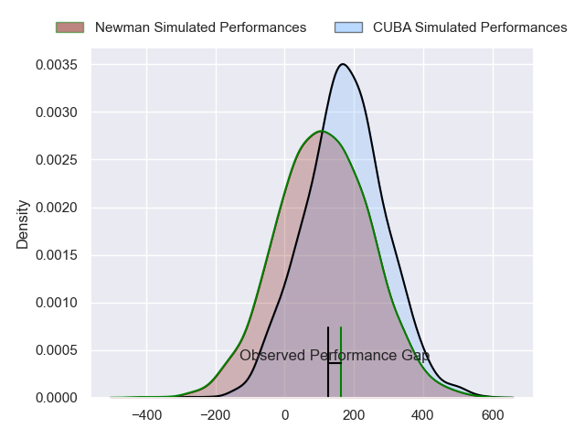
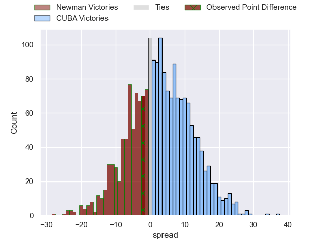
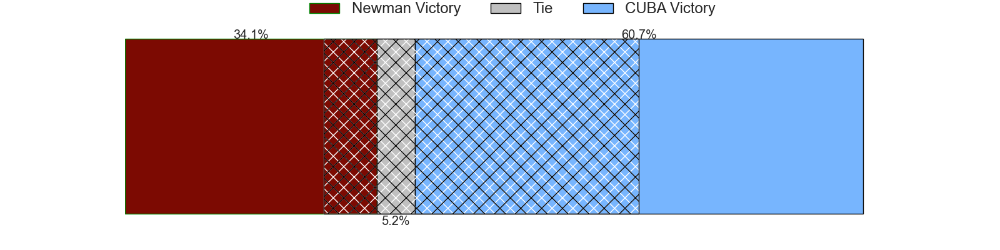

---  
layout: page  
title: Newman at CUBA; 23-21  
date: 2024-04-06 18:00:00 -0500  
categories: "URBA Top 12 2024" match review  
---
# Newman at CUBA; 23-21

# Club Level Predictions

The first set of predictions treats a club as the smallest object, as the club develops its members, organizes a gameplan, and deploys its players as needed for each match. This club model has a prediction of 0.55, which translates to predicting CUBA to win by 1.8.

Our Over/Under is 56.5 - and combined with the spread above, we have a predicted scoreline of 28 to 29

Each club has a rating and a rating deviation (similar to a Glicko rating), and expected performances can be generated. This allows for simulated matches and spreads like the ones below.
## Projected Performances - Club Model

## Projected Spreads - Club Model

## Projected Results - Club Model

# Player Level Predictions - Version 2

Treating teams instead as an entity made up of the currently active players, I have ratings for each player in an altogether different system. These can be combined to form team ratings once teamsheets are announced, weighting starters a bit higher than the reserves. After the match is played, players can be weighted by their minutes on the field, allowing for an accurate measure of the team's composition. With these compiled team ratings, we can make predictions, measure inaccuracy, and update the individual player ratings.
## Prediction without Player Minutes: CUBA by 3.7

Newman by 0.0 on a neutral pitch

## Projected Performances - Player Model

## Projected Spreads - Player Model

## Projected Results - Player Model

|   Away Minutes | Away Player               |   Away Percentile |   Number |   Home Percentile | Home Player          |   Home Minutes |
|---------------:|:--------------------------|------------------:|---------:|------------------:|:---------------------|---------------:|
|             70 | Miguel Prince             |             25.74 |        1 |             24.64 | Joaquin Yaquiche     |             50 |
|             70 | Marcelo Brandi            |             28.24 |        2 |             25.88 | Tomas Anderlic       |             59 |
|             50 | Luciano Borio             |             51.19 |        3 |             24.64 | Facundo Aguirre      |             50 |
|             80 | Tomas Ureta               |             31.32 |        4 |             27.92 | Santiago Landau      |             80 |
|             80 | Alejandro Urtubey         |             31.32 |        5 |             41.05 | Marcos Loza          |             54 |
|             80 | Joaquin de la Vega        |             28.54 |        6 |             25.26 | Francisco Sied       |             50 |
|             50 | Miguel Urtubey            |             24.33 |        7 |             23.64 | Segundo Pisani       |             80 |
|             80 | Rodrigo Diaz de Vivar     |             48.54 |        8 |             25.61 | Lucas Campion        |             71 |
|             80 | Felix Branca              |             29.79 |        9 |             36.67 | Facundo Fontan Gotta |             80 |
|             80 | Gonzalo Guiterrez Taboada |             26    |       10 |             20.5  | Felipe de la Vega    |             80 |
|             80 | Cruz Pereira              |             52.43 |       11 |             26.73 | Santiago Cardini     |             80 |
|             80 | Tomas Keena               |             28.75 |       12 |             25.81 | Felipe Perdomo       |             68 |
|             80 | Benjamin Lanfranco        |             28.75 |       13 |             25.45 | Francisco Patrono    |             80 |
|             80 | Leandro Leivas            |             29.56 |       14 |             23.69 | Segundo Perdomo      |             80 |
|             80 | Francisco Pasman          |             26.18 |       15 |             27.41 | Marcos Moroni        |             61 |
|             10 | Away Team 16              |            nan    |       16 |            nan    | Home Team 16         |             30 |
|             10 | Away Team 17              |            nan    |       17 |            nan    | Home Team 17         |              0 |
|             30 | Away Team 18              |            nan    |       18 |            nan    | Home Team 18         |             30 |
|              0 | Away Team 19              |            nan    |       19 |            nan    | Home Team 19         |              0 |
|              0 | Away Team 20              |            nan    |       20 |            nan    | Home Team 4          |             26 |
|              0 | Away Team 21              |            nan    |       21 |            nan    | Home Team 21         |             12 |
|              0 | Away Team 22              |            nan    |       22 |            nan    | Home Team 22         |             19 |
|              0 | Away Team 23              |            nan    |       23 |            nan    | Home Team 23         |              0 |

